# Workflow of GWAS project

## 1. QUALITY CONTROL AND RELATEDNESS


### Filtering bfiles to only contain IDs with phenotypic data

```R
awk '{print $1, $1}' height.txt > keep_height_ids.txt
plink --bfile gwas_data --keep keep_height_ids.txt --make-bed --out gwas_data_height
#1376653 variants and 1071 people pass filters and QC.
```

### Filtering the height_metadata.txt and filtering by chip


```R
awk '{print $1}' height.txt > keep_height_ids_onecolumn.txt
awk 'NR==FNR {ids[$1]; next} $1 in ids' keep_height_ids_onecolumn.txt metadata.txt > metadata_height.txt
wc -l metadata_height.txt
#1071 metadata_height.txt
```

```R
metadata <- read.table("metadata_height.txt", header = FALSE, sep = "\t", stringsAsFactors = FALSE)
```
```R
table(metadata$V3)
```
 Unknown 	HTS iSelect HD    Illumina GSAs      OmniExpress 		OmniExpress plus  
             232              275              128              170  		 266 

```R
nrow(metadata)
```

1071


```R
for (chip_type in unique(metadata$chip)) {
  
  # Subset metadata by chip type
  group_data <- subset(metadata, chip == chip_type)
  
  # Clean chip_type string for filename
  filename <- paste0(gsub(" ", "_", chip_type), ".keep")
  
  # Write keep file (FID and IID as user ID)
  write.table(
    data.frame(FID = group_data$user, IID = group_data$user),
    file = filename,
    sep = "\t",
    quote = FALSE,
    row.names = FALSE,
    col.names = FALSE
  )
}
```

### Creating bfiles for each chip subset


```R
plink --bfile gwas_data_height \
      --keep HTS_iSelect_HD.keep \
      --make-bed \
      --out HTS_iSelect_HD
plink --bfile gwas_data_height \
      --keep Illumina_GSAs.keep \
      --make-bed \
      --out Illumina_GSAs
plink --bfile gwas_data_height \
      --keep Unknown.keep \
      --make-bed \
      --out Unknown
plink --bfile gwas_data_height \
      --keep OmniExpress_plus.keep \
      --make-bed \
      --out OmniExpress_plus
plink --bfile gwas_data_height \
      --keep OmniExpress.keep \
      --make-bed \
      --out OmniExpress
```

### Sample QC

#### Sex check - removing all mismatches and unknowns


```R
plink --bfile HTS_iSelect_HD --check-sex --out HTS_iSelect_HD_sex
plink --bfile Illumina_GSAs --check-sex --out Illumina_GSAs_sex
plink --bfile Unknown --check-sex --out Unknown_sex
plink --bfile OmniExpress_plus --check-sex --out OmniExpress_plus_sex
plink --bfile OmniExpress --check-sex --out OmniExpress_sex

grep PROBLEM HTS_iSelect_HD_sex.sexcheck > HTS_iSelect_HD_wrong_sex.txt
plink --bfile HTS_iSelect_HD --remove HTS_iSelect_HD_wrong_sex.txt --make-bed --out HTS_iSelect_HD_postsex

grep PROBLEM Illumina_GSAs_sex.sexcheck > Illumina_GSAs_wrong_sex.txt
plink --bfile Illumina_GSAs --remove Illumina_GSAs_wrong_sex.txt --make-bed --out Illumina_GSAs_postsex

grep PROBLEM Unknown_sex.sexcheck > Unknown_wrong_sex.txt
plink --bfile Unknown --remove Unknown_wrong_sex.txt --make-bed --out Unknown_postsex

grep PROBLEM OmniExpress_plus_sex.sexcheck > OmniExpress_plus_wrong_sex.txt
plink --bfile OmniExpress_plus --remove OmniExpress_plus_wrong_sex.txt --make-bed --out OmniExpress_plus_postsex

grep PROBLEM OmniExpress_sex.sexcheck > OmniExpress_wrong_sex.txt
plink --bfile OmniExpress --remove OmniExpress_wrong_sex.txt --make-bed --out OmniExpress_postsex
```

#### 2. Identification of individuals with elevated missing data rates or outlying heterozygosity rate


```R
plink --bfile OmniExpress_postsex --missing --out OmniExpress_postsex
plink --bfile OmniExpress_postsex --het --out OmniExpress_postsex 

plink --bfile OmniExpress_plus_postsex --missing --out OmniExpress_plus_postsex
plink --bfile OmniExpress_plus_postsex --het --out OmniExpress_plus_postsex

plink --bfile Unknown_postsex --missing --out Unknown_postsex
plink --bfile Unknown_postsex --het --out Unknown_postsex

plink --bfile Illumina_GSAs_postsex --missing --out Illumina_GSAs_postsex
plink --bfile Illumina_GSAs_postsex --het --out Illumina_GSAs_postsex

plink --bfile HTS_iSelect_HD_postsex --missing --out HTS_iSelect_HD_postsex
plink --bfile HTS_iSelect_HD_postsex --het --out HTS_iSelect_HD_postsex
```

.imiss - Shows how much data is missing per person (i.e., per sample)
.lmiss - Shows how much data is missing per SNP.
.het - assess heterozygosity per individual
| Column | Description                                             |
| ------ | ------------------------------------------------------- |
| FID    | Family ID                                               |
| IID    | Individual ID                                           |
| O(HOM) | Observed number of homozygous genotypes                 |
| E(HOM) | Expected number of homozygous genotypes                 |
| N(NM)  | Number of non-missing genotypes                         |
| F      | Inbreeding coefficient estimate (observed vs. expected) |

F = 0 → Normal heterozygosity
F > 0 → More homozygous than expected (possible inbreeding)
F < 0 → More heterozygous than expected (possible contamination)


```R
library(dplyr)

# Read the missingness and heterozygosity files
HTS_iSelect_HD_postsex_miss <- read.table("HTS_iSelect_HD_postsex.imiss", header = TRUE)
HTS_iSelect_HD_postsex_het <- read.table("HTS_iSelect_HD_postsex.het", header = TRUE)

# Merge both datasets by FID and IID
HTS_iSelect_HD_postsex <- inner_join(HTS_iSelect_HD_postsex_miss, HTS_iSelect_HD_postsex_het)

# Calculate observed heterozygosity rate
HTS_iSelect_HD_postsex$Het <- (HTS_iSelect_HD_postsex$N.NM. - HTS_iSelect_HD_postsex$O.HOM.) / HTS_iSelect_HD_postsex$N.NM.

plot(HTS_iSelect_HD_postsex$Het, HTS_iSelect_HD_postsex$F_MISS, xlab="Heterozygosity Rate", ylab="Missing Rate", main="Heterozygosity vs Missingness (HTS_iSelect_HD)")

# Add threshold line for missingness (e.g., 0.02)

# Define heterozygosity thresholds (e.g., +/- 3 SD from mean)
het_mean <- mean(HTS_iSelect_HD_postsex$Het, na.rm = TRUE)
het_sd <- sd(HTS_iSelect_HD_postsex$Het, na.rm = TRUE)
abline(v = het_mean + 3 * het_sd, col = "blue", lty = 2)  # vertical upper threshold
abline(v = het_mean - 3 * het_sd, col = "blue", lty = 2)  # vertical lower threshold
abline(h = 0.02, col = "red", lty = 2)  # horizontal line
```

    Joining with `by = join_by(FID, IID)`


    
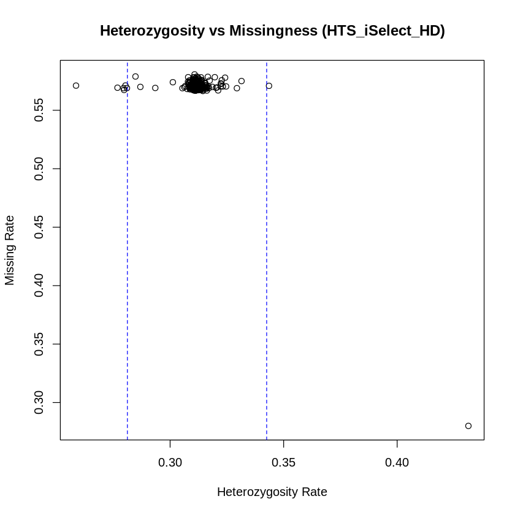
    


Extremely high missingness, possibly due to presence of SNPs that were not accounted in the chip specific array.

### Analysing how much of the SNPs have 100% missingness in each subset 

```R
HTS_lmiss <- read.table("HTS_iSelect_HD_postsex.lmiss", header = TRUE)
HTS_lmiss$chip <- "HTS_iSelect_HD"

Illumina_GSAs_lmiss <- read.table("Illumina_GSAs_postsex.lmiss", header = TRUE)
Illumina_GSAs_lmiss$chip <- "Illumina_GSAs"

nochip_lmiss <- read.table("Unknown_postsex.lmiss", header = TRUE)
nochip_lmiss$chip <- "Unknown"

OmniExpress_plus_lmiss <- read.table("OmniExpress_plus_postsex.lmiss", header = TRUE)
OmniExpress_plus_lmiss$chip <- "OmniExpress_plus"

OmniExpress_lmiss <- read.table("OmniExpress_postsex.lmiss", header = TRUE)
OmniExpress_lmiss$chip <- "OmniExpress"

all_lmiss <- rbind(HTS_lmiss, Illumina_GSAs_lmiss, nochip_lmiss, OmniExpress_plus_lmiss, OmniExpress_lmiss)
```


    
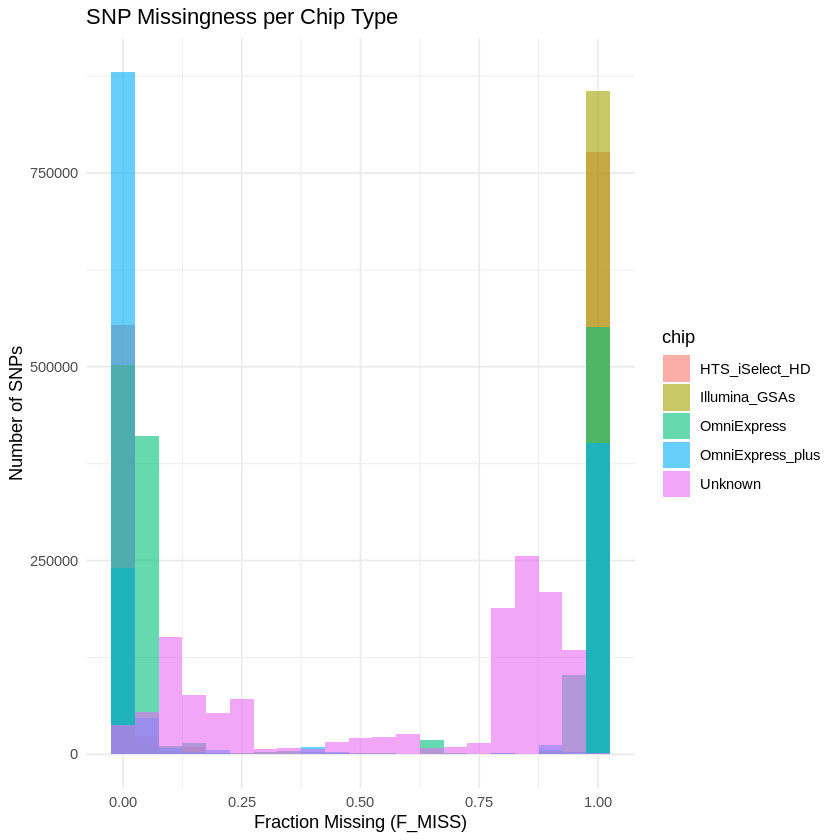
    


```R
library(ggplot2)

ggplot(all_lmiss, aes(x = F_MISS)) +
  geom_histogram(binwidth = 0.05, fill = "steelblue", alpha = 0.7, boundary = 0) +
  geom_vline(xintercept = 1.0, color = "red", linetype = "dashed", size = 1) +  # 100% missing
  facet_wrap(~ chip, scales = "free_y") +
  theme_minimal() +
  labs(title = "SNP Missingness Distribution by Chip Type",
       subtitle = "Red dashed line marks SNPs with 100% missingness",
       x = "Fraction Missing (F_MISS)",
       y = "Number of SNPs") +
  theme(strip.text = element_text(face = "bold"),
        plot.title = element_text(size = 14),
        plot.subtitle = element_text(size = 10))

```

    Warning message:
    “Using `size` aesthetic for lines was deprecated in ggplot2 3.4.0.
    ℹ Please use `linewidth` instead.”


    
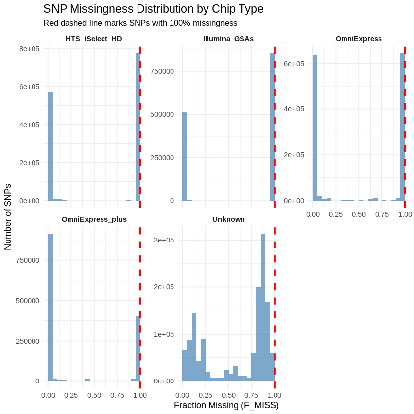
    


```R
library(dplyr)

all_lmiss %>%
  filter(F_MISS == 1) %>%
  group_by(chip) %>%
  summarise("100%_missing_SNPs" = n())
```


<table class="dataframe">
<caption>A tibble: 5 × 2</caption>
<thead>
	<tr><th scope=col>chip</th><th scope=col>100%_missing_SNPs</th></tr>
	<tr><th scope=col>&lt;chr&gt;</th><th scope=col>&lt;int&gt;</th></tr>
</thead>
<tbody>
	<tr><td>HTS_iSelect_HD  </td><td>380169</td></tr>
	<tr><td>Illumina_GSAs   </td><td>853856</td></tr>
	<tr><td>OmniExpress     </td><td>   597</td></tr>
	<tr><td>OmniExpress_plus</td><td>342534</td></tr>
	<tr><td>Unknown         </td><td>     1</td></tr>
</tbody>
</table>


```R
library(dplyr)

# Loop through each chip and write list of SNPs with 100% missingness
unique_chips <- unique(all_lmiss$chip)

for (chip_name in unique_chips) {
  snps_to_remove <- all_lmiss %>%
    filter(chip == chip_name, F_MISS == 1) %>%
    pull(SNP)
  
  # Save to file
  write.table(snps_to_remove,
              file = paste0("snps_to_remove_", gsub(" ", "_", chip_name), ".txt"),
              quote = FALSE, row.names = FALSE, col.names = FALSE)
}

```

### Removing the 100% SNPs and creating new bfiles with chip relavant SNPs


```R
plink --bfile HTS_iSelect_HD_postsex --exclude snps_to_remove_HTS_iSelect_HD.txt --make-bed --out HTS_iSelect_HD_postsex_specificSNPs
plink --bfile Illumina_GSAs_postsex --exclude snps_to_remove_Illumina_GSAs.txt --make-bed --out Illumina_GSAs_postsex_specificSNPs
plink --bfile OmniExpress_postsex --exclude snps_to_remove_OmniExpress.txt --make-bed --out OmniExpress_postsex_specificSNPs
plink --bfile OmniExpress_plus_postsex --exclude snps_to_remove_OmniExpress_plus.txt --make-bed --out OmniExpress_plus_postsex_specificSNPs
plink --bfile Unknown_postsex --exclude snps_to_remove_Unknown.txt --make-bed --out Unknown_postsex_specificSNPs
```

### Redoing the sample missingnes and heterozygosity


```Bash
plink --bfile HTS_iSelect_HD_postsex_specificSNPs --missing --out HTS_iSelect_HD_postsex_specificSNPs
plink --bfile Illumina_GSAs_postsex_specificSNPs --missing --out Illumina_GSAs_postsex_specificSNPs
plink --bfile OmniExpress_postsex_specificSNPs --missing --out OmniExpress_postsex_specificSNPs
plink --bfile OmniExpress_plus_postsex_specificSNPs --missing --out OmniExpress_plus_postsex_specificSNPs
plink --bfile Unknown_postsex_specificSNPs --missing --out Unknown_postsex_specificSNPs

plink --bfile HTS_iSelect_HD_postsex_specificSNPs --het --out HTS_iSelect_HD_postsex_specificSNPs 
plink --bfile Illumina_GSAs_postsex_specificSNPs --het --out Illumina_GSAs_postsex_specificSNPs 
plink --bfile OmniExpress_postsex_specificSNPs --het --out OmniExpress_postsex_specificSNPs 
plink --bfile OmniExpress_plus_postsex_specificSNPs --het --out OmniExpress_plus_postsex_specificSNPs
plink --bfile Unknown_postsex_specificSNPs --het --out Unknown_postsex_specificSNPs

```


```R
library(dplyr)

# Read the missingness and heterozygosity files
HTS_iSelect_HD_postsex_miss <- read.table("HTS_iSelect_HD_postsex_specificSNPs.imiss", header = TRUE)
HTS_iSelect_HD_postsex_het <- read.table("HTS_iSelect_HD_postsex_specificSNPs.het", header = TRUE)

# Merge both datasets by FID and IID
HTS_iSelect_HD_postsex <- inner_join(HTS_iSelect_HD_postsex_miss, HTS_iSelect_HD_postsex_het)

# Calculate observed heterozygosity rate
HTS_iSelect_HD_postsex$Het <- (HTS_iSelect_HD_postsex$N.NM. - HTS_iSelect_HD_postsex$O.HOM.) / HTS_iSelect_HD_postsex$N.NM.

plot(HTS_iSelect_HD_postsex$Het, HTS_iSelect_HD_postsex$F_MISS, xlab="Heterozygosity Rate", ylab="Missing Rate", main="Heterozygosity vs Missingness (HTS_iSelect_HD)")

# Add threshold line for missingness (e.g., 0.02)

# Define heterozygosity thresholds (e.g., +/- 3 SD from mean)
het_mean <- mean(HTS_iSelect_HD_postsex$Het, na.rm = TRUE)
het_sd <- sd(HTS_iSelect_HD_postsex$Het, na.rm = TRUE)
abline(v = het_mean + 3 * het_sd, col = "blue", lty = 2)  # vertical upper threshold
abline(v = het_mean - 3 * het_sd, col = "blue", lty = 2)  # vertical lower threshold
abline(h = 0.02, col = "red", lty = 2)  # horizontal line
```

    Joining with `by = join_by(FID, IID)`


    
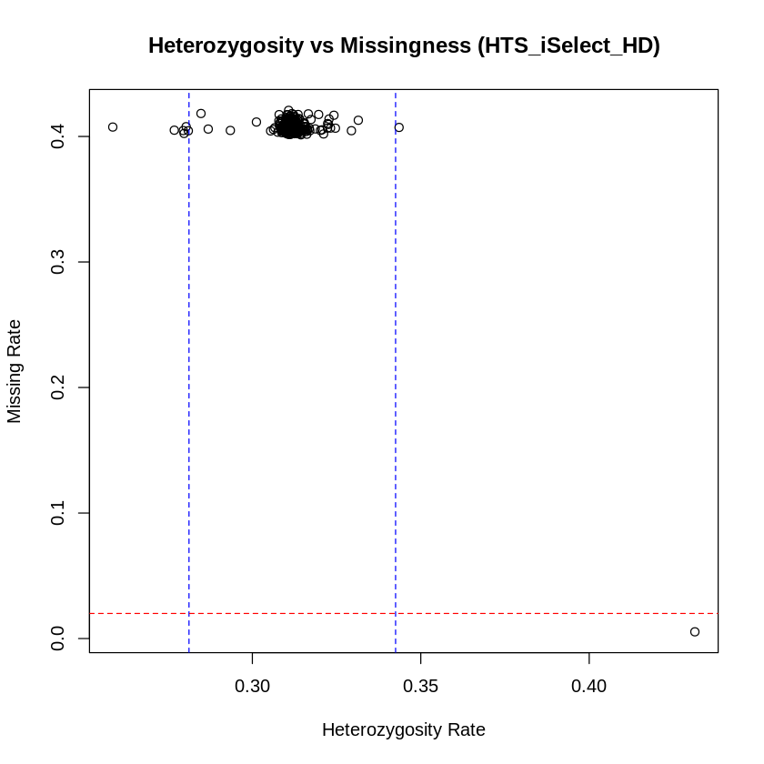
    
### plot missingness X heterozygosity for each chip


```R
library(dplyr)
library(ggplot2)

# Function to read and process each chip dataset
process_chip_data <- function(miss_file, het_file, chip_name) {
  miss <- read.table(miss_file, header = TRUE)
  het <- read.table(het_file, header = TRUE)
  
  df <- inner_join(miss, het, by = c("FID", "IID"))
  df <- df %>% 
    mutate(Het = (N.NM. - O.HOM.) / N.NM.,
           chip = chip_name)
  return(df)
}

# Process all chips (update file names accordingly)
chip1 <- process_chip_data("HTS_iSelect_HD_postsex_specificSNPs.imiss", "HTS_iSelect_HD_postsex_specificSNPs.het", "HTS iSelect HD")
chip2 <- process_chip_data("Illumina_GSAs_postsex_specificSNPs.imiss", "Illumina_GSAs_postsex_specificSNPs.het", "Illumina GSAs")
chip3 <- process_chip_data("OmniExpress_postsex_specificSNPs.imiss", "OmniExpress_postsex_specificSNPs.het", "OmniExpress")
chip4 <- process_chip_data("OmniExpress_plus_postsex_specificSNPs.imiss", "OmniExpress_plus_postsex_specificSNPs.het", "OmniExpress plus")
chip5 <- process_chip_data("Unknown_postsex_specificSNPs.imiss", "Unknown_postsex_specificSNPs.het", "Unknown")

# Combine all dataframes
all_data <- bind_rows(chip1, chip2, chip3, chip4, chip5)

# Calculate mean and SD per chip for heterozygosity thresholds
het_stats <- all_data %>%
  group_by(chip) %>%
  summarise(
    het_mean = mean(Het, na.rm = TRUE),
    het_sd = sd(Het, na.rm = TRUE)
  )

# Join thresholds back to the main dataframe
all_data <- all_data %>%
  left_join(het_stats, by = "chip")

# Plot with ggplot2 and facet_wrap
ggplot(all_data, aes(x = Het, y = F_MISS)) +
  geom_point(alpha = 0.6) +
  geom_vline(aes(xintercept = het_mean + 3 * het_sd), color = "blue", linetype = "dashed") +
  geom_vline(aes(xintercept = het_mean - 3 * het_sd), color = "blue", linetype = "dashed") +
  geom_hline(yintercept = 0.02, color = "red", linetype = "dashed") +
  facet_wrap(~ chip, scales = "free") +
  labs(title = "Heterozygosity vs Missingness by Chip",
       subtitle = "After removing SNPs with 100% missiness",
       x = "Heterozygosity Rate",
       y = "Missing Rate") +
  theme_minimal()

```

    Warning message:
    “Removed 2 rows containing missing values (`geom_point()`).”


    
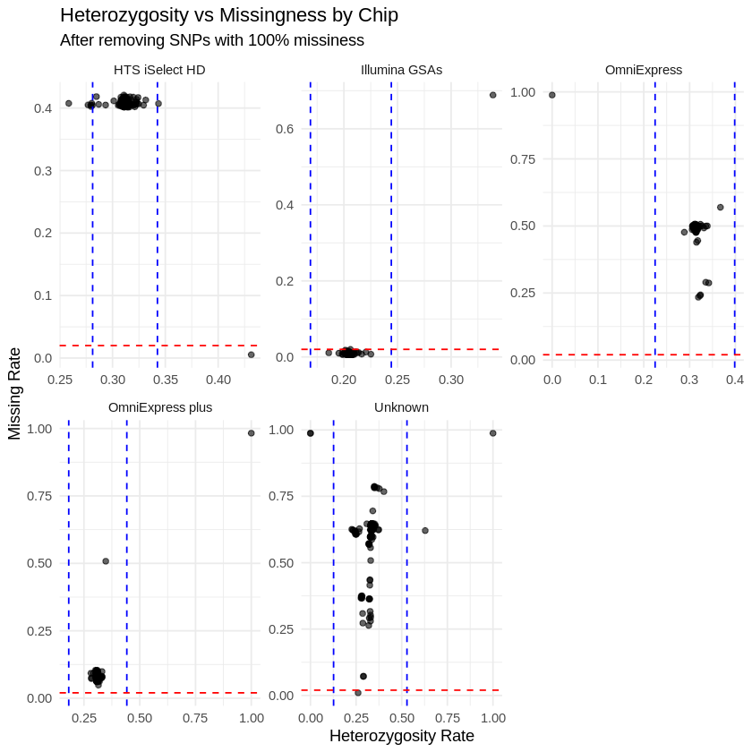
    


Missingness is still bad

### Applying --geno 0.05 to fully account for missingness

```R
plink --bfile HTS_iSelect_HD_postsex_specificSNPs --geno 0.05 --make-bed --out HTS_iSelect_HD_postsex_specificSNPs_geno0.05
plink --bfile Illumina_GSAs_postsex_specificSNPs --geno 0.05 --make-bed --out Illumina_GSAs_postsex_specificSNPs_geno0.05
plink --bfile OmniExpress_plus_postsex_specificSNPs --geno 0.05 --make-bed --out OmniExpress_plus_postsex_specificSNPs_geno0.05
plink --bfile OmniExpress_postsex_specificSNPs --geno 0.05 --make-bed --out OmniExpress_postsex_specificSNPs_geno0.05
plink --bfile Unknown_postsex_specificSNPs --geno 0.05 --make-bed --out Unknown_postsex_specificSNPs_geno0.05
```


```R
plink --bfile HTS_iSelect_HD_postsex_specificSNPs_geno0.05 --missing --out HTS_iSelect_HD_postsex_specificSNPs_geno0.05
plink --bfile HTS_iSelect_HD_postsex_specificSNPs_geno0.05 --het --out HTS_iSelect_HD_postsex_specificSNPs_geno0.05 

plink --bfile Illumina_GSAs_postsex_specificSNPs_geno0.05 --missing --out Illumina_GSAs_postsex_specificSNPs_geno0.05
plink --bfile Illumina_GSAs_postsex_specificSNPs_geno0.05 --het --out Illumina_GSAs_postsex_specificSNPs_geno0.05 

plink --bfile OmniExpress_plus_postsex_specificSNPs_geno0.05 --missing --out OmniExpress_plus_postsex_specificSNPs_geno0.05
plink --bfile OmniExpress_plus_postsex_specificSNPs_geno0.05 --het --out OmniExpress_plus_postsex_specificSNPs_geno0.05 

plink --bfile OmniExpress_postsex_specificSNPs_geno0.05 --missing --out OmniExpress_postsex_specificSNPs_geno0.05
plink --bfile OmniExpress_postsex_specificSNPs_geno0.05 --het --out OmniExpress_postsex_specificSNPs_geno0.05

plink --bfile Unknown_postsex_specificSNPs_geno0.05 --missing --out Unknown_postsex_specificSNPs_geno0.05
plink --bfile Unknown_postsex_specificSNPs_geno0.05 --het --out Unknown_postsex_specificSNPs_geno0.05
```

### visualising better missingnes for one chip

```R
library(dplyr)

# Read the missingness and heterozygosity files
HTS_iSelect_HD_postsex_miss <- read.table("HTS_iSelect_HD_postsex_specificSNPs_geno0.05.imiss", header = TRUE)
HTS_iSelect_HD_postsex_het <- read.table("HTS_iSelect_HD_postsex_specificSNPs_geno0.05.het", header = TRUE)

# Merge both datasets by FID and IID
HTS_iSelect_HD_postsex <- inner_join(HTS_iSelect_HD_postsex_miss, HTS_iSelect_HD_postsex_het)

# Calculate observed heterozygosity rate
HTS_iSelect_HD_postsex$Het <- (HTS_iSelect_HD_postsex$N.NM. - HTS_iSelect_HD_postsex$O.HOM.) / HTS_iSelect_HD_postsex$N.NM.

plot(HTS_iSelect_HD_postsex$Het, HTS_iSelect_HD_postsex$F_MISS, xlab="Heterozygosity Rate", ylab="Missing Rate", main="Heterozygosity vs Missingness (HTS_iSelect_HD)")

# Add threshold line for missingness (e.g., 0.02)

# Define heterozygosity thresholds (e.g., +/- 3 SD from mean)
het_mean <- mean(HTS_iSelect_HD_postsex$Het, na.rm = TRUE)
het_sd <- sd(HTS_iSelect_HD_postsex$Het, na.rm = TRUE)
abline(v = het_mean + 3 * het_sd, col = "blue", lty = 2)  # vertical upper threshold
abline(v = het_mean - 3 * het_sd, col = "blue", lty = 2)  # vertical lower threshold
abline(h = 0.02, col = "red", lty = 2)  # horizontal line
```

    
    Attaching package: ‘dplyr’
    
    
    The following objects are masked from ‘package:stats’:
    
        filter, lag
    
    
    The following objects are masked from ‘package:base’:
    
        intersect, setdiff, setequal, union
    
    
    Joining with `by = join_by(FID, IID)`


    
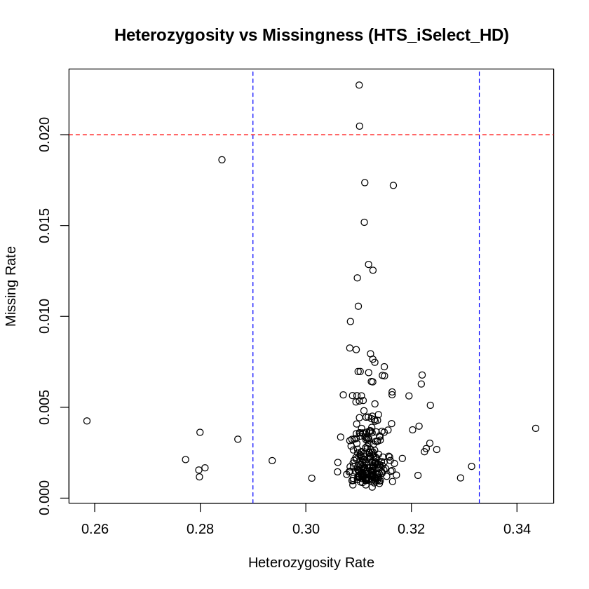
    

### Thresholds for missingness and heterozygosity for each chip

```R
library(dplyr)
library(ggplot2)

# Function to load and process each chip-specific dataset
process_chip_data <- function(miss_file, het_file, chip_name) {
  miss <- read.table(miss_file, header = TRUE)
  het <- read.table(het_file, header = TRUE)
  
  df <- inner_join(miss, het, by = c("FID", "IID")) %>%
    mutate(
      Het = (N.NM. - O.HOM.) / N.NM.,
      chip = chip_name
    )
  
  return(df)
}

# Load all datasets (edit file paths and chip names accordingly)
chip1 <- process_chip_data("HTS_iSelect_HD_postsex_specificSNPs_geno0.05.imiss", "HTS_iSelect_HD_postsex_specificSNPs_geno0.05.het", "HTS iSelect HD")
chip2 <- process_chip_data("Illumina_GSAs_postsex_specificSNPs_geno0.05.imiss", "Illumina_GSAs_postsex_specificSNPs_geno0.05.het", "Illumina GSAs")
chip3 <- process_chip_data("OmniExpress_postsex_specificSNPs_geno0.05.imiss", "OmniExpress_postsex_specificSNPs_geno0.05.het", "OmniExpress")
chip4 <- process_chip_data("OmniExpress_plus_postsex_specificSNPs_geno0.05.imiss", "OmniExpress_plus_postsex_specificSNPs_geno0.05.het", "OmniExpress plus")
chip5 <- process_chip_data("Unknown_postsex_specificSNPs_geno0.05.imiss", "Unknown_postsex_specificSNPs_geno0.05.het", "Unknown")

# Combine datasets
all_data <- bind_rows(chip1, chip2, chip3, chip4, chip5)

# Compute mean and SD of heterozygosity per chip
het_stats <- all_data %>%
  group_by(chip) %>%
  summarise(
    het_mean = mean(Het, na.rm = TRUE),
    het_sd = sd(Het, na.rm = TRUE)
  )

# Merge stats back to main dataframe
all_data <- left_join(all_data, het_stats, by = "chip")

# Plot with ggplot2
ggplot(all_data, aes(x = Het, y = F_MISS)) +
  geom_point(alpha = 0.6) +
  geom_vline(aes(xintercept = het_mean + 3 * het_sd), color = "blue", linetype = "dashed") +
  geom_vline(aes(xintercept = het_mean - 3 * het_sd), color = "blue", linetype = "dashed") +
  geom_hline(yintercept = 0.02, color = "red", linetype = "dashed") +
  facet_wrap(~ chip, scales = "free") +
  theme_minimal() +
  labs(
    title = "Heterozygosity vs Missingness (post --geno 0.05)",
    x = "Heterozygosity Rate",
    y = "Missing Genotype Rate"
  )

```

    Warning message:
    “Removed 6 rows containing missing values (`geom_point()`).”


    
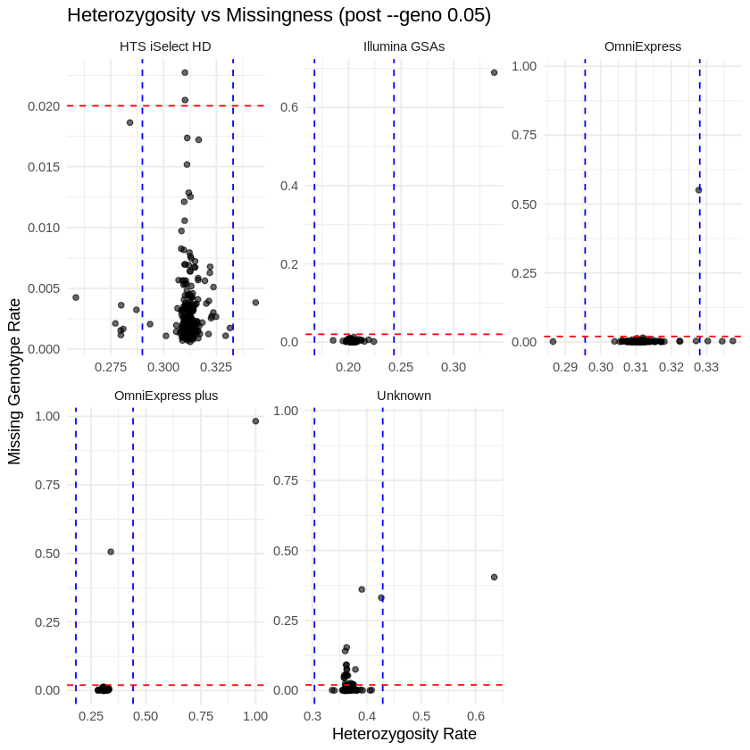
    


### Remove heterozygosity +- 3 s.d. from mean


```R
# Calculate upper and lower Het thresholds
upper_het_thresh <- het_mean + 3 * het_sd
lower_het_thresh <- het_mean - 3 * het_sd

# Identify samples to exclude based on Het
het_outliers <- HTS_iSelect_HD_postsex %>%
  filter(Het > upper_het_thresh | Het < lower_het_thresh) %>%
  select(FID, IID)

# Write out a file listing these samples for removal
write.table(het_outliers, "HTS_iSelect_HD_het_outliers.txt", col.names = FALSE, row.names = FALSE, quote = FALSE, sep = "\t")
```

### Accounting for heterozygosity in each chip

```R
library(dplyr)

# Define a function for heterozygosity filtering
process_het_outliers <- function(miss_file, het_file, output_name) {
  # Load files
  miss <- read.table(miss_file, header = TRUE)
  het <- read.table(het_file, header = TRUE)

  # Merge and compute heterozygosity
  merged <- inner_join(miss, het, by = c("FID", "IID")) %>%
    mutate(Het = (N.NM. - O.HOM.) / N.NM.)

  # Calculate thresholds
  het_mean <- mean(merged$Het, na.rm = TRUE)
  het_sd <- sd(merged$Het, na.rm = TRUE)
  upper_het_thresh <- het_mean + 3 * het_sd
  lower_het_thresh <- het_mean - 3 * het_sd

  # Filter outliers
  het_outliers <- merged %>%
    filter(Het > upper_het_thresh | Het < lower_het_thresh) %>%
    select(FID, IID)

  # Save to file
  write.table(het_outliers, paste0(output_name, "_het_outliers.txt"),
              col.names = FALSE, row.names = FALSE, quote = FALSE, sep = "\t")
  
  # Return count of outliers (optional)
  return(nrow(het_outliers))
}

# Illumina GSAs
process_het_outliers("Illumina_GSAs_postsex_specificSNPs_geno0.05.imiss",
                     "Illumina_GSAs_postsex_specificSNPs_geno0.05.het",
                     "Illumina_GSAs")

# OmniExpress
process_het_outliers("OmniExpress_postsex_specificSNPs_geno0.05.imiss",
                     "OmniExpress_postsex_specificSNPs_geno0.05.het",
                     "OmniExpress")

# OmniExpress Plus
process_het_outliers("OmniExpress_plus_postsex_specificSNPs_geno0.05.imiss",
                     "OmniExpress_plus_postsex_specificSNPs_geno0.05.het",
                     "OmniExpress_plus")
#Unknown
process_het_outliers("Unknown_postsex_specificSNPs_geno0.05.imiss",
                     "Unknown_postsex_specificSNPs_geno0.05.het",
                     "Unknown")
```

### Removing het outliers

```R
plink --bfile HTS_iSelect_HD_postsex_specificSNPs_geno0.05 --remove HTS_iSelect_HD_het_outliers.txt --make-bed --out HTS_iSelect_HD_postsex_specificSNPs_geno_het
#262 people remaining
plink --bfile Illumina_GSAs_postsex_specificSNPs_geno0.05 --remove Illumina_GSAs_het_outliers.txt --make-bed --out Illumina_GSAs_postsex_specificSNPs_geno_het
#124 people remaining.
plink --bfile OmniExpress_postsex_specificSNPs_geno0.05 --remove OmniExpress_het_outliers.txt --make-bed --out OmniExpress_postsex_specificSNPs_geno_het
#125 people remaining.
plink --bfile OmniExpress_plus_postsex_specificSNPs_geno0.05 --remove OmniExpress_plus_het_outliers.txt --make-bed --out OmniExpress_plus_postsex_specificSNPs_geno_het
#257 people remaining.
plink --bfile Unknown_postsex_specificSNPs_geno0.05 --remove Unknown_het_outliers.txt --make-bed --out Unknown_postsex_specificSNPs_geno_het
#202 people remaining.
```


```R
plink --bfile HTS_iSelect_HD_postsex_specificSNPs_geno_het --mind 0.02 --make-bed --out HTS_iSelect_HD_postsex_specificSNPs_geno_het_mind
#260 people remaining
plink --bfile Illumina_GSAs_postsex_specificSNPs_geno_het --mind 0.02 --make-bed --out Illumina_GSAs_postsex_specificSNPs_geno_het_mind
#124 people remaining.
plink --bfile OmniExpress_postsex_specificSNPs_geno_het --mind 0.02 --make-bed --out OmniExpress_postsex_specificSNPs_geno_het_mind
#121 people remaining.
plink --bfile OmniExpress_plus_postsex_specificSNPs_geno_het --mind 0.02 --make-bed --out OmniExpress_plus_postsex_specificSNPs_geno_het_mind
#256 people remaining.
plink --bfile Unknown_postsex_specificSNPs_geno_het --mind 0.02 --make-bed --out Unknown_postsex_specificSNPs_geno_het_mind
#176 people remaining.
```

### Identification of duplicated or related individuals

LD prune the SNPs to get a list of independent SNPs to keep


```R
plink --bfile HTS_iSelect_HD_postsex_specificSNPs_geno_het_mind --indep-pairwise 500kb 5 0.2 --out HTS_iSelect_HD_postsex_specificSNPs_geno_het_mind
#429870 of 571075 variants removed
plink --bfile Illumina_GSAs_postsex_specificSNPs_geno_het_mind --indep-pairwise 500kb 5 0.2 --out Illumina_GSAs_postsex_specificSNPs_geno_het_mind
#323678 of 514384 variants removed.
plink --bfile OmniExpress_postsex_specificSNPs_geno_het_mind --indep-pairwise 500kb 5 0.2 --out OmniExpress_postsex_specificSNPs_geno_het_mind
#521916 of 638800 variants removed.
plink --bfile OmniExpress_plus_postsex_specificSNPs_geno_het_mind --indep-pairwise 500kb 5 0.2 --out OmniExpress_plus_postsex_specificSNPs_geno_het_mind
#773657 of 913802 variants removed.
plink --bfile Unknown_postsex_specificSNPs_geno_het_mind --indep-pairwise 500kb 5 0.2 --out Unknown_postsex_specificSNPs_geno_het_mind
#23702 of 66864 variants removed.

```


```R
plink --bfile HTS_iSelect_HD_postsex_specificSNPs_geno_het_mind --extract HTS_iSelect_HD_postsex_specificSNPs_geno_het_mind.prune.in --genome --min 0.185 --out HTS_iSelect_HD_postsex_specificSNPs_geno_het_mind_ldprune
# 0 related
plink --bfile Illumina_GSAs_postsex_specificSNPs_geno_het_mind --extract Illumina_GSAs_postsex_specificSNPs_geno_het_mind.prune.in --genome --min 0.185 --out Illumina_GSAs_postsex_specificSNPs_geno_het_mind_ldprune
# 1 pair related
plink --bfile OmniExpress_postsex_specificSNPs_geno_het_mind --extract OmniExpress_postsex_specificSNPs_geno_het_mind.prune.in --genome --min 0.185 --out OmniExpress_postsex_specificSNPs_geno_het_mind_ldprune
# 2 pairs related
plink --bfile OmniExpress_plus_postsex_specificSNPs_geno_het_mind --extract OmniExpress_plus_postsex_specificSNPs_geno_het_mind.prune.in --genome --min 0.185 --out OmniExpress_plus_postsex_specificSNPs_geno_het_mind_ldprune
# 1 pair related
plink --bfile Unknown_postsex_specificSNPs_geno_het_mind --extract Unknown_postsex_specificSNPs_geno_het_mind.prune.in --genome --min 0.185 --out Unknown_postsex_specificSNPs_geno_het_mind_ldprune
# 2 pairs related
```


```R
# Manually changed names since function approached resulted in encoding error
# Set working directory or full paths
genome_file <- "OmniExpress_plus_postsex_specificSNPs_geno_het_mind_ldprune.genome"

# Read the .genome file
related <- read.table(genome_file, header = TRUE)

# Filter for related pairs (PI_HAT > 0.185)
related_pairs <- related[related$PI_HAT > 0.185, c("FID1", "IID1", "FID2", "IID2")]

# Choose one individual per pair to remove (e.g., always IID2)
to_remove <- unique(data.frame(FID = related_pairs$FID2, IID = related_pairs$IID2))

# Write to file for PLINK removal (UTF-8 safe)
write.table(to_remove, file = "OmniExpress_plus_related_pairs_to_remove.txt",
            col.names = FALSE, row.names = FALSE, quote = FALSE, sep = "\t", fileEncoding = "UTF-8")

```


### Combine all the related individuals 


```R
library(dplyr)

# List your .genome files (adjust names as needed)
genome_files <- c(
    "Unknown_postsex_specificSNPs_geno_het_mind_ldprune.genome",
    "OmniExpress_plus_postsex_specificSNPs_geno_het_mind_ldprune.genome",
    "OmniExpress_postsex_specificSNPs_geno_het_mind_ldprune.genome",
    "Illumina_GSAs_postsex_specificSNPs_geno_het_mind_ldprune.genome",
    "HTS_iSelect_HD_postsex_specificSNPs_geno_het_mind_ldprune.genome"
)

# Read and combine them
all_genome <- do.call(rbind, lapply(genome_files, function(file) {
  read.table(file, header = TRUE)
}))

# Optionally, write out the combined file
write.table(all_genome, "combined.genome", row.names = FALSE, quote = FALSE)

```

### Removing one individual from the related pair and new bfiles


```R
plink --bfile HTS_iSelect_HD_postsex_specificSNPs_geno_het_mind --remove HTS_iSelect_HD_related_pairs_to_remove.txt --make-bed --out HTS_iSelect_HD_postsex_specificSNPs_geno_het_mind_unrelated
plink --bfile OmniExpress_plus_postsex_specificSNPs_geno_het_mind --remove OmniExpress_plus_related_pairs_to_remove.txt --make-bed --out OmniExpress_plus_postsex_specificSNPs_geno_het_mind_unrelated
plink --bfile OmniExpress_postsex_specificSNPs_geno_het_mind --remove OmniExpress_related_pairs_to_remove.txt --make-bed --out OmniExpress_postsex_specificSNPs_geno_het_mind_unrelated
plink --bfile Illumina_GSAs_postsex_specificSNPs_geno_het_mind --remove Illumina_GSAs_related_pairs_to_remove.txt --make-bed --out Illumina_GSAs_postsex_specificSNPs_geno_het_mind_unrelated
plink --bfile Unknown_postsex_specificSNPs_geno_het_mind --remove Unknown_related_pairs_to_remove.txt --make-bed --out Unknown_postsex_specificSNPs_geno_het_mind_unrelated
```

### SNP QC (hwe and maf)


```R
plink --bfile HTS_iSelect_HD_postsex_specificSNPs_geno_het_mind_unrelated --hwe 0.00001 --maf 0.01 --make-bed --out HTS_iSelect_HD_postsex_specificSNPs_geno_het_mind_unrelated_hwemaf
plink --bfile OmniExpress_plus_postsex_specificSNPs_geno_het_mind_unrelated --hwe 0.00001 --maf 0.01 --make-bed --out OmniExpress_plus_postsex_specificSNPs_geno_het_mind_unrelated_hwemaf
plink --bfile OmniExpress_postsex_specificSNPs_geno_het_mind_unrelated --hwe 0.00001 --maf 0.01 --make-bed --out OmniExpress_postsex_specificSNPs_geno_het_mind_unrelated_hwemaf
plink --bfile Illumina_GSAs_postsex_specificSNPs_geno_het_mind_unrelated --hwe 0.00001 --maf 0.01 --make-bed --out Illumina_GSAs_postsex_specificSNPs_geno_het_mind_unrelated_hwemaf
plink --bfile Unknown_postsex_specificSNPs_geno_het_mind_unrelated --hwe 0.00001 --maf 0.01 --make-bed --out Unknown_postsex_specificSNPs_geno_het_mind_unrelated_hwemaf
```

## checking for ambigiuos SNPs and removing them

```R
bim <- read.table("OmniExpress_plus_postsex_specificSNPs_geno_het_mind_unrelated_hwemaf.bim")
ambig <- bim[
  (bim$V5 == "A" & bim$V6 == "T") |
  (bim$V5 == "T" & bim$V6 == "A") |
  (bim$V5 == "C" & bim$V6 == "G") |
  (bim$V5 == "G" & bim$V6 == "C"), ]

write.table(ambig$V2, "OmniExpress_plus_ambiguous.txt", quote=FALSE, row.names=FALSE, col.names=FALSE)

bim <- read.table("Illumina_GSAs_postsex_specificSNPs_geno_het_mind_unrelated_hwemaf.bim")
ambig <- bim[
  (bim$V5 == "A" & bim$V6 == "T") |
  (bim$V5 == "T" & bim$V6 == "A") |
  (bim$V5 == "C" & bim$V6 == "G") |
  (bim$V5 == "G" & bim$V6 == "C"), ]

write.table(ambig$V2, "Illumina_GSAs_ambiguous.txt", quote=FALSE, row.names=FALSE, col.names=FALSE)

bim <- read.table("Unknown_postsex_specificSNPs_geno_het_mind_unrelated_hwemaf.bim")
ambig <- bim[
  (bim$V5 == "A" & bim$V6 == "T") |
  (bim$V5 == "T" & bim$V6 == "A") |
  (bim$V5 == "C" & bim$V6 == "G") |
  (bim$V5 == "G" & bim$V6 == "C"), ]

write.table(ambig$V2, "Unknown_ambiguous.txt", quote=FALSE, row.names=FALSE, col.names=FALSE)

bim <- read.table("OmniExpress_postsex_specificSNPs_geno_het_mind_unrelated_hwemaf.bim")
ambig <- bim[
  (bim$V5 == "A" & bim$V6 == "T") |
  (bim$V5 == "T" & bim$V6 == "A") |
  (bim$V5 == "C" & bim$V6 == "G") |
  (bim$V5 == "G" & bim$V6 == "C"), ]

write.table(ambig$V2, "OmniExpress_ambiguous.txt", quote=FALSE, row.names=FALSE, col.names=FALSE)

bim <- read.table("HTS_iSelect_HD_postsex_specificSNPs_geno_het_mind_unrelated_hwemaf.bim")
ambig <- bim[
  (bim$V5 == "A" & bim$V6 == "T") |
  (bim$V5 == "T" & bim$V6 == "A") |
  (bim$V5 == "C" & bim$V6 == "G") |
  (bim$V5 == "G" & bim$V6 == "C"), ]

write.table(ambig$V2, "HTS_iSelect_HD_ambiguous.txt", quote=FALSE, row.names=FALSE, col.names=FALSE)

```


```R
plink --bfile OmniExpress_plus_postsex_specificSNPs_geno_het_mind_unrelated_hwemaf --exclude OmniExpress_plus_ambiguous.txt --make-bed --out OmniExpress_plus_noambig
plink --bfile HTS_iSelect_HD_postsex_specificSNPs_geno_het_mind_unrelated_hwemaf --exclude HTS_iSelect_HD_ambiguous.txt --make-bed --out HTS_iSelect_HD_noambig
plink --bfile Unknown_postsex_specificSNPs_geno_het_mind_unrelated_hwemaf --exclude Unknown_ambiguous.txt --make-bed --out Unknown__noambig
plink --bfile OmniExpress_postsex_specificSNPs_geno_het_mind_unrelated_hwemaf --exclude OmniExpress_ambiguous.txt --make-bed --out OmniExpress_noambig
plink --bfile Illumina_GSAs_postsex_specificSNPs_geno_het_mind_unrelated_hwemaf --exclude Illumina_GSAs_ambiguous.txt --make-bed --out Illumina_GSAs_noambig
```
### gathering common snps accros chips
```R
get_snps <- function(file) read.table(file, header=FALSE)$V2
snps1 <- get_snps("OmniExpress_plus_noambig.bim")
snps2 <- get_snps("HTS_iSelect_HD_noambig.bim")
snps3 <- get_snps("Unknown__noambig.bim")
snps4 <- get_snps("OmniExpress_noambig.bim")
snps5 <- get_snps("Illumina_GSAs_noambig.bim")

common_snps <- Reduce(intersect, list(snps1, snps2, snps3, snps4, snps5))

write.table(common_snps, "common.snps", quote=FALSE, row.names=FALSE, col.names=FALSE)

```
### extracting only common snps accros chips

```R
plink --bfile OmniExpress_plus_noambig --extract common.snps --make-bed --out OmniExpress_plus_common1
plink --bfile HTS_iSelect_HD_noambig --extract common.snps --make-bed --out HTS_iSelect_HD_common1
plink --bfile Unknown__noambig --extract common.snps --make-bed --out Unknown_common1
plink --bfile OmniExpress_noambig --extract common.snps --make-bed --out OmniExpress_common1
plink --bfile Illumina_GSAs_noambig --extract common.snps --make-bed --out Illumina_GSAs_common1

```

## Merging all the chip datasets post QC
```R
# Try chip2 first
plink --bfile OmniExpress_plus_common1 --bmerge HTS_iSelect_HD_common1 --make-bed --out merge_OmniExpress_plus_HTS_iSelect_HD

plink --bfile merge_OmniExpress_plus_HTS_iSelect_HD --bmerge Unknown_common1 --make-bed --out merge_OmniExpress_plus_HTS_iSelect_HD_Unknown

plink --bfile merge_OmniExpress_plus_HTS_iSelect_HD_Unknown --bmerge OmniExpress_common1 --make-bed --out merge_OmniExpress_plus_HTS_iSelect_HD_Unknown_OmniExpress

plink --bfile merge_OmniExpress_plus_HTS_iSelect_HD_Unknown_OmniExpress --bmerge Illumina_GSAs_common1 --make-bed --out merge_all

```

### preping phenotype.txt and covariates.txt files for GWA
```R
# Load FID/IID from merged_final
fam <- read.table("merge_all.fam", header=FALSE)
colnames(fam) <- c("FID", "IID", "PID", "MID", "SEX", "PHENO")
ids <- fam[, c("FID", "IID")]

# Load your height data (example: only IIDs)
height <- read.table("height.txt", header=FALSE)
colnames(height) <- c("IID", "HEIGHT")

# Merge
pheno <- merge(ids, height, by="IID")
pheno <- pheno[, c("FID", "IID", "HEIGHT")]

write.table(pheno, file="phenotype.txt", quote=FALSE, row.names=FALSE, col.names=TRUE)

```


```R
covar <- fam[, c("FID", "IID", "SEX")]
write.table(covar, file="covariates.txt", quote=FALSE, row.names=FALSE, col.names=TRUE)

```
# PCA

```R
plink --bfile merge_all --pca 10 --out pca_merge_all

```


```R
# Load PCA data
pca <- read.table("pca_merge_all.eigenvec", header=FALSE)
colnames(pca) <- c("FID", "IID", paste0("PC", 1:10))  # Adjust if more PCs

# Basic PC1 vs PC2
plot(pca$PC1, pca$PC2, pch=20,
     xlab="PC1", ylab="PC2", main="PCA: PC1 vs PC2")

```


    
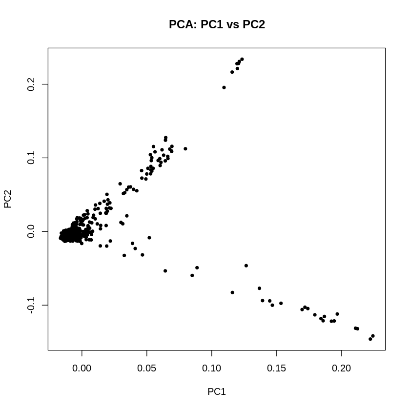
    


```R
# Read eigenvalues file
eigenval <- scan("pca_merge_all.eigenval")

# Calculate proportion variance explained per PC
var_exp <- eigenval / sum(eigenval) * 100

# Check first few variances
head(var_exp)
```


<style>
.list-inline {list-style: none; margin:0; padding: 0}
.list-inline>li {display: inline-block}
.list-inline>li:not(:last-child)::after {content: "\00b7"; padding: 0 .5ex}
</style>
<ol class=list-inline><li>40.5572796413688</li><li>17.728423982261</li><li>7.17262499488392</li><li>6.15001071367522</li><li>5.67045336902953</li><li>5.04132589555491</li></ol>


```R
metadata <- read.table("metadata.txt", header = TRUE, sep = "\t", stringsAsFactors = FALSE)
metadata$chip[metadata$chip == ""] <- "Unknown"
head(metadata)
colnames(metadata)
```


<table class="dataframe">
<caption>A data.frame: 6 × 6</caption>
<thead>
	<tr><th></th><th scope=col>user</th><th scope=col>build</th><th scope=col>chip</th><th scope=col>chip_version</th><th scope=col>inferred_sex</th><th scope=col>source</th></tr>
	<tr><th></th><th scope=col>&lt;chr&gt;</th><th scope=col>&lt;chr&gt;</th><th scope=col>&lt;chr&gt;</th><th scope=col>&lt;chr&gt;</th><th scope=col>&lt;chr&gt;</th><th scope=col>&lt;chr&gt;</th></tr>
</thead>
<tbody>
	<tr><th scope=row>1</th><td>10645</td><td>37</td><td>Unknown       </td><td>  </td><td>Female</td><td>AncestryDNA             </td></tr>
	<tr><th scope=row>2</th><td>10542</td><td>37</td><td>HTS iSelect HD</td><td>v4</td><td>Female</td><td>23andMe                 </td></tr>
	<tr><th scope=row>3</th><td>10653</td><td>37</td><td>Unknown       </td><td>  </td><td>Female</td><td>AncestryDNA, AncestryDNA</td></tr>
	<tr><th scope=row>4</th><td>10106</td><td>37</td><td>Unknown       </td><td>  </td><td>Female</td><td>AncestryDNA             </td></tr>
	<tr><th scope=row>5</th><td>10559</td><td>37</td><td>Illumina GSAs </td><td>v5</td><td>Male  </td><td>23andMe                 </td></tr>
	<tr><th scope=row>6</th><td>10828</td><td>37</td><td>Illumina GSAs </td><td>v5</td><td>Female</td><td>23andMe                 </td></tr>
</tbody>
</table>


<style>
.list-inline {list-style: none; margin:0; padding: 0}
.list-inline>li {display: inline-block}
.list-inline>li:not(:last-child)::after {content: "\00b7"; padding: 0 .5ex}
</style>
<ol class=list-inline><li>'user'</li><li>'build'</li><li>'chip'</li><li>'chip_version'</li><li>'inferred_sex'</li><li>'source'</li></ol>


```R
colnames(metadata) <- c("FID", "build", "chip", "chip_version", "inferred_sex", "source")
```


```R
pca_meta <- merge(pca, metadata, by = c("FID"))
head(pca_meta)
```


<table class="dataframe">
<caption>A data.frame: 6 × 17</caption>
<thead>
	<tr><th></th><th scope=col>FID</th><th scope=col>IID</th><th scope=col>PC1</th><th scope=col>PC2</th><th scope=col>PC3</th><th scope=col>PC4</th><th scope=col>PC5</th><th scope=col>PC6</th><th scope=col>PC7</th><th scope=col>PC8</th><th scope=col>PC9</th><th scope=col>PC10</th><th scope=col>build</th><th scope=col>chip</th><th scope=col>chip_version</th><th scope=col>inferred_sex</th><th scope=col>source</th></tr>
	<tr><th></th><th scope=col>&lt;int&gt;</th><th scope=col>&lt;int&gt;</th><th scope=col>&lt;dbl&gt;</th><th scope=col>&lt;dbl&gt;</th><th scope=col>&lt;dbl&gt;</th><th scope=col>&lt;dbl&gt;</th><th scope=col>&lt;dbl&gt;</th><th scope=col>&lt;dbl&gt;</th><th scope=col>&lt;dbl&gt;</th><th scope=col>&lt;dbl&gt;</th><th scope=col>&lt;dbl&gt;</th><th scope=col>&lt;dbl&gt;</th><th scope=col>&lt;chr&gt;</th><th scope=col>&lt;chr&gt;</th><th scope=col>&lt;chr&gt;</th><th scope=col>&lt;chr&gt;</th><th scope=col>&lt;chr&gt;</th></tr>
</thead>
<tbody>
	<tr><th scope=row>1</th><td> 8</td><td> 8</td><td>-0.00695248</td><td>-0.000978118</td><td>-0.01889710</td><td>-0.04086600</td><td>-0.00226661</td><td> 0.0351734</td><td>-0.000920792</td><td>-0.0516592</td><td>-0.02058380</td><td>-0.04031980</td><td>37</td><td>OmniExpress plus</td><td>v3</td><td>Female</td><td>23andMe     </td></tr>
	<tr><th scope=row>2</th><td>11</td><td>11</td><td> 0.00638909</td><td>-0.000885972</td><td>-0.06231530</td><td>-0.11414400</td><td>-0.02321030</td><td> 0.0664040</td><td>-0.011471100</td><td>-0.0501895</td><td> 0.04645120</td><td> 0.03766630</td><td>37</td><td>OmniExpress plus</td><td>v3</td><td>Male  </td><td>23andMe     </td></tr>
	<tr><th scope=row>3</th><td>14</td><td>14</td><td>-0.01231010</td><td>-0.004080500</td><td> 0.00722458</td><td> 0.00892257</td><td> 0.00432515</td><td>-0.0216232</td><td> 0.027711000</td><td> 0.0421512</td><td>-0.01365510</td><td>-0.02740390</td><td>37</td><td>Unknown         </td><td>  </td><td>Female</td><td>23andMe     </td></tr>
	<tr><th scope=row>4</th><td>16</td><td>16</td><td>-0.01386140</td><td>-0.002910680</td><td>-0.00355122</td><td> 0.01436510</td><td>-0.01112460</td><td> 0.0391532</td><td>-0.002504390</td><td>-0.0215492</td><td> 0.00324311</td><td> 0.02365200</td><td>37</td><td>HTS iSelect HD  </td><td>v4</td><td>Male  </td><td>23andMe     </td></tr>
	<tr><th scope=row>5</th><td>17</td><td>17</td><td>-0.01186810</td><td>-0.001851780</td><td> 0.01857800</td><td> 0.02757830</td><td>-0.00194662</td><td>-0.0217239</td><td>-0.013766200</td><td> 0.0398188</td><td>-0.02290460</td><td> 0.00213072</td><td>37</td><td>Unknown         </td><td>  </td><td>Female</td><td>23andMe     </td></tr>
	<tr><th scope=row>6</th><td>26</td><td>26</td><td>-0.00637205</td><td> 0.002338360</td><td> 0.01158400</td><td> 0.01872460</td><td> 0.01837330</td><td>-0.0293547</td><td>-0.005018150</td><td>-0.0169588</td><td> 0.01844180</td><td>-0.00944889</td><td>37</td><td>Unknown         </td><td>  </td><td>Male  </td><td>vcf, 23andMe</td></tr>
</tbody>
</table>

### PCA Plot Colored by Chip


```R
library(ggplot2)

ggplot(pca_meta, aes(x = PC1, y = PC2, color = chip)) +
  geom_point(alpha = 0.7, size = 2) +
  xlab(paste0("PC1 (", round(var_exp[1], 2), "% variance)")) +
  ylab(paste0("PC2 (", round(var_exp[2], 2), "% variance)")) +
  theme_minimal() +
  ggtitle("PCA Plot Colored by Chip") +
  theme(plot.title = element_text(hjust = 0.5))
```


    
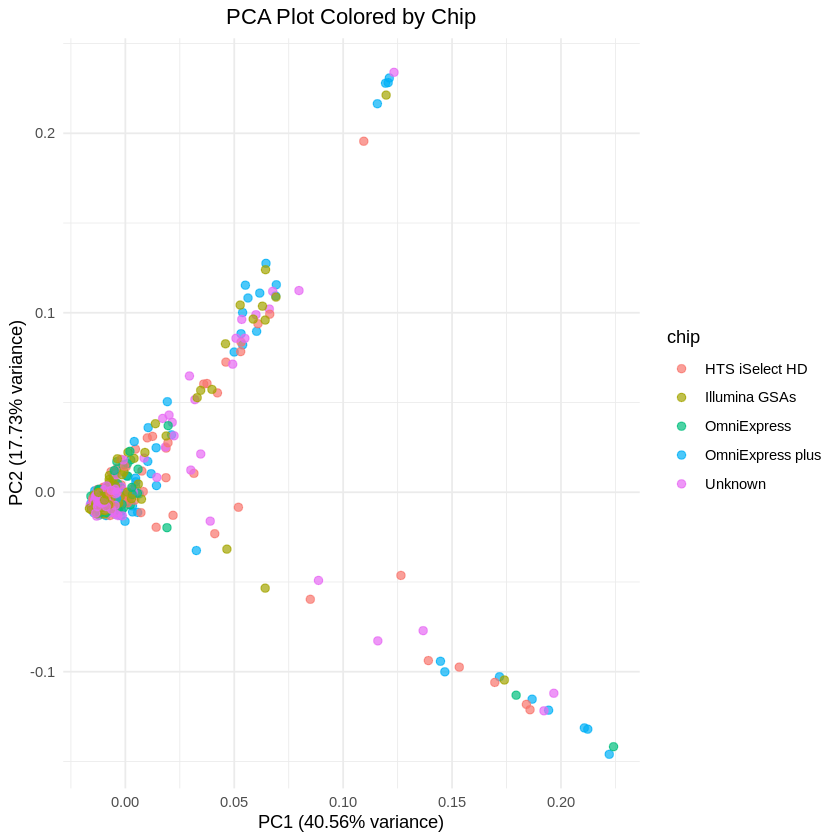
    

### PCA Plot Colored by Sex

```R
ggplot(pca_meta, aes(x = PC1, y = PC2, color = inferred_sex)) +
  geom_point(alpha = 0.7, size = 2) +
  xlab(paste0("PC1 (", round(var_exp[1], 2), "% variance)")) +
  ylab(paste0("PC2 (", round(var_exp[2], 2), "% variance)")) +
  theme_minimal() +
  ggtitle("PCA Plot Colored by Sex") +
  theme(plot.title = element_text(hjust = 0.5))
```


    
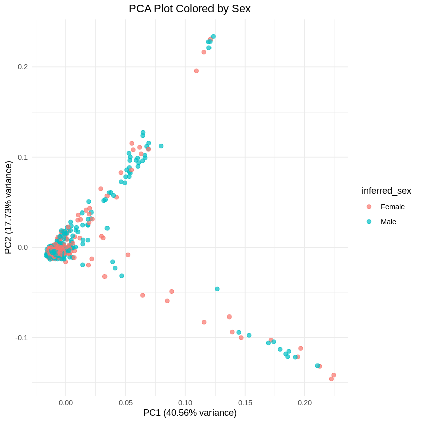
    


```R
phenotype <- read.table("height.txt", header = TRUE)
colnames(phenotype) <- c("FID", "Height")
pca_meta_pheno <- merge(pca_meta, phenotype, by = c("FID"))
head(pca_meta_pheno)
```


<table class="dataframe">
<caption>A data.frame: 6 × 18</caption>
<thead>
	<tr><th></th><th scope=col>FID</th><th scope=col>IID</th><th scope=col>PC1</th><th scope=col>PC2</th><th scope=col>PC3</th><th scope=col>PC4</th><th scope=col>PC5</th><th scope=col>PC6</th><th scope=col>PC7</th><th scope=col>PC8</th><th scope=col>PC9</th><th scope=col>PC10</th><th scope=col>build</th><th scope=col>chip</th><th scope=col>chip_version</th><th scope=col>inferred_sex</th><th scope=col>source</th><th scope=col>Height</th></tr>
	<tr><th></th><th scope=col>&lt;int&gt;</th><th scope=col>&lt;int&gt;</th><th scope=col>&lt;dbl&gt;</th><th scope=col>&lt;dbl&gt;</th><th scope=col>&lt;dbl&gt;</th><th scope=col>&lt;dbl&gt;</th><th scope=col>&lt;dbl&gt;</th><th scope=col>&lt;dbl&gt;</th><th scope=col>&lt;dbl&gt;</th><th scope=col>&lt;dbl&gt;</th><th scope=col>&lt;dbl&gt;</th><th scope=col>&lt;dbl&gt;</th><th scope=col>&lt;chr&gt;</th><th scope=col>&lt;chr&gt;</th><th scope=col>&lt;chr&gt;</th><th scope=col>&lt;chr&gt;</th><th scope=col>&lt;chr&gt;</th><th scope=col>&lt;dbl&gt;</th></tr>
</thead>
<tbody>
	<tr><th scope=row>1</th><td> 8</td><td> 8</td><td>-0.00695248</td><td>-0.000978118</td><td>-0.01889710</td><td>-0.04086600</td><td>-0.00226661</td><td> 0.0351734</td><td>-0.000920792</td><td>-0.0516592</td><td>-0.02058380</td><td>-0.04031980</td><td>37</td><td>OmniExpress plus</td><td>v3</td><td>Female</td><td>23andMe     </td><td>171.00</td></tr>
	<tr><th scope=row>2</th><td>11</td><td>11</td><td> 0.00638909</td><td>-0.000885972</td><td>-0.06231530</td><td>-0.11414400</td><td>-0.02321030</td><td> 0.0664040</td><td>-0.011471100</td><td>-0.0501895</td><td> 0.04645120</td><td> 0.03766630</td><td>37</td><td>OmniExpress plus</td><td>v3</td><td>Male  </td><td>23andMe     </td><td>177.80</td></tr>
	<tr><th scope=row>3</th><td>14</td><td>14</td><td>-0.01231010</td><td>-0.004080500</td><td> 0.00722458</td><td> 0.00892257</td><td> 0.00432515</td><td>-0.0216232</td><td> 0.027711000</td><td> 0.0421512</td><td>-0.01365510</td><td>-0.02740390</td><td>37</td><td>Unknown         </td><td>  </td><td>Female</td><td>23andMe     </td><td>155.00</td></tr>
	<tr><th scope=row>4</th><td>16</td><td>16</td><td>-0.01386140</td><td>-0.002910680</td><td>-0.00355122</td><td> 0.01436510</td><td>-0.01112460</td><td> 0.0391532</td><td>-0.002504390</td><td>-0.0215492</td><td> 0.00324311</td><td> 0.02365200</td><td>37</td><td>HTS iSelect HD  </td><td>v4</td><td>Male  </td><td>23andMe     </td><td>183.00</td></tr>
	<tr><th scope=row>5</th><td>17</td><td>17</td><td>-0.01186810</td><td>-0.001851780</td><td> 0.01857800</td><td> 0.02757830</td><td>-0.00194662</td><td>-0.0217239</td><td>-0.013766200</td><td> 0.0398188</td><td>-0.02290460</td><td> 0.00213072</td><td>37</td><td>Unknown         </td><td>  </td><td>Female</td><td>23andMe     </td><td>172.72</td></tr>
	<tr><th scope=row>6</th><td>26</td><td>26</td><td>-0.00637205</td><td> 0.002338360</td><td> 0.01158400</td><td> 0.01872460</td><td> 0.01837330</td><td>-0.0293547</td><td>-0.005018150</td><td>-0.0169588</td><td> 0.01844180</td><td>-0.00944889</td><td>37</td><td>Unknown         </td><td>  </td><td>Male  </td><td>vcf, 23andMe</td><td>188.00</td></tr>
</tbody>
</table>


### adjusting height to bins for visualisation

```R
pca_meta_pheno$Height_bin <- cut(
  pca_meta_pheno$Height,
  breaks = seq(140, 200, by = 10),  # Adjust as needed
  right = FALSE,
  labels = paste0(seq(140, 190, by = 10), "-", seq(149, 199, by = 10))
)
```
### PCA Plot Colored by Height

```R
ggplot(pca_meta_pheno, aes(x = PC1, y = PC2, color = Height_bin)) +
  geom_point(alpha = 0.7, size = 2) +
  xlab(paste0("PC1 (", round(var_exp[1], 2), "% variance)")) +
  ylab(paste0("PC2 (", round(var_exp[2], 2), "% variance)")) +
  theme_minimal() +
  ggtitle("PCA Plot Colored by Height") +
  theme(plot.title = element_text(hjust = 0.5))
```


    
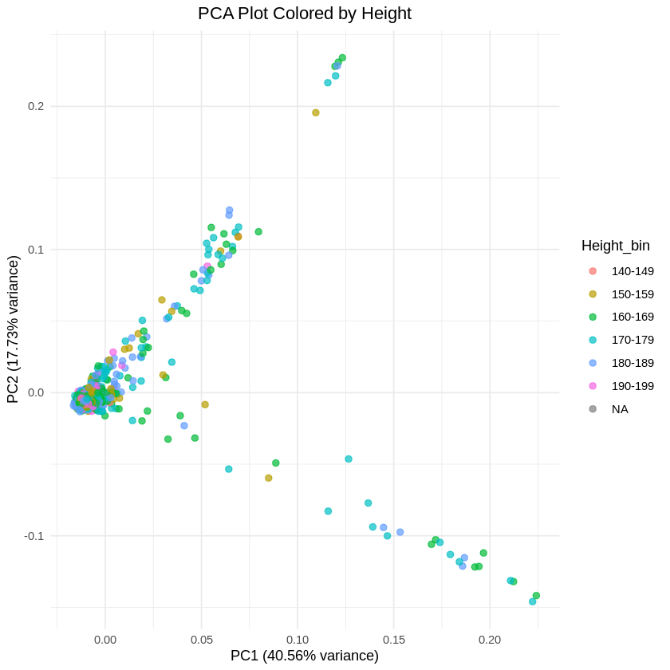
    


### Including 1-10 PCs in the covariates.txt

```R
pca <- read.table("pca_merge_all.eigenvec", header=FALSE)
colnames(pca) <- c("FID", "IID", paste0("PC", 1:10))

covar <- merge(covar, pca, by=c("FID", "IID"))
write.table(covar, "covariates.txt", quote=FALSE, row.names=FALSE, col.names=TRUE)

```
# GWAS

```R
plink --bfile merge_all \
  --pheno phenotype.txt \
  --covar covariates.txt \
  --covar-name SEX PC1 PC2 PC3 PC4 PC5 \
  --linear \
  --out gwas_with_pcs

```
### QQ and Manhattan plot

```R
# Load GWAS results
gwas <- read.table("gwas_with_pcs.assoc.linear", header=TRUE)

# Filter only additive model (skip interactions, etc.)
gwas <- subset(gwas, TEST == "ADD")

# Remove NA p-values
gwas <- gwas[!is.na(gwas$P), ]

# Compute expected p-values
gwas <- gwas[order(gwas$P), ]
gwas$expected <- -log10(ppoints(nrow(gwas)))
gwas$observed <- -log10(gwas$P)

# QQ Plot
plot(gwas$expected, gwas$observed, pch=20, col="blue",
     xlab=expression(Expected~~-log[10](P)),
     ylab=expression(Observed~~-log[10](P)),
     main="QQ Plot")
abline(0, 1, col="red")

```


    
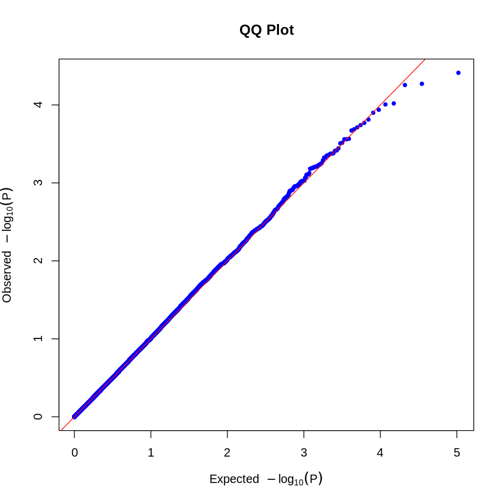
    


```R
# Prepare data
gwas$CHR <- as.numeric(gwas$CHR)
gwas$BP <- as.numeric(gwas$BP)

# Remove NAs and sort
gwas <- gwas[!is.na(gwas$CHR) & !is.na(gwas$BP), ]

# Manhattan Plot
library(qqman)
manhattan(gwas, chr="CHR", bp="BP", snp="SNP", p="P",
          genomewideline=-log10(5e-8), suggestiveline=-log10(1e-5),
          main="Manhattan Plot (Model 2)")

```


    
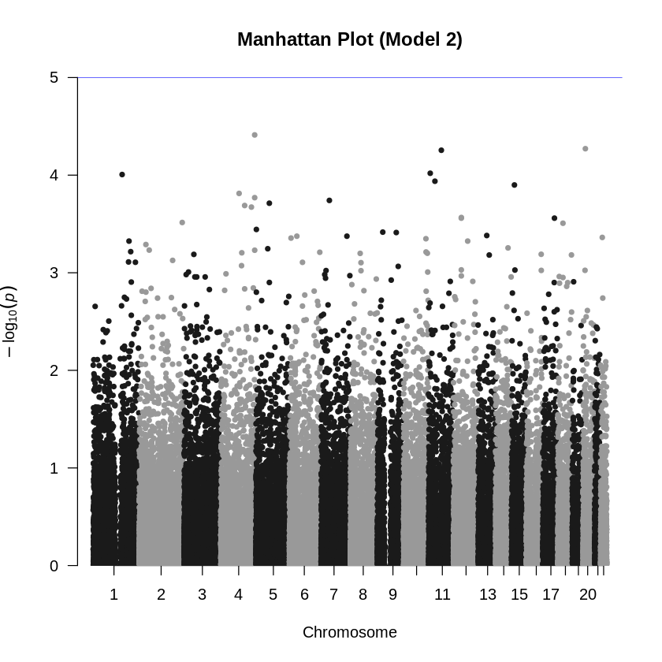
    

### inflation factor analysis

Lambda GC (Genomic Control inflation factor)to check whether your test statistics are inflated, which could indicate population stratification, cryptic relatedness, or other biases.


```R
# Convert p-values to chi-squared stats (df=1)
gwas$chisq <- qchisq(1 - gwas$P, df=1)

# Compute lambda GC
lambda_gc <- median(gwas$chisq, na.rm=TRUE) / 0.456
cat("Lambda GC:", round(lambda_gc, 3), "\n")

```

    Lambda GC: 0.998 


### Repeat GWAS without PCs as covariates (Model 1)


```R
plink --bfile merge_all \
  --pheno phenotype.txt \
  --covar covariates.txt \
  --covar-name SEX \
  --linear \
  --out gwas_height_with_sex_only

```


```R
# Load GWAS results
gwas <- read.table("gwas_height_with_sex_only.assoc.linear", header=TRUE)

# Filter only additive model (skip interactions, etc.)
gwas <- subset(gwas, TEST == "ADD")

# Remove NA p-values
gwas <- gwas[!is.na(gwas$P), ]

# Compute expected p-values
gwas <- gwas[order(gwas$P), ]
gwas$expected <- -log10(ppoints(nrow(gwas)))
gwas$observed <- -log10(gwas$P)

# QQ Plot
plot(gwas$expected, gwas$observed, pch=20, col="blue",
     xlab=expression(Expected~~-log[10](P)),
     ylab=expression(Observed~~-log[10](P)),
     main="QQ Plot (Model 1)")
abline(0, 1, col="red")
```


    
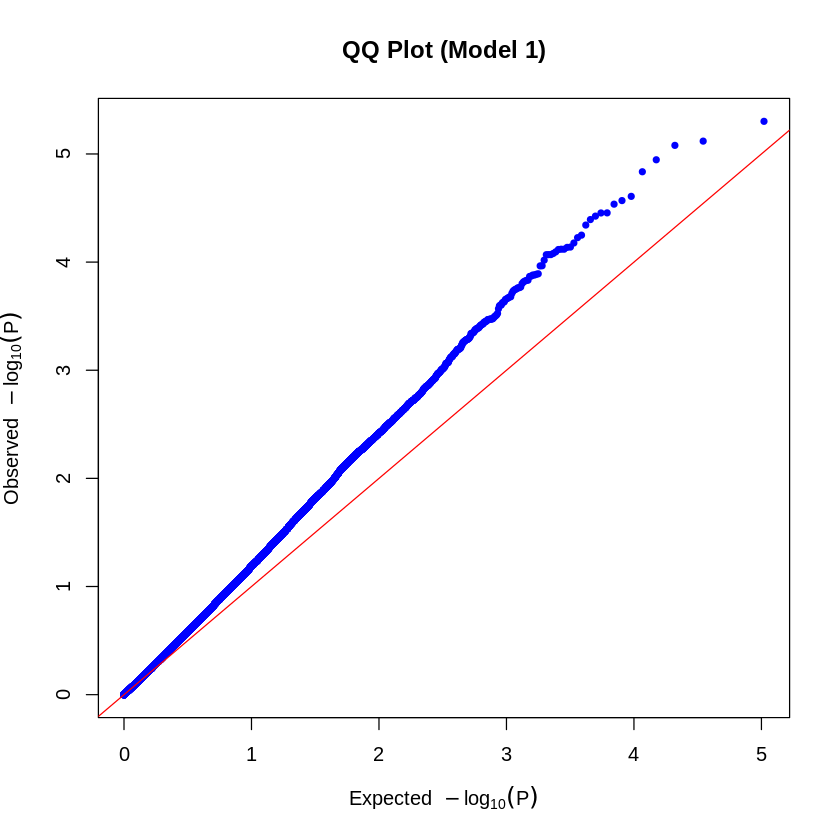
    


```R
# Prepare data
gwas$CHR <- as.numeric(gwas$CHR)
gwas$BP <- as.numeric(gwas$BP)

# Remove NAs and sort
gwas <- gwas[!is.na(gwas$CHR) & !is.na(gwas$BP), ]

# Manhattan Plot
library(qqman)
manhattan(gwas, chr="CHR", bp="BP", snp="SNP", p="P",
          genomewideline=-log10(5e-8), suggestiveline=-log10(1e-5),
          main="Manhattan Plot (Model 1)")

```


    
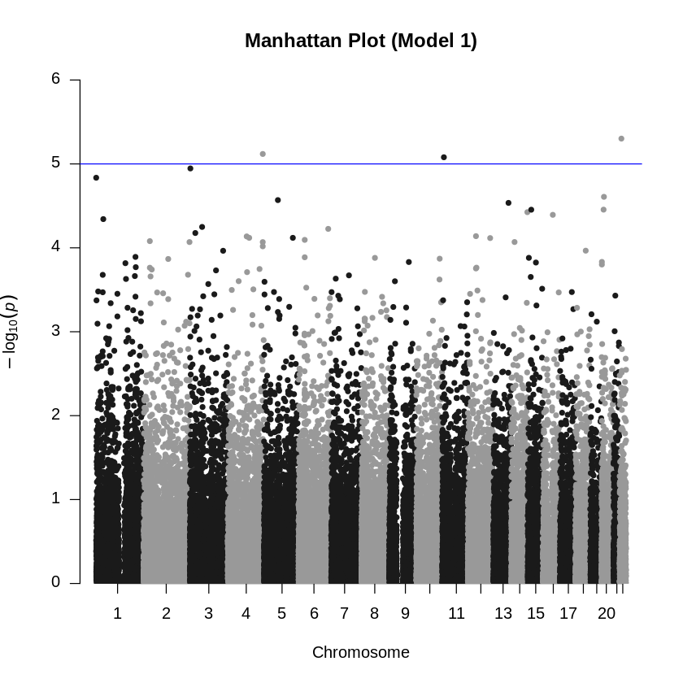
    


```R
# Convert p-values to chi-squared stats (df=1)
gwas$chisq <- qchisq(1 - gwas$P, df=1)

# Compute lambda GC
lambda_gc <- median(gwas$chisq, na.rm=TRUE) / 0.456
cat("Lambda GC:", round(lambda_gc, 3), "\n")

```

    Lambda GC: 1.232 


