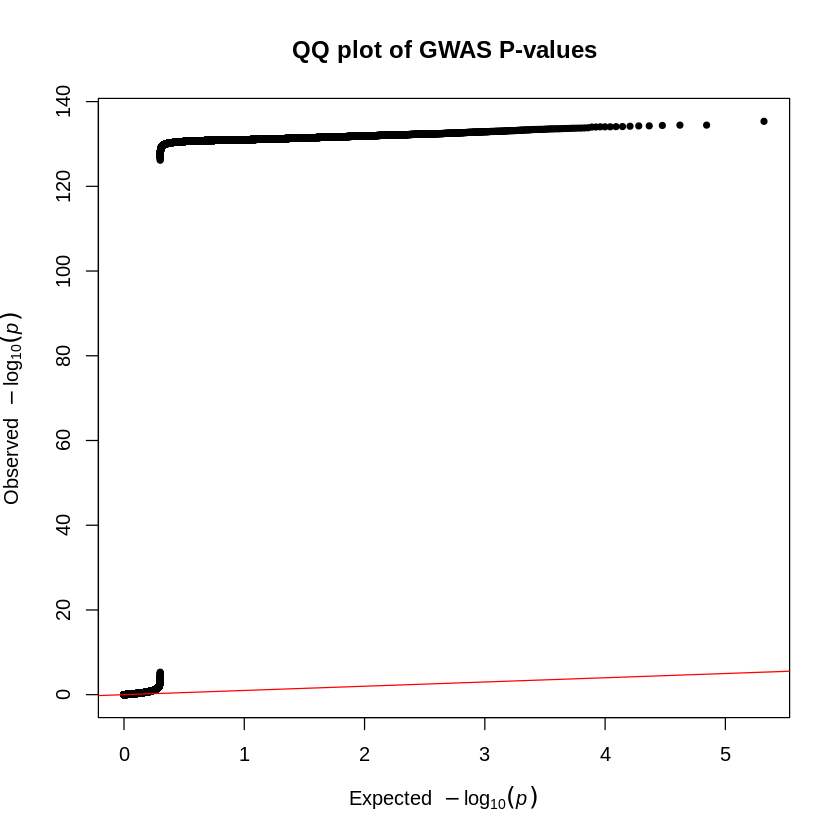

# Workflow of GWAS project

## 1. QC

### Filtering bfiles to only contain IDs with phenotypic data


```R
awk '{print $1, $1}' height.txt > keep_height_ids.txt
plink --bfile gwas_data --keep keep_height_ids.txt --make-bed --out gwas_data_height
#1376653 variants and 1071 people pass filters and QC.
```

### Filtering the height_metadata.txt and filtering by chip


```R
awk '{print $1}' height.txt > keep_height_ids_onecolumn.txt
awk 'NR==FNR {ids[$1]; next} $1 in ids' keep_height_ids_onecolumn.txt metadata.txt > metadata_height.txt
wc -l metadata_height.txt
#1071 metadata_height.txt
```


```R
metadata <- read.table("metadata_height.txt", header = FALSE, sep = "\t", stringsAsFactors = FALSE)
print(metadata)
```

            V1 V2               V3 V4     V5
    1    10542 37   HTS iSelect HD v4 Female
    2    10653 37                     Female
    3    10559 37    Illumina GSAs v5   Male
    4     1100 37 OmniExpress plus v3   Male
    5     1033 37 OmniExpress plus v3   Male
    6    10383 37                       Male
    7    10448 37                     Female
    8    10093 37                       Male
    9    10790 37                       Male
    10   10936 37                       Male
    11   10635 37                     Female
    12   11076 37   HTS iSelect HD v4 Female
    13   10348 37                       Male
    14    1079 37 OmniExpress plus v3 Female
    15    1071 37 OmniExpress plus v3   Male
    16   10074 37    Illumina GSAs v5 Female
    17   10171 37    Illumina GSAs v5   Male
    18   10347 37                       Male
    19    1103 37 OmniExpress plus v3 Female
    20    1084 37      OmniExpress          
    21    1029 37 OmniExpress plus v3 Female
    22    1094 37 OmniExpress plus v3   Male
    23   10785 37                     Female
    24    1040 37 OmniExpress plus v3   Male
    25   10868 37    Illumina GSAs v5 Female
    26   10962 37                     Female
    27    1046 37 OmniExpress plus v3   Male
    28   10530 37                       Male
    29   10977 37      OmniExpress v1 Female
    30   10881 37      OmniExpress      Male
    31    1039 37 OmniExpress plus v3   Male
    32   10279 37    Illumina GSAs v5 Female
    33    1060 37 OmniExpress plus v3   Male
    34   10195 37    Illumina GSAs v5 Female
    35    1035 37      OmniExpress v1 Female
    36    1081 37 OmniExpress plus v3 Female
    37   10408 37   HTS iSelect HD v4 Female
    38   10302 37    Illumina GSAs v5 Female
    39   11053 37                       Male
    40   10885 37    Illumina GSAs v5   Male
    41    1085 37 OmniExpress plus v3   Male
    42    1078 37      OmniExpress v1 Female
    43   10523 37    Illumina GSAs v5   Male
    44   10424 37                     Female
    45   10620 37    Illumina GSAs v5 Female
    46   10092 37   HTS iSelect HD v4   Male
    47   10508 37      OmniExpress v1 Female
    48    1020 37 OmniExpress plus v3   Male
    49   10325 37    Illumina GSAs v5 Female
    50   10251 37 OmniExpress plus v3 Female
    51   10430 37                     Female
    52      11 37 OmniExpress plus v3   Male
    53   10984 37                       Male
    54    1010 37                       Male
    55   10883 37                     Female
    56   11015 37   HTS iSelect HD v4 Female
    57    1074 37      OmniExpress v1 Female
    58   10374 37 OmniExpress plus v3 Female
    59   10233 37    Illumina GSAs v5   Male
    60   10097 37                     Female
    61   10702 37    Illumina GSAs v5 Female
    62    1022 37 OmniExpress plus v3   Male
    63    1080 37 OmniExpress plus v3 Female
    64    1038 37 OmniExpress plus v3 Female
    65   10036 37                       Male
    66   10770 37    Illumina GSAs v5 Female
    67   10632 37                       Male
    68   10773 37                       Male
    69   10919 37    Illumina GSAs      Male
    70   10077 37    Illumina GSAs v5 Female
    71   10575 37                     Female
    72   10586 37                       Male
    73   10490 37                     Female
    74    1063 37 OmniExpress plus v3   Male
    75   10191 37    Illumina GSAs v5   Male
    76   10207 37    Illumina GSAs v5   Male
    77    1058 37 OmniExpress plus v3 Female
    78    1089 37 OmniExpress plus v3 Female
    79    1077 37 OmniExpress plus v3   Male
    80   10020 37    Illumina GSAs v5   Male
    81    1059 37                           
    82    1104 37 OmniExpress plus v3 Female
    83   10967 37    Illumina GSAs v5 Female
    84   10260 37                     Female
    85    1075 37 OmniExpress plus v3 Female
    86   11069 37                     Female
    87     141 37 OmniExpress plus v3   Male
    88    1193 37 OmniExpress plus v3 Female
    89   11753 37                       Male
    90   11531 37                       Male
    91   11795 37                     Female
    92    1165 37 OmniExpress plus v3 Female
    93    1325 37 OmniExpress plus v3 Female
    94    1221 37 OmniExpress plus v3   Male
    95   11562 37                       Male
    96   11493 37   HTS iSelect HD v4 Female
    97     139 37 OmniExpress plus v3   Male
    98    1131 37 OmniExpress plus v3 Female
    99   11135 37                     Female
    100   1290 37 OmniExpress plus v3   Male
    101   1201 37 OmniExpress plus v3 Female
    102   1470 37 OmniExpress plus v3   Male
    103   1459 37 OmniExpress plus v3 Female
    104   1288 37 OmniExpress plus v3 Female
    105   1465 37 OmniExpress plus v3 Female
    106   1390 37 OmniExpress plus v3 Female
    107   1403 37                           
    108   1112 37 OmniExpress plus v3   Male
    109  11441 37    Illumina GSAs v5 Female
    110    137 37 OmniExpress plus v3   Male
    111  11519 37      OmniExpress v1 Female
    112   1472 37                           
    113  11739 37                     Female
    114   1227 37 OmniExpress plus v3   Male
    115   1192 37 OmniExpress plus v3 Female
    116  11526 37                     Female
    117  11388 37    Illumina GSAs v5 Female
    118   1409 37 OmniExpress plus v3   Male
    119   1379 37 OmniExpress plus v3 Female
    120   1447 37 OmniExpress plus v3 Female
    121   1213 37 OmniExpress plus v3 Female
    122     14 37                     Female
    123   1235 37 OmniExpress plus v3 Female
    124  11520 37                           
    125   1384 37 OmniExpress plus v3   Male
    126  11819 37    Illumina GSAs v5 Female
    127  11458 37                     Female
    128  11515 37                     Female
    129  11698 37    Illumina GSAs v5   Male
    130   1366 37 OmniExpress plus v3 Female
    131   1499 37 OmniExpress plus v3 Female
    132  11641 37                       Male
    133   1125 37 OmniExpress plus v3   Male
    134  11584 37                     Female
    135   1171 37 OmniExpress plus v3 Female
    136   1378 37   HTS iSelect HD v4 Female
    137   1258 37 OmniExpress plus v3   Male
    138  11432 37                       Male
    139   1375 37 OmniExpress plus v3 Female
    140  11425 37    Illumina GSAs v5 Female
    141   1190 37 OmniExpress plus v3 Female
    142   1121 37 OmniExpress plus v3 Female
    143  11525 37                       Male
    144   1392 37 OmniExpress plus v3 Female
    145   1172 37 OmniExpress plus v3 Female
    146   1233 37 OmniExpress plus v3 Female
    147    146 37 OmniExpress plus v3   Male
    148   1412 37 OmniExpress plus v3 Female
    149  11143 37                     Female
    150    123 37 OmniExpress plus v3   Male
    151   1163 37 OmniExpress plus v3   Male
    152  11528 37                       Male
    153  11397 37                     Female
    154   1147 37 OmniExpress plus v3   Male
    155   1215 37 OmniExpress plus v3 Female
    156   1114 37 OmniExpress plus v3   Male
    157  11802 37    Illumina GSAs v5   Male
    158  11396 37                     Female
    159  11744 37                           
    160   1312 37 OmniExpress plus v3   Male
    161   1196 37 OmniExpress plus v3   Male
    162   1382 37 OmniExpress plus v3 Female
    163   1491 37      OmniExpress          
    164   1269 37 OmniExpress plus v3 Female
    165  11499 37                     Female
    166   1173 37 OmniExpress plus v3 Female
    167   1718 37   HTS iSelect HD v4   Male
    168   1503 37   HTS iSelect HD v4 Female
    169   1525 37   HTS iSelect HD v4   Male
    170   1952 37   HTS iSelect HD v4   Male
    171   1759 37   HTS iSelect HD v4 Female
    172   1964 37      OmniExpress      Male
    173   1561 37      OmniExpress          
    174   1764 37 OmniExpress plus v3   Male
    175   1785 37   HTS iSelect HD v4 Female
    176   1647 37      OmniExpress v1 Female
    177   1996 37 OmniExpress plus v3 Female
    178    160 37 OmniExpress plus v3 Female
    179   1627 37   HTS iSelect HD v4   Male
    180   1980 37 OmniExpress plus v3   Male
    181   1641 37   HTS iSelect HD v4   Male
    182   1514 37   HTS iSelect HD v4   Male
    183   1599 37      OmniExpress          
    184   1712 37 OmniExpress plus v3 Female
    185   1738 37                           
    186   1984 37 OmniExpress plus v3 Female
    187   1678 37 OmniExpress plus v3 Female
    188   1871 37                     Female
    189    159 37 OmniExpress plus v3 Female
    190   2008 37   HTS iSelect HD v4 Female
    191   1987 37 OmniExpress plus v3   Male
    192   2000 37   HTS iSelect HD v4 Female
    193   1566 37 OmniExpress plus v3   Male
    194   1777 37   HTS iSelect HD v4   Male
    195   1970 37   HTS iSelect HD v4 Female
    196   1578 37   HTS iSelect HD v4   Male
    197   1742 37 OmniExpress plus v3 Female
    198    154 37 OmniExpress plus v3   Male
    199   1968 37 OmniExpress plus v3 Female
    200    180 37                       Male
    201     16 37   HTS iSelect HD v4   Male
    202   1825 37 OmniExpress plus v3   Male
    203   2004 37   HTS iSelect HD v4 Female
    204   1879 37   HTS iSelect HD v4   Male
    205   1985 37 OmniExpress plus v3   Male
    206   1848 37 OmniExpress plus v3   Male
    207    177 37 OmniExpress plus v3   Male
    208   1691 37      OmniExpress v1   Male
    209   1686 37   HTS iSelect HD v4   Male
    210   1735 37      OmniExpress          
    211   1737 37      OmniExpress v1 Female
    212   1887 37   HTS iSelect HD v4   Male
    213   2013 37   HTS iSelect HD v4   Male
    214   1833 37   HTS iSelect HD v4 Female
    215    187 37                       Male
    216    199 37 OmniExpress plus v3   Male
    217     17 37                     Female
    218   2362 37   HTS iSelect HD v4   Male
    219   2106 37 OmniExpress plus v3   Male
    220   2099 37   HTS iSelect HD v4 Female
    221   2456 37 OmniExpress plus v3   Male
    222   2076 37   HTS iSelect HD v4   Male
    223   2385 37 OmniExpress plus v3   Male
    224   2393 37      OmniExpress v1   Male
    225   2645 37   HTS iSelect HD v4   Male
    226   2516 37 OmniExpress plus v3 Female
    227   2455 37   HTS iSelect HD v4 Female
    228   2288 37 OmniExpress plus v3   Male
    229   2214 37 OmniExpress plus v3   Male
    230   2498 37 OmniExpress plus v3   Male
    231     26 37                       Male
    232   2238 37 OmniExpress plus v3   Male
    233   2635 37   HTS iSelect HD v4 Female
    234   2512 37 OmniExpress plus v3 Female
    235    216 37 OmniExpress plus v3   Male
    236   2189 37   HTS iSelect HD v4   Male
    237   2070 37                           
    238   2050 37 OmniExpress plus v3 Female
    239    266 37 OmniExpress plus v3   Male
    240   2616 37   HTS iSelect HD v4   Male
    241   2570 37   HTS iSelect HD v4   Male
    242   2166 37   HTS iSelect HD v4 Female
    243   2207 37      OmniExpress v1   Male
    244   2402 37   HTS iSelect HD v4   Male
    245    258 37 OmniExpress plus v3   Male
    246   2034 37   HTS iSelect HD v4 Female
    247   2307 37 OmniExpress plus v3 Female
    248   2676 37 OmniExpress plus v3   Male
    249   2153 37 OmniExpress plus v3   Male
    250    203 37      OmniExpress          
    251    251 37 OmniExpress plus v3 Female
    252   2457 37   HTS iSelect HD v4   Male
    253   2075 37   HTS iSelect HD v4 Female
    254   2399 37   HTS iSelect HD v4 Female
    255   2557 37   HTS iSelect HD v4   Male
    256   2692 37   HTS iSelect HD v4   Male
    257   2274 37                       Male
    258   2293 37 OmniExpress plus v3 Female
    259   2421 37   HTS iSelect HD v4   Male
    260   2358 37      OmniExpress v1 Female
    261    241 37 OmniExpress plus v3   Male
    262   2023 37 OmniExpress plus v3 Female
    263   2506 37      OmniExpress          
    264   2662 37                           
    265   2151 37 OmniExpress plus v3   Male
    266   2276 37   HTS iSelect HD v4 Female
    267   2356 37   HTS iSelect HD v4 Female
    268   2504 37 OmniExpress plus v3   Male
    269   2291 37   HTS iSelect HD v4   Male
    270   2225 37   HTS iSelect HD v4 Female
    271   2052 37   HTS iSelect HD v4 Female
    272    268 37 OmniExpress plus v3 Female
    273   2279 37   HTS iSelect HD v4   Male
    274   2574 37      OmniExpress v1   Male
    275   2571 37      OmniExpress v1 Female
    276   2699 37   HTS iSelect HD v4   Male
    277   2159 37   HTS iSelect HD v4 Female
    278   2576 37   HTS iSelect HD v4 Female
    279   2673 37      OmniExpress v1   Male
    280   2158 37 OmniExpress plus v3 Female
    281   2361 37   HTS iSelect HD v4 Female
    282   2636 37      OmniExpress v1 Female
    283   2535 37   HTS iSelect HD v4   Male
    284   2177 37   HTS iSelect HD v4   Male
    285   2568 37   HTS iSelect HD v4   Male
    286   2101 37      OmniExpress v1   Male
    287    262 37                       Male
    288   2406 37   HTS iSelect HD v4   Male
    289   2297 37   HTS iSelect HD v4 Female
    290   2660 37                       Male
    291   2412 37 OmniExpress plus v3 Female
    292   2314 37   HTS iSelect HD v4 Female
    293   2202 37   HTS iSelect HD v4 Female
    294    328 37 OmniExpress plus v3   Male
    295   3267 37      OmniExpress          
    296   2760 37 OmniExpress plus v3 Female
    297   3341 37 OmniExpress plus v3 Female
    298   2849 37 OmniExpress plus v3   Male
    299    276 37 OmniExpress plus v3   Male
    300   3257 37   HTS iSelect HD v4   Male
    301     33 37 OmniExpress plus v3   Male
    302   3227 37 OmniExpress plus v3   Male
    303   3326 37   HTS iSelect HD v4 Female
    304   2890 37 OmniExpress plus v3   Male
    305    295 37 OmniExpress plus v3   Male
    306   2705 37      OmniExpress          
    307   2755 37   HTS iSelect HD v4 Female
    308   3303 37      OmniExpress          
    309   2971 37 OmniExpress plus v3 Female
    310   2887 37   HTS iSelect HD v4   Male
    311    325 37 OmniExpress plus v3   Male
    312   2881 37 OmniExpress plus v3   Male
    313    330 37 OmniExpress plus v3   Male
    314   3170 37 OmniExpress plus v3   Male
    315   3080 37   HTS iSelect HD v4 Female
    316   3068 37      OmniExpress          
    317   2746 37                       Male
    318   3192 37                           
    319    319 37 OmniExpress plus v3 Female
    320   2759 37   HTS iSelect HD v4   Male
    321   2797 37   HTS iSelect HD v4   Male
    322   2732 37      OmniExpress          
    323   3122 37   HTS iSelect HD v4   Male
    324   2983 37 OmniExpress plus v3 Female
    325   3124 37      OmniExpress v1   Male
    326    279 37 OmniExpress plus v3 Female
    327   3321 37   HTS iSelect HD v4 Female
    328   3196 37   HTS iSelect HD v4 Female
    329   3186 37 OmniExpress plus v3   Male
    330   2964 37   HTS iSelect HD v4 Female
    331   2969 37 OmniExpress plus v3 Female
    332   3158 37 OmniExpress plus v3 Female
    333   2953 37      OmniExpress          
    334   2707 37 OmniExpress plus v3   Male
    335   3046 37   HTS iSelect HD v4 Female
    336   3140 37   HTS iSelect HD v4 Female
    337   2708 37      OmniExpress v1   Male
    338   3015 37      OmniExpress v1   Male
    339   2858 37   HTS iSelect HD v4 Female
    340    305 37 OmniExpress plus v3   Male
    341   3211 37 OmniExpress plus v3   Male
    342   2839 37      OmniExpress          
    343   2901 37   HTS iSelect HD v4   Male
    344   3289 37   HTS iSelect HD v4 Female
    345   3025 37      OmniExpress v1 Female
    346    285 37 OmniExpress plus v3   Male
    347   3064 37   HTS iSelect HD v4   Male
    348    288 37 OmniExpress plus v3 Female
    349   3280 37 OmniExpress plus v3 Female
    350   3275 37   HTS iSelect HD v4   Male
    351   3050 37      OmniExpress v1   Male
    352   2715 37      OmniExpress v1 Female
    353   3364 37   HTS iSelect HD v4 Female
    354   3343 37 OmniExpress plus v3 Female
    355   3018 37   HTS iSelect HD v4   Male
    356   3277 37      OmniExpress v1 Female
    357   3265 37   HTS iSelect HD v4   Male
    358   2720 37   HTS iSelect HD v4 Female
    359   2907 37   HTS iSelect HD v4   Male
    360   2841 37   HTS iSelect HD v4 Female
    361   2758 37   HTS iSelect HD v4   Male
    362   2928 37      OmniExpress          
    363   3145 37   HTS iSelect HD v4 Female
    364   3167 37   HTS iSelect HD v4   Male
    365   2912 37   HTS iSelect HD v4   Male
    366    294 37 OmniExpress plus v3   Male
    367   2850 37   HTS iSelect HD v4 Female
    368   3130 37                       Male
    369   3306 37   HTS iSelect HD v4   Male
    370   2874 37   HTS iSelect HD v4   Male
    371   3034 37   HTS iSelect HD v4 Female
    372   3317 37   HTS iSelect HD v4   Male
    373   2966 37   HTS iSelect HD v4 Female
    374   2826 37   HTS iSelect HD v4   Male
    375   3179 37 OmniExpress plus v3 Female
    376   2903 37   HTS iSelect HD v4 Female
    377   3881 37   HTS iSelect HD v4 Female
    378   3733 37      OmniExpress v1   Male
    379   3667 37   HTS iSelect HD v4   Male
    380   3865 37   HTS iSelect HD v4 Female
    381   3395 37 OmniExpress plus v3   Male
    382   3478 37   HTS iSelect HD v4 Female
    383    337 37 OmniExpress plus v3   Male
    384   3957 37      OmniExpress v1   Male
    385   3422 37   HTS iSelect HD v4 Female
    386   3459 37      OmniExpress v1 Female
    387   3777 37   HTS iSelect HD v4   Male
    388   3532 37   HTS iSelect HD v4 Female
    389   3581 37   HTS iSelect HD v4 Female
    390   3912 37   HTS iSelect HD v4 Female
    391   3680 37   HTS iSelect HD v4   Male
    392   3730 37   HTS iSelect HD v4   Male
    393    366 37 OmniExpress plus v3   Male
    394   3858 37      OmniExpress v1 Female
    395   3834 37   HTS iSelect HD v4   Male
    396   3974 37   HTS iSelect HD v4 Female
    397   3923 37 OmniExpress plus v3 Female
    398   3622 37   HTS iSelect HD v4 Female
    399   3381 37   HTS iSelect HD v4   Male
    400   3964 37   HTS iSelect HD v4   Male
    401   3682 37   HTS iSelect HD v4   Male
    402   3882 37   HTS iSelect HD v4   Male
    403   3547 37   HTS iSelect HD    Female
    404    339 37      OmniExpress      Male
    405   3799 37 OmniExpress plus v3   Male
    406   4012 37                           
    407   3582 37   HTS iSelect HD v4 Female
    408   3486 37   HTS iSelect HD v4 Female
    409    397 37 OmniExpress plus v3   Male
    410   3672 37      OmniExpress v1 Female
    411   3952 37      OmniExpress          
    412   3671 37      OmniExpress v1 Female
    413   3934 37   HTS iSelect HD v4   Male
    414   3370 37                           
    415   3571 37      OmniExpress v1 Female
    416    347 37 OmniExpress plus v3 Female
    417    345 37 OmniExpress plus v3 Female
    418   3495 37   HTS iSelect HD v4 Female
    419   3987 37   HTS iSelect HD v4   Male
    420   3531 37 OmniExpress plus v3 Female
    421   3626 37      OmniExpress v1 Female
    422   3866 37   HTS iSelect HD v4   Male
    423   3639 37   HTS iSelect HD v4 Female
    424   3689 37   HTS iSelect HD v4 Female
    425   3802 37   HTS iSelect HD v4   Male
    426   3749 37   HTS iSelect HD v4   Male
    427   3948 37   HTS iSelect HD v4   Male
    428    357 37 OmniExpress plus v3   Male
    429   3990 37   HTS iSelect HD v4 Female
    430   4009 37   HTS iSelect HD v4   Male
    431   3415 37 OmniExpress plus v3   Male
    432   3862 37   HTS iSelect HD v4   Male
    433   3660 37      OmniExpress v1 Female
    434   3688 37      OmniExpress v1 Female
    435   3992 37   HTS iSelect HD v4   Male
    436   3998 37                           
    437   3695 37   HTS iSelect HD v4 Female
    438   3767 37      OmniExpress v1 Female
    439   3642 37   HTS iSelect HD v4   Male
    440   3913 37   HTS iSelect HD v4 Female
    441   3397 37      OmniExpress      Male
    442   3751 37      OmniExpress      Male
    443     40 37 OmniExpress plus v3   Male
    444    380 37 OmniExpress plus v3   Male
    445   3886 37      OmniExpress v1 Female
    446   3922 37   HTS iSelect HD v4 Female
    447   3821 37   HTS iSelect HD v4   Male
    448    341 37 OmniExpress plus v3 Female
    449   3942 37                       Male
    450     35 37                       Male
    451   3885 37      OmniExpress v1 Female
    452   3867 37   HTS iSelect HD v4 Female
    453   4614 37      OmniExpress v1   Male
    454   4460 37      OmniExpress v1 Female
    455    466 37 OmniExpress plus v3   Male
    456   4130 37   HTS iSelect HD v4 Female
    457   4372 37   HTS iSelect HD v4   Male
    458   4018 37   HTS iSelect HD v4 Female
    459   4021 37      OmniExpress v1   Male
    460   4585 37      OmniExpress          
    461   4030 37   HTS iSelect HD v4   Male
    462   4604 37      OmniExpress v1   Male
    463   4547 37   HTS iSelect HD v4 Female
    464   4267 37   HTS iSelect HD v4   Male
    465   4351 37   HTS iSelect HD v4 Female
    466   4468 37      OmniExpress v1 Female
    467   4546 37                           
    468   4438 37 OmniExpress plus v3 Female
    469   4569 37 OmniExpress plus v3   Male
    470   4483 37   HTS iSelect HD v4 Female
    471   4552 37      OmniExpress v1   Male
    472   4580 37   HTS iSelect HD v4 Female
    473    441 37 OmniExpress plus v3   Male
    474   4359 37   HTS iSelect HD v4 Female
    475   4428 37   HTS iSelect HD v4 Female
    476   4029 37   HTS iSelect HD v4   Male
    477   4532 37   HTS iSelect HD v4 Female
    478   4509 37   HTS iSelect HD v4   Male
    479   4290 37   HTS iSelect HD v4   Male
    480   4425 37      OmniExpress v1   Male
    481   4502 37      OmniExpress v1   Male
    482   4342 37 OmniExpress plus v3   Male
    483   4170 37                           
    484    437 37 OmniExpress plus v3   Male
    485   4482 37   HTS iSelect HD v4   Male
    486   4095 37   HTS iSelect HD v4 Female
    487   4613 37                           
    488   4584 37      OmniExpress      Male
    489   4356 37   HTS iSelect HD v4 Female
    490   4641 37      OmniExpress v1 Female
    491    429 37      OmniExpress v1   Male
    492   4568 37      OmniExpress v1 Female
    493   4084 37                       Male
    494   4111 37      OmniExpress v1 Female
    495   4066 37   HTS iSelect HD v4   Male
    496   4248 37 OmniExpress plus v3   Male
    497   4041 37      OmniExpress v1 Female
    498   4133 37      OmniExpress v1 Female
    499   4381 37 OmniExpress plus v3   Male
    500   4667 37      OmniExpress      Male
    501   4583 37      OmniExpress      Male
    502   4178 37   HTS iSelect HD v4   Male
    503   4195 37 OmniExpress plus v3   Male
    504   4057 37   HTS iSelect HD v4   Male
    505    463 37 OmniExpress plus v3   Male
    506   4295 37   HTS iSelect HD v4   Male
    507   4360 37      OmniExpress          
    508   4538 37      OmniExpress v1   Male
    509   4065 37   HTS iSelect HD v4   Male
    510   4064 37      OmniExpress v1 Female
    511   4539 37   HTS iSelect HD v4   Male
    512   4252 37      OmniExpress v1   Male
    513   4602 37      OmniExpress v1   Male
    514   4143 37   HTS iSelect HD v4   Male
    515   4034 37   HTS iSelect HD v4   Male
    516   4181 37   HTS iSelect HD v4   Male
    517   4440 37      OmniExpress v1   Male
    518   4644 37      OmniExpress          
    519   4026 37                           
    520   4412 37      OmniExpress v1 Female
    521   4292 37                           
    522   4597 37      OmniExpress v1   Male
    523   4194 37 OmniExpress plus v3 Female
    524   4055 37   HTS iSelect HD v4 Female
    525   4499 37   HTS iSelect HD v4 Female
    526   4185 37   HTS iSelect HD v4 Female
    527   4200 37 OmniExpress plus v3   Male
    528   4147 37   HTS iSelect HD v4 Female
    529   4048 37 OmniExpress plus v3 Female
    530   4522 37      OmniExpress v1 Female
    531   4577 37                       Male
    532   4558 37 OmniExpress plus v3   Male
    533   4654 37      OmniExpress v1 Female
    534   4500 37 OmniExpress plus v3   Male
    535   4555 37      OmniExpress v1 Female
    536   4198 37      OmniExpress          
    537    483 37 OmniExpress plus v3 Female
    538   5233 37   HTS iSelect HD v4 Female
    539   5301 37      OmniExpress      Male
    540   5098 37 OmniExpress plus v3 Female
    541   5185 37   HTS iSelect HD v4   Male
    542   5027 37                       Male
    543    500 37 OmniExpress plus v3   Male
    544    488 37 OmniExpress plus v3   Male
    545    528 37 OmniExpress plus v3   Male
    546    468 37 OmniExpress plus v3 Female
    547   5284 37   HTS iSelect HD v4 Female
    548   5180 37   HTS iSelect HD v4   Male
    549   5130 37   HTS iSelect HD v4 Female
    550   4954 37      OmniExpress v1   Male
    551   5226 37   HTS iSelect HD v4 Female
    552   5323 37   HTS iSelect HD v4 Female
    553   5066 37                       Male
    554   4801 37   HTS iSelect HD v4   Male
    555   5283 37      OmniExpress          
    556   4941 37                       Male
    557   4735 37 OmniExpress plus v3 Female
    558   4712 37   HTS iSelect HD v4   Male
    559   5169 37                     Female
    560   4671 37   HTS iSelect HD v4   Male
    561   4797 37   HTS iSelect HD v4   Male
    562   5190 37   HTS iSelect HD v4 Female
    563   5034 37      OmniExpress v1 Female
    564   5107 37                     Female
    565   4897 37   HTS iSelect HD v4   Male
    566    497 37 OmniExpress plus v3   Male
    567   5310 37   HTS iSelect HD v4 Female
    568   4939 37      OmniExpress v1 Female
    569   5192 37                     Female
    570   5241 37      OmniExpress v1 Female
    571   5221 37                       Male
    572   4962 37   HTS iSelect HD v4 Female
    573    481 37 OmniExpress plus v3   Male
    574   5099 37      OmniExpress v1 Female
    575   5342 37   HTS iSelect HD v4 Female
    576   5235 37 OmniExpress plus v3   Male
    577    502 37 OmniExpress plus v3 Female
    578   5278 37      OmniExpress v1 Female
    579   4985 37   HTS iSelect HD v4 Female
    580    495 37 OmniExpress plus v3 Female
    581   5044 37 OmniExpress plus v3 Female
    582    503 37 OmniExpress plus v3 Female
    583   5168 37   HTS iSelect HD v4 Female
    584   4864 37      OmniExpress v1 Female
    585   5207 37   HTS iSelect HD v4   Male
    586   4813 37   HTS iSelect HD v4 Female
    587   5103 37      OmniExpress v1 Female
    588   4754 37      OmniExpress          
    589   4834 37      OmniExpress v1 Female
    590   5206 37   HTS iSelect HD v4   Male
    591   4697 37   HTS iSelect HD v4 Female
    592   5276 37   HTS iSelect HD v4 Female
    593   5182 37   HTS iSelect HD v4 Female
    594   4880 37      OmniExpress          
    595   4879 37   HTS iSelect HD v4 Female
    596   4696 37      OmniExpress    Female
    597   4825 37   HTS iSelect HD v4   Male
    598   5146 37   HTS iSelect HD v4   Male
    599    512 37                     Female
    600   5249 37                     Female
    601   5275 37      OmniExpress          
    602   4703 37   HTS iSelect HD v4 Female
    603   4715 37   HTS iSelect HD v4   Male
    604   5199 37      OmniExpress v1   Male
    605   4952 37                           
    606    533 37 OmniExpress plus v3   Male
    607   5048 37   HTS iSelect HD v4 Female
    608   4756 37   HTS iSelect HD v4   Male
    609   4935 37   HTS iSelect HD v4   Male
    610   4732 37      OmniExpress v1 Female
    611   5105 37   HTS iSelect HD v4 Female
    612   5330 37                     Female
    613   4718 37   HTS iSelect HD v4 Female
    614   4996 37                     Female
    615   4910 37      OmniExpress v1   Male
    616   5093 37   HTS iSelect HD v4 Female
    617   4680 37   HTS iSelect HD v4 Female
    618   5943 37                     Female
    619   5352 37   HTS iSelect HD v4 Female
    620    556 37 OmniExpress plus v3   Male
    621   5552 37   HTS iSelect HD v4 Female
    622   5820 37   HTS iSelect HD v4 Female
    623   5460 37                     Female
    624   5844 37      OmniExpress    Female
    625   5918 37   HTS iSelect HD v4 Female
    626   5515 37   HTS iSelect HD v4   Male
    627   5487 37   HTS iSelect HD v4 Female
    628   5362 37      OmniExpress          
    629   5475 37   HTS iSelect HD v4   Male
    630   5815 37                       Male
    631   5853 37                       Male
    632   5859 37      OmniExpress      Male
    633   5778 37   HTS iSelect HD v4   Male
    634    580 37                       Male
    635   5494 37                     Female
    636   5559 37                       Male
    637   5633 37      OmniExpress    Female
    638   5795 37                       Male
    639   5480 37                     Female
    640   5516 37   HTS iSelect HD v4 Female
    641   5573 37      OmniExpress    Female
    642   5850 37   HTS iSelect HD v4   Male
    643    594 37 OmniExpress plus v3   Male
    644   5425 37   HTS iSelect HD v4 Female
    645   5502 37      OmniExpress    Female
    646    589 37 OmniExpress plus v3   Male
    647   5612 37                       Male
    648   5536 37                     Female
    649   5800 37   HTS iSelect HD v4   Male
    650   6035 37 OmniExpress plus v3 Female
    651    602 37 OmniExpress plus v3   Male
    652   5917 37   HTS iSelect HD v4 Female
    653   5544 37      OmniExpress          
    654   5900 37   HTS iSelect HD v4   Male
    655   5521 37   HTS iSelect HD v4 Female
    656   5727 37                     Female
    657    583 37 OmniExpress plus v3   Male
    658    595 37 OmniExpress plus v3 Female
    659   5857 37                     Female
    660    574 37 OmniExpress plus v3   Male
    661   5456 37   HTS iSelect HD v4   Male
    662   5741 37   HTS iSelect HD v4 Female
    663   5743 37   HTS iSelect HD v4   Male
    664   5432 37   HTS iSelect HD v4   Male
    665   5866 37   HTS iSelect HD v4 Female
    666   5527 37   HTS iSelect HD v4   Male
    667   5621 37   HTS iSelect HD v4   Male
    668   5961 37                       Male
    669    563 37 OmniExpress plus v3   Male
    670   5792 37      OmniExpress    Female
    671   5773 37   HTS iSelect HD v4 Female
    672    561 37 OmniExpress plus v3 Female
    673   5935 37                       Male
    674   5514 37      OmniExpress          
    675   5868 37                     Female
    676   5581 37                     Female
    677    579 37      OmniExpress          
    678   5637 37   HTS iSelect HD v4   Male
    679    539 37 OmniExpress plus v3 Female
    680     60 37                       Male
    681   5912 37      OmniExpress      Male
    682    569 37 OmniExpress plus v3 Female
    683   6056 37      OmniExpress      Male
    684   5435 37   HTS iSelect HD v4 Female
    685   5719 37   HTS iSelect HD v4 Female
    686   5506 37                     Female
    687   6510 37   HTS iSelect HD v4   Male
    688    650 37 OmniExpress plus v3   Male
    689   6725 37                           
    690    646 37 OmniExpress plus v3   Male
    691    651 37 OmniExpress plus v3   Male
    692    609 37 OmniExpress plus v3   Male
    693   6182 37                     Female
    694   6156 37   HTS iSelect HD v4   Male
    695   6866 37    Illumina GSAs v5 Female
    696    610 37 OmniExpress plus v3   Male
    697   6814 37   HTS iSelect HD v4 Female
    698    669 37 OmniExpress plus v3   Male
    699   6858 37   HTS iSelect HD v4   Male
    700    684 37 OmniExpress plus v3 Female
    701   6869 37                     Female
    702   6184 37      OmniExpress          
    703   6639 37    Illumina GSAs v5 Female
    704     64 37                       Male
    705   6885 37      OmniExpress    Female
    706   6228 37      OmniExpress      Male
    707    644 37                       Male
    708   6221 37                     Female
    709    613 37 OmniExpress plus v3   Male
    710   6805 37    Illumina GSAs v5 Female
    711   6545 37    Illumina GSAs v5   Male
    712   6120 37 OmniExpress plus v3 Female
    713   6117 37                       Male
    714   6103 37   HTS iSelect HD v4   Male
    715    675 37 OmniExpress plus    Female
    716   6483 37    Illumina GSAs v5 Female
    717   6169 37   HTS iSelect HD v4 Female
    718   6321 37                     Female
    719   6704 37      OmniExpress      Male
    720   6189 37                     Female
    721   6873 37    Illumina GSAs v5   Male
    722   6257 37   HTS iSelect HD v4 Female
    723   6296 37                       Male
    724   6861 37 OmniExpress plus v3 Female
    725   6493 37                       Male
    726   6127 37                       Male
    727   6191 37      OmniExpress    Female
    728   6695 37      OmniExpress          
    729   6832 37   HTS iSelect HD v4 Female
    730   6124 37                     Female
    731   6882 37                     Female
    732   6074 37   HTS iSelect HD v4   Male
    733   6238 37   HTS iSelect HD v4 Female
    734   6633 37                     Female
    735   6815 37                     Female
    736   6573 37   HTS iSelect HD v4 Female
    737   6589 37 OmniExpress plus v3   Male
    738   6793 37                           
    739   6263 37                       Male
    740    685 37 OmniExpress plus v3 Female
    741   6367 37   HTS iSelect HD v4 Female
    742   6204 37   HTS iSelect HD v4 Female
    743   6699 37    Illumina GSAs v5 Female
    744   6828 37                     Female
    745   6560 37    Illumina GSAs v5 Female
    746   6247 37      OmniExpress      Male
    747   6745 37    Illumina GSAs v5   Male
    748    678 37 OmniExpress plus v3   Male
    749   6665 37                       Male
    750   6093 37                       Male
    751    637 37 OmniExpress plus v3   Male
    752   6583 37                     Female
    753   6381 37   HTS iSelect HD v4   Male
    754   7307 37      OmniExpress v1   Male
    755    704 37                       Male
    756   7500 37                       Male
    757   6943 37    Illumina GSAs v5   Male
    758    754 37 OmniExpress plus v3   Male
    759   7585 37   HTS iSelect HD v4 Female
    760   7098 37    Illumina GSAs v5 Female
    761   7527 37      OmniExpress    Female
    762   7567 37                       Male
    763    762 37 OmniExpress plus v3 Female
    764   7320 37    Illumina GSAs v5   Male
    765   7189 37      OmniExpress v1   Male
    766   7228 37                     Female
    767   6949 37                       Male
    768   7470 37                     Female
    769   7610 37    Illumina GSAs v5   Male
    770    748 37                     Female
    771   7020 37   HTS iSelect HD v4   Male
    772   7413 37   HTS iSelect HD v4 Female
    773   7266 37    Illumina GSAs v5 Female
    774   6916 37                     Female
    775    726 37 OmniExpress plus v3   Male
    776   7572 37                       Male
    777   6959 37      OmniExpress      Male
    778   7359 37    Illumina GSAs v5 Female
    779    717 37                       Male
    780   7141 37                     Female
    781    721 37 OmniExpress plus v3 Female
    782   7498 37                     Female
    783   6910 37    Illumina GSAs v5   Male
    784   7047 37    Illumina GSAs v5   Male
    785   7281 37                       Male
    786   7184 37                     Female
    787   7561 37                     Female
    788   7028 37                       Male
    789   7454 37                       Male
    790   7053 37                     Female
    791   7372 37      OmniExpress      Male
    792   7547 37 OmniExpress plus v3 Female
    793   7119 37    Illumina GSAs v5   Male
    794   7218 37    Illumina GSAs v5   Male
    795     71 37      OmniExpress    Female
    796   6993 37   HTS iSelect HD v4 Female
    797   7360 37   HTS iSelect HD v4   Male
    798   7597 37      OmniExpress    Female
    799   6971 37   HTS iSelect HD v4 Female
    800   7127 37 OmniExpress plus v3   Male
    801   7195 37      OmniExpress      Male
    802   7569 37                     Female
    803   7379 37    Illumina GSAs v5 Female
    804    693 37                       Male
    805   7099 37                     Female
    806    734 37                     Female
    807   7538 37      OmniExpress      Male
    808    758 37 OmniExpress plus v3   Male
    809   7134 37                       Male
    810   7613 37      OmniExpress    Female
    811    735 37 OmniExpress plus v3   Male
    812   7280 37    Illumina GSAs v5 Female
    813   7485 37    Illumina GSAs v5 Female
    814   7297 37                     Female
    815   7214 37   HTS iSelect HD v4   Male
    816   7493 37                     Female
    817   7339 37                     Female
    818   7011 37                       Male
    819   7190 37                     Female
    820   7244 37                       Male
    821   7252 37    Illumina GSAs v5   Male
    822   7311 37                       Male
    823   7163 37      OmniExpress      Male
    824   6981 37   HTS iSelect HD v4   Male
    825   7153 37    Illumina GSAs v5   Male
    826   7376 37      OmniExpress v1   Male
    827   7144 37    Illumina GSAs v5   Male
    828   7475 37   HTS iSelect HD v4 Female
    829   7466 37    Illumina GSAs v5   Male
    830    703 37      OmniExpress          
    831   7089 37   HTS iSelect HD v4 Female
    832   7231 37    Illumina GSAs v5 Female
    833   7285 37   HTS iSelect HD v4 Female
    834    749 37 OmniExpress plus v3   Male
    835   7229 37   HTS iSelect HD v4   Male
    836   7616 37      OmniExpress      Male
    837   6935 37      OmniExpress v1 Female
    838      8 37 OmniExpress plus v3 Female
    839   7783 37    Illumina GSAs v5 Female
    840   7989 37 OmniExpress plus v3 Female
    841   8393 37    Illumina GSAs v5 Female
    842   8134 37    Illumina GSAs v5   Male
    843   7688 37      OmniExpress    Female
    844    803 37 OmniExpress plus v3 Female
    845   8184 37    Illumina GSAs v5   Male
    846   8319 37                       Male
    847   7735 37      OmniExpress v1 Female
    848   7708 37      OmniExpress      Male
    849   8301 37   HTS iSelect HD v4 Female
    850    777 37 OmniExpress plus v3   Male
    851   8383 37    Illumina GSAs v5 Female
    852   7707 37                     Female
    853   8129 37 OmniExpress plus v3 Female
    854   7931 37                       Male
    855   8139 37                     Female
    856   8217 37    Illumina GSAs v5   Male
    857    807 37 OmniExpress plus v3   Male
    858   7968 37    Illumina GSAs v5   Male
    859   7954 37   HTS iSelect HD v4 Female
    860    839 37 OmniExpress plus v3   Male
    861    820 37 OmniExpress plus v3   Male
    862    782 37 OmniExpress plus v3 Female
    863   8384 37      OmniExpress v1   Male
    864   8360 37                     Female
    865    811 37 OmniExpress plus v3 Female
    866   8327 37      OmniExpress v1   Male
    867   8090 37   HTS iSelect HD v4   Male
    868   8274 37      OmniExpress v1 Female
    869   7856 37                     Female
    870   7685 37    Illumina GSAs v5 Female
    871    775 37 OmniExpress plus v3   Male
    872    810 37                       Male
    873   7898 37    Illumina GSAs v5   Male
    874   8049 37                       Male
    875   8363 37   HTS iSelect HD v4 Female
    876   8203 37                       Male
    877   8387 37   HTS iSelect HD v4 Female
    878    832 37 OmniExpress plus v3   Male
    879    792 37 OmniExpress plus v3   Male
    880   7841 37    Illumina GSAs v5 Female
    881   8132 37      OmniExpress    Female
    882     80 37 OmniExpress plus v3   Male
    883   7757 37                     Female
    884   7753 37                       Male
    885   8206 37    Illumina GSAs v5   Male
    886    842 37 OmniExpress plus v3 Female
    887   8015 37      OmniExpress          
    888   7639 37    Illumina GSAs v5 Female
    889   8089 37    Illumina GSAs v5 Female
    890   7959 37                     Female
    891   8120 37    Illumina GSAs v5   Male
    892   8318 37 OmniExpress plus v3 Female
    893   7759 37                       Male
    894   7732 37      OmniExpress      Male
    895   7622 37                     Female
    896   7657 37    Illumina GSAs v5 Female
    897   7824 37    Illumina GSAs v5 Female
    898   8158 37                       Male
    899   7828 37      OmniExpress    Female
    900   8052 37      OmniExpress      Male
    901   8100 37    Illumina GSAs v5   Male
    902   8058 37    Illumina GSAs v5 Female
    903    808 37 OmniExpress plus v3   Male
    904   7701 37                     Female
    905   7967 37    Illumina GSAs v5 Female
    906   7781 37                       Male
    907   8076 37    Illumina GSAs v5 Female
    908   7992 37    Illumina GSAs v5   Male
    909   7785 37   HTS iSelect HD v4 Female
    910   8314 37    Illumina GSAs v5 Female
    911   8155 37    Illumina GSAs v5 Female
    912   8238 37    Illumina GSAs v5   Male
    913   8416 37   HTS iSelect HD v4 Female
    914   7876 37   HTS iSelect HD v4 Female
    915   7912 37                           
    916   8204 37                     Female
    917   7915 37    Illumina GSAs v5   Male
    918   7693 37                     Female
    919    779 37 OmniExpress plus v3   Male
    920   8085 37      OmniExpress          
    921    816 37 OmniExpress plus v3   Male
    922   8554 37    Illumina GSAs v5   Male
    923   9218 37                     Female
    924    912 37 OmniExpress plus v3 Female
    925   8930 37                     Female
    926   8432 37      OmniExpress    Female
    927   8991 37      OmniExpress          
    928    898 37 OmniExpress plus v3   Male
    929   8469 37      OmniExpress      Male
    930   9046 37                     Female
    931   8783 37    Illumina GSAs v5   Male
    932   8675 37    Illumina GSAs v5 Female
    933   9248 37    Illumina GSAs v5 Female
    934   8734 37    Illumina GSAs v5 Female
    935    885 37 OmniExpress plus v3   Male
    936    918 37 OmniExpress plus v3 Female
    937   8598 37    Illumina GSAs v5   Male
    938    925 37 OmniExpress plus v3   Male
    939   9195 37 OmniExpress plus v3   Male
    940   8864 37    Illumina GSAs v5 Female
    941   9076 37    Illumina GSAs v5   Male
    942   9211 37    Illumina GSAs v5   Male
    943   8463 37    Illumina GSAs v5   Male
    944   8883 37   HTS iSelect HD v4   Male
    945   9126 37                     Female
    946   9232 37 OmniExpress plus v3 Female
    947   8563 37                     Female
    948   9215 37    Illumina GSAs v5   Male
    949   8634 37   HTS iSelect HD v4   Male
    950    899 37 OmniExpress plus v3 Female
    951     86 37                       Male
    952   8803 37    Illumina GSAs v5 Female
    953   9246 37    Illumina GSAs v5   Male
    954   8990 37                     Female
    955   8656 37                     Female
    956   8534 37                       Male
    957   8466 37                     Female
    958   8844 37                       Male
    959   8840 37    Illumina GSAs v5 Female
    960   9107 37      OmniExpress          
    961   8449 37    Illumina GSAs v5   Male
    962   8787 37    Illumina GSAs v5 Female
    963   9129 37                     Female
    964    916 37 OmniExpress plus v3   Male
    965   8988 37    Illumina GSAs v5 Female
    966   8933 37                       Male
    967   9185 37   HTS iSelect HD v4 Female
    968   9111 37                       Male
    969   8808 37    Illumina GSAs v5 Female
    970   8739 37                       Male
    971   8737 37 OmniExpress plus v3   Male
    972   8483 37    Illumina GSAs v5   Male
    973   8423 37    Illumina GSAs v5   Male
    974   8911 37    Illumina GSAs v5 Female
    975   8934 37    Illumina GSAs v5   Male
    976   8635 37    Illumina GSAs v5   Male
    977   8707 37      OmniExpress    Female
    978   9039 37                     Female
    979   9101 37    Illumina GSAs v5 Female
    980    854 37 OmniExpress plus v3   Male
    981   8538 37                     Female
    982   8915 37                       Male
    983   9036 37                     Female
    984   9081 37                       Male
    985    915 37 OmniExpress plus v3   Male
    986   8427 37      OmniExpress    Female
    987   8547 37      OmniExpress      Male
    988   8499 37      OmniExpress    Female
    989   8851 37    Illumina GSAs v5 Female
    990   8951 37                     Female
    991   8818 37    Illumina GSAs v5   Male
    992   9164 37                     Female
    993   8731 37    Illumina GSAs v5   Male
    994   9072 37    Illumina GSAs v5 Female
    995   8885 37      OmniExpress v1 Female
    996   8905 37    Illumina GSAs v5 Female
    997   8977 37   HTS iSelect HD v4 Female
    998    903 37 OmniExpress plus v3   Male
    999    887 37 OmniExpress plus v3   Male
    1000  8715 37                     Female
    1001  9112 37    Illumina GSAs v5   Male
    1002  8529 37                     Female
    1003  9247 37                       Male
    1004  8780 37                       Male
    1005  8592 37      OmniExpress      Male
    1006  8546 37                       Male
    1007  8666 37                       Male
    1008   952 37 OmniExpress plus v3   Male
    1009  9720 37    Illumina GSAs v5   Male
    1010  9862 37                       Male
    1011  9413 37                       Male
    1012  9672 37                     Female
    1013  9568 37    Illumina GSAs v5   Male
    1014  9539 37      OmniExpress v1   Male
    1015  9784 37                     Female
    1016   990 37 OmniExpress plus v3   Male
    1017  9724 37                     Female
    1018  9906 37                     Female
    1019   999 37 OmniExpress plus v3   Male
    1020  9835 37                     Female
    1021  9518 37    Illumina GSAs v5   Male
    1022  9702 37    Illumina GSAs v5 Female
    1023  9974 37                     Female
    1024   966 37 OmniExpress plus v3 Female
    1025  9281 37                     Female
    1026  9360 37    Illumina GSAs v5   Male
    1027  9565 37    Illumina GSAs v5   Male
    1028  9276 37    Illumina GSAs v5 Female
    1029  9707 37                     Female
    1030  9849 37                       Male
    1031  9869 37    Illumina GSAs v5   Male
    1032  9507 37                       Male
    1033  9336 37                       Male
    1034  9752 37                     Female
    1035  9486 37                       Male
    1036  9726 37    Illumina GSAs v5   Male
    1037  9575 37                       Male
    1038  9375 37    Illumina GSAs v5   Male
    1039  9453 37    Illumina GSAs v5   Male
    1040  9274 37    Illumina GSAs v5   Male
    1041  9905 37                     Female
    1042  9485 37   HTS iSelect HD v4   Male
    1043    99 37 OmniExpress plus v3   Male
    1044  9516 37    Illumina GSAs v5   Male
    1045  9430 37                     Female
    1046  9369 37    Illumina GSAs v5 Female
    1047   972 37                       Male
    1048   991 37      OmniExpress v1 Female
    1049  9471 37                       Male
    1050  9314 37                     Female
    1051  9839 37   HTS iSelect HD v4 Female
    1052   954 37 OmniExpress plus v3   Male
    1053  9817 37                       Male
    1054  9367 37    Illumina GSAs v5 Female
    1055   943 37 OmniExpress plus v3   Male
    1056  9497 37                     Female
    1057   926 37 OmniExpress plus v3   Male
    1058   945 37      OmniExpress          
    1059  9616 37    Illumina GSAs v5 Female
    1060  9743 37    Illumina GSAs v5 Female
    1061  9380 37    Illumina GSAs v5 Female
    1062  9822 37      OmniExpress      Male
    1063  9323 37   HTS iSelect HD v4 Female
    1064  9324 37    Illumina GSAs v5   Male
    1065  9528 37   HTS iSelect HD v4 Female
    1066  9979 37                     Female
    1067  9278 37      OmniExpress v1 Female
    1068  9351 37    Illumina GSAs v5   Male
    1069  9427 37   HTS iSelect HD v4 Female
    1070  9388 37      OmniExpress          
    1071  9941 37      OmniExpress      Male
                                                                                     V6
    1                                                                           23andMe
    2                                                          AncestryDNA, AncestryDNA
    3                                                                           23andMe
    4                                                                           23andMe
    5                                                                           23andMe
    6                                                                       AncestryDNA
    7                                                                       AncestryDNA
    8                                                                       AncestryDNA
    9                                                                       AncestryDNA
    10                                                                          23andMe
    11                                                                      AncestryDNA
    12                                                                          23andMe
    13                                                                          23andMe
    14                                                                          23andMe
    15                                                                          23andMe
    16                                                                          23andMe
    17                                                                          23andMe
    18                                                                            FTDNA
    19                                                                          23andMe
    20                                                                            FTDNA
    21                                                                          23andMe
    22                                                                          23andMe
    23                                                                      AncestryDNA
    24                                                                          23andMe
    25                                                                          23andMe
    26                                                                      AncestryDNA
    27                                                                          23andMe
    28                                                                      AncestryDNA
    29                                                                      AncestryDNA
    30                                                                       MyHeritage
    31                                                                          23andMe
    32                                                                          23andMe
    33                                                                          23andMe
    34                                                                 23andMe, 23andMe
    35                                                                      AncestryDNA
    36                                                                 23andMe, 23andMe
    37                                                                          23andMe
    38                                                                          23andMe
    39                                                                      AncestryDNA
    40                                                                          23andMe
    41                                                                          23andMe
    42                                                                      AncestryDNA
    43                                                                          23andMe
    44                                                                      AncestryDNA
    45                                                                          23andMe
    46                                                                          23andMe
    47                                                                      AncestryDNA
    48                                                                          23andMe
    49                                                                          23andMe
    50                                                                          23andMe
    51                                                                      AncestryDNA
    52                                                                          23andMe
    53                                                                      AncestryDNA
    54                                                                          23andMe
    55                                                                     FTDNA, FTDNA
    56                                                                          23andMe
    57                                                                      AncestryDNA
    58                                                                          23andMe
    59                                                                          23andMe
    60                                                         AncestryDNA, AncestryDNA
    61                                                                          23andMe
    62                                                                          23andMe
    63                                                                          23andMe
    64                                                                          23andMe
    65                                                                      AncestryDNA
    66                                                                          23andMe
    67                                                                 23andMe, 23andMe
    68                                                                      AncestryDNA
    69                                                                          generic
    70                                                                          23andMe
    71                                                                            FTDNA
    72                                                                      AncestryDNA
    73                                                                      AncestryDNA
    74                                                                          23andMe
    75                                                                          23andMe
    76                                                                          23andMe
    77                                                                          23andMe
    78                                                                          23andMe
    79                                                                          23andMe
    80                                                                          23andMe
    81                                                                          generic
    82                                                        23andMe, 23andMe, 23andMe
    83                                                                          23andMe
    84                                                                      AncestryDNA
    85                                                                          23andMe
    86                                                                      AncestryDNA
    87                                                                          23andMe
    88                                                                          23andMe
    89                                                                      AncestryDNA
    90                                                             AncestryDNA, 23andMe
    91                                                                      AncestryDNA
    92                                                                          23andMe
    93                                                                          23andMe
    94                                                                          23andMe
    95                                                                      AncestryDNA
    96                                                                          23andMe
    97                                                                          23andMe
    98                                                                          23andMe
    99                                                                      AncestryDNA
    100                                                                         23andMe
    101                                                                         23andMe
    102                                                                         23andMe
    103                                                                         23andMe
    104                                                                         23andMe
    105                                                                         23andMe
    106                                                                         23andMe
    107                                                                         23andMe
    108                                                                         23andMe
    109                                                                         23andMe
    110                                                                         23andMe
    111                                                                     AncestryDNA
    112                                                                         23andMe
    113                                                                    FTDNA, FTDNA
    114                                                                         23andMe
    115                                                                         23andMe
    116                                                                     AncestryDNA
    117                                                                         23andMe
    118                                                                         23andMe
    119                                                                         23andMe
    120                                                                         23andMe
    121                                                                         23andMe
    122                                                                         23andMe
    123                                                                         23andMe
    124                                                                         generic
    125                                                                         23andMe
    126                                                                         23andMe
    127                                                                     AncestryDNA
    128                                                                     AncestryDNA
    129                                                                         23andMe
    130                                                                         23andMe
    131                                                                         23andMe
    132                                                                      MyHeritage
    133                                                                         23andMe
    134                                                                     AncestryDNA
    135                                                                23andMe, 23andMe
    136                                                                         23andMe
    137                                                                         23andMe
    138                                                                           FTDNA
    139                                                                         23andMe
    140                                                                         23andMe
    141                                                                         23andMe
    142                                                            23andMe, AncestryDNA
    143                                                                      MyHeritage
    144                                                                         23andMe
    145                                                                         23andMe
    146                                                                         23andMe
    147                                                                         23andMe
    148                                                                         23andMe
    149                                                                           FTDNA
    150                                                                         23andMe
    151                                                                         23andMe
    152                                                                     AncestryDNA
    153                                                                     AncestryDNA
    154                                                            23andMe, AncestryDNA
    155                                                                         23andMe
    156                                                                         23andMe
    157                                                                         23andMe
    158                                                                     AncestryDNA
    159                                                                             vcf
    160                                                                         23andMe
    161                                                                         23andMe
    162                                                                         23andMe
    163                                                                           FTDNA
    164                                                                         23andMe
    165                                                                     AncestryDNA
    166                                                                         23andMe
    167                                                                         23andMe
    168                                                                         23andMe
    169                                                                         23andMe
    170                                                                23andMe, 23andMe
    171                                                                         23andMe
    172                                                                23andMe, 23andMe
    173                                                                           FTDNA
    174                                                                         23andMe
    175                                                                         23andMe
    176                                                                     AncestryDNA
    177                                                                         23andMe
    178                                                                         23andMe
    179                                                                         23andMe
    180                                                                         23andMe
    181                                                                         23andMe
    182                                                                         23andMe
    183                                                                           FTDNA
    184                                                                         23andMe
    185                                                                         23andMe
    186                                                                         23andMe
    187                                                                         23andMe
    188                                                                           FTDNA
    189                                                                         23andMe
    190                                                                         23andMe
    191                                                           23andMe, FTDNA, FTDNA
    192                                                                         23andMe
    193                                                                         23andMe
    194                                                                23andMe, 23andMe
    195                                                                         23andMe
    196                                                                         23andMe
    197                                                                         23andMe
    198                                                                         23andMe
    199                                                                23andMe, 23andMe
    200                                                                         23andMe
    201                                                                         23andMe
    202                                                                         23andMe
    203                                                                         23andMe
    204                                                                         23andMe
    205                                                                         23andMe
    206                                                                         23andMe
    207                                                                         23andMe
    208                                                                     AncestryDNA
    209                                                                         23andMe
    210                                                                           FTDNA
    211                                                                     AncestryDNA
    212                                                                         23andMe
    213                                                                         23andMe
    214                                                                         23andMe
    215                                                                         23andMe
    216                                                                         23andMe
    217                                                                         23andMe
    218                                                                         23andMe
    219                                                                         23andMe
    220                                                                         23andMe
    221                                                                         23andMe
    222                                                                         23andMe
    223                                                                         23andMe
    224                                                        AncestryDNA, AncestryDNA
    225                                                                         23andMe
    226                                                                         23andMe
    227                                                                         23andMe
    228                                                                23andMe, 23andMe
    229                                                                         23andMe
    230                                                                         23andMe
    231                                                                    vcf, 23andMe
    232                                                                         23andMe
    233                                                                         23andMe
    234                                                                         23andMe
    235                                                                         23andMe
    236                                                                         23andMe
    237                                                                         23andMe
    238                                                                         23andMe
    239                                                                         23andMe
    240                                                                         23andMe
    241                                                                         23andMe
    242                                                                         23andMe
    243                                                                     AncestryDNA
    244                                                                         23andMe
    245                                                                         23andMe
    246                                                                         23andMe
    247                                                                         23andMe
    248                                                                         23andMe
    249                                                                         23andMe
    250                                                                           FTDNA
    251                                                                         23andMe
    252                                                                         23andMe
    253                                                                         23andMe
    254                                                                         23andMe
    255                                                                         23andMe
    256                                                                         23andMe
    257                                                                         23andMe
    258                                                                         23andMe
    259                                                                         23andMe
    260                                                                     AncestryDNA
    261                                                                         23andMe
    262                                                                         23andMe
    263                                                                           FTDNA
    264                                                                         23andMe
    265                                                                         23andMe
    266                                                                         23andMe
    267                                                                         23andMe
    268                                                                         23andMe
    269                                                                         23andMe
    270                                                                         23andMe
    271                                                                         23andMe
    272                                                                         23andMe
    273                                                                         23andMe
    274                                                                     AncestryDNA
    275                                                                     AncestryDNA
    276                                                                         23andMe
    277                                                                         23andMe
    278                                                                         23andMe
    279                                                                     AncestryDNA
    280                                                                         23andMe
    281                                                                         23andMe
    282                                                                     AncestryDNA
    283                                                                         23andMe
    284                                                                         23andMe
    285                                                                         23andMe
    286                                                                     AncestryDNA
    287                                                                         23andMe
    288                                                                         23andMe
    289                                                                         23andMe
    290                                                                         23andMe
    291                                                                23andMe, 23andMe
    292                                                                         23andMe
    293                                                                         23andMe
    294                                                                         23andMe
    295                                                                           FTDNA
    296                                                                         23andMe
    297                                                                         23andMe
    298                                                                         23andMe
    299                                                                         23andMe
    300                                                                         23andMe
    301                                                                         23andMe
    302                                                                         23andMe
    303                                                                         23andMe
    304                                                                         23andMe
    305                                                                         23andMe
    306                                                                           FTDNA
    307                                                                         23andMe
    308                                                                           FTDNA
    309                                                                         23andMe
    310                                                                         23andMe
    311                                                                         23andMe
    312                                                                         23andMe
    313                                                                         23andMe
    314                                                                23andMe, 23andMe
    315                                                                         23andMe
    316                                                                           FTDNA
    317                                                                           FTDNA
    318                                                                         23andMe
    319                                                                         23andMe
    320                                                                         23andMe
    321                                                                         23andMe
    322                                                                           FTDNA
    323                                                                         23andMe
    324                                                                         23andMe
    325                                                                     AncestryDNA
    326                                                                         23andMe
    327                                                                23andMe, 23andMe
    328                                                                         23andMe
    329                                                                         23andMe
    330                                                                         23andMe
    331                                                                         23andMe
    332                                                                         23andMe
    333                                                                           FTDNA
    334                                                                23andMe, 23andMe
    335                                                                         23andMe
    336                                                                         23andMe
    337                                                                     AncestryDNA
    338                                                        AncestryDNA, AncestryDNA
    339                                                                         23andMe
    340                                                           23andMe, FTDNA, FTDNA
    341                                                                         23andMe
    342                                                                           FTDNA
    343                                                                         23andMe
    344                                                                         23andMe
    345                                                                     AncestryDNA
    346                                                                         23andMe
    347                                                                         23andMe
    348                                                           23andMe, FTDNA, FTDNA
    349                                                                         23andMe
    350                                                                         23andMe
    351                                                                     AncestryDNA
    352                                                                     AncestryDNA
    353                                                                         23andMe
    354                                                                         23andMe
    355                                                                         23andMe
    356                                                        AncestryDNA, AncestryDNA
    357                                                                         23andMe
    358                                                                         23andMe
    359                                                                         23andMe
    360                                                                         23andMe
    361                                                                         23andMe
    362                                                                           FTDNA
    363                                                                         23andMe
    364                                                                         23andMe
    365                                                                         23andMe
    366                                                                         23andMe
    367                                                                         23andMe
    368                                                                         23andMe
    369                                                                         23andMe
    370                                                                         23andMe
    371                                                                         23andMe
    372                                                                         23andMe
    373                                                                         23andMe
    374                                                                         23andMe
    375                                                                         23andMe
    376                                                                23andMe, 23andMe
    377                                                                         23andMe
    378                                                                     AncestryDNA
    379                                                                         23andMe
    380                                                                         23andMe
    381                                                     23andMe, AncestryDNA, FTDNA
    382                                                                         23andMe
    383                                                                         23andMe
    384                                                                     AncestryDNA
    385                                                                         23andMe
    386                                                                     AncestryDNA
    387                                                                         23andMe
    388                                                                         23andMe
    389                                                                         23andMe
    390                                                                         23andMe
    391                                                                         23andMe
    392                                                                         23andMe
    393                                                                         23andMe
    394                                                        AncestryDNA, AncestryDNA
    395                                                                         23andMe
    396                                                                         23andMe
    397                                                                         23andMe
    398                                                                         23andMe
    399                                                                  23andMe, FTDNA
    400                                                                         23andMe
    401                                                                         23andMe
    402                                                                         23andMe
    403                                                                         generic
    404                                                                    FTDNA, FTDNA
    405                                                                23andMe, 23andMe
    406                                                                         23andMe
    407                                                                         23andMe
    408                                                                         23andMe
    409                                                                         23andMe
    410                                                                     AncestryDNA
    411                                                                           FTDNA
    412                                                                     AncestryDNA
    413                                                                         23andMe
    414                                                                         23andMe
    415                                                              AncestryDNA, FTDNA
    416                                                                         23andMe
    417                                                                         23andMe
    418                                                                         23andMe
    419                                                                         23andMe
    420                                                                         23andMe
    421                                                                     AncestryDNA
    422                                                                         23andMe
    423                                                                         23andMe
    424                                                                         23andMe
    425                                                                         23andMe
    426                                                                         23andMe
    427                                                                         23andMe
    428                                                                         23andMe
    429                                                                         23andMe
    430                                                                         23andMe
    431                                                                         23andMe
    432                                                                         23andMe
    433                                                                     AncestryDNA
    434                                                                     AncestryDNA
    435                                                                         23andMe
    436                                                                           FTDNA
    437                                                                         23andMe
    438                                                                     AncestryDNA
    439                                                                         23andMe
    440                                                                         23andMe
    441                                                    FTDNA, FTDNA, 23andMe, FTDNA
    442                                                                           FTDNA
    443                                                                         23andMe
    444                                                                         23andMe
    445                                                                     AncestryDNA
    446                                                                         23andMe
    447                                                                         23andMe
    448                                                                         23andMe
    449                                                                         23andMe
    450                                                                    vcf, 23andMe
    451                                                                     AncestryDNA
    452                                                                23andMe, 23andMe
    453                                                                     AncestryDNA
    454                                                                     AncestryDNA
    455                                                                         23andMe
    456                                                                         23andMe
    457                                                                         23andMe
    458                                                                         23andMe
    459                                                                     AncestryDNA
    460                                                                           FTDNA
    461                                                                23andMe, 23andMe
    462                                                                     AncestryDNA
    463                                                                         23andMe
    464                                                                         23andMe
    465                                                                         23andMe
    466                                                                     AncestryDNA
    467                                                                           FTDNA
    468                                                                         23andMe
    469                                                                         23andMe
    470                                                                         23andMe
    471                                                                     AncestryDNA
    472                                                                         23andMe
    473                                                                         23andMe
    474                                                                         23andMe
    475                                                                         23andMe
    476                                                                         23andMe
    477                                                           23andMe, FTDNA, FTDNA
    478                                                                         23andMe
    479                                                                         23andMe
    480                                                                     AncestryDNA
    481                                                                     AncestryDNA
    482                                                                         23andMe
    483                                                                         23andMe
    484                                                                         23andMe
    485                                                                         23andMe
    486                                                                         23andMe
    487                                                                           FTDNA
    488                                                                           FTDNA
    489                                                                         23andMe
    490                                                                     AncestryDNA
    491                                                            AncestryDNA, 23andMe
    492                                                                     AncestryDNA
    493                                                                         23andMe
    494                                                                     AncestryDNA
    495                                                                         23andMe
    496                                                                         23andMe
    497                                                                     AncestryDNA
    498                                                                     AncestryDNA
    499                                                                         23andMe
    500                                                                    FTDNA, FTDNA
    501                                                                           FTDNA
    502                                                                23andMe, 23andMe
    503                                                                         23andMe
    504                                                                         23andMe
    505                                                                         23andMe
    506                                                                         23andMe
    507                                                                           FTDNA
    508                                                                     AncestryDNA
    509                                                                         23andMe
    510                                                                     AncestryDNA
    511                                                                         23andMe
    512                                                                     AncestryDNA
    513                                                                     AncestryDNA
    514                                                                         23andMe
    515                                                                         23andMe
    516                                                                         23andMe
    517                                                                     AncestryDNA
    518                                                                           FTDNA
    519                                                                           FTDNA
    520                                                                     AncestryDNA
    521                                                                         23andMe
    522                                                                     AncestryDNA
    523                                                                         23andMe
    524                                                                         23andMe
    525                                                                         23andMe
    526                                                                         23andMe
    527                                                                         23andMe
    528                                                                         23andMe
    529                                                                         23andMe
    530                                                                     AncestryDNA
    531                                                                23andMe, 23andMe
    532                                                                23andMe, 23andMe
    533                                                                     AncestryDNA
    534                                                                         23andMe
    535                                                                     AncestryDNA
    536                                                                           FTDNA
    537                                                                         23andMe
    538                                                                         23andMe
    539                                                      FTDNA, FTDNA, FTDNA, FTDNA
    540                                                                         23andMe
    541                                                                         23andMe
    542                                                                     AncestryDNA
    543                                                                         23andMe
    544                                                                    23andMe, vcf
    545                                                                         23andMe
    546                                                                         23andMe
    547                                                                         23andMe
    548                                                                         23andMe
    549                                                                         23andMe
    550                                                                     AncestryDNA
    551                                                       23andMe, 23andMe, 23andMe
    552                                                                         23andMe
    553                                                                     AncestryDNA
    554                                                                         23andMe
    555                                                                           FTDNA
    556                                                                         23andMe
    557                                                                         23andMe
    558                                                                         23andMe
    559                                                                     AncestryDNA
    560                                                                         23andMe
    561                                                                         23andMe
    562                                                                         23andMe
    563                                                                     AncestryDNA
    564                                                            AncestryDNA, 23andMe
    565                                                                         23andMe
    566                                                                         23andMe
    567                                                                         23andMe
    568                                                                     AncestryDNA
    569                                                                             vcf
    570                                                                     AncestryDNA
    571                                                                     AncestryDNA
    572                                                                         23andMe
    573                                                                         23andMe
    574                                                                     AncestryDNA
    575                                                                         23andMe
    576                                                            23andMe, AncestryDNA
    577                                                                         23andMe
    578                                                                     AncestryDNA
    579                                                                         23andMe
    580                                                                         23andMe
    581                                                                         23andMe
    582                                                                         23andMe
    583                                                                         23andMe
    584                                                              AncestryDNA, FTDNA
    585                                                                         23andMe
    586                                                                         23andMe
    587                                                                     AncestryDNA
    588                                                                           FTDNA
    589                                                                     AncestryDNA
    590                                                                         23andMe
    591                                                                         23andMe
    592                                                                         23andMe
    593                                                                         23andMe
    594                                                                           FTDNA
    595                                                                         23andMe
    596                                                                           FTDNA
    597                                                                         23andMe
    598                                                                         23andMe
    599                                                                         23andMe
    600                                                            AncestryDNA, 23andMe
    601                                                                           FTDNA
    602                                                                         23andMe
    603                                                                         23andMe
    604                                                                     AncestryDNA
    605                                                                         23andMe
    606                                                                         23andMe
    607                                                                         23andMe
    608                                                                         23andMe
    609                                                                         23andMe
    610                                                        AncestryDNA, AncestryDNA
    611                                                                         23andMe
    612                                                            AncestryDNA, 23andMe
    613                                                                         23andMe
    614                                                                     AncestryDNA
    615                                                                     AncestryDNA
    616                                                                         23andMe
    617                                                                         23andMe
    618                                                                     AncestryDNA
    619                                                                         23andMe
    620                                                                         23andMe
    621                                                                         23andMe
    622                                                                         23andMe
    623                                                                         23andMe
    624                                                                           FTDNA
    625                                                                         23andMe
    626                                                                         23andMe
    627                                                                         23andMe
    628                                                                           FTDNA
    629                                                                         23andMe
    630                                                                        DNA.Land
    631                                                       AncestryDNA, GenesForGood
    632                                                                           FTDNA
    633                                                                         23andMe
    634                                                                         23andMe
    635                                                                     AncestryDNA
    636                                                                     AncestryDNA
    637                                                              FTDNA, AncestryDNA
    638                                                                     AncestryDNA
    639                                                                    GenesForGood
    640                                                                         23andMe
    641                                                              FTDNA, AncestryDNA
    642                                                                         23andMe
    643                                                                         23andMe
    644                                                                         23andMe
    645                                                                           FTDNA
    646                                                                         23andMe
    647                                                            AncestryDNA, 23andMe
    648                                                                     AncestryDNA
    649                                                                         23andMe
    650                                                                23andMe, 23andMe
    651                                                                         23andMe
    652                                                                         23andMe
    653                                                                    FTDNA, FTDNA
    654                                                                         23andMe
    655                                                                         23andMe
    656                                                                     AncestryDNA
    657                                                                         23andMe
    658                                                                         23andMe
    659                                                              AncestryDNA, FTDNA
    660                                                                         23andMe
    661                                                                         23andMe
    662                                                                         23andMe
    663                                                                         23andMe
    664                                                                         23andMe
    665                                                                         23andMe
    666                                                                         23andMe
    667                                                                         23andMe
    668                                                        AncestryDNA, AncestryDNA
    669                                                                         23andMe
    670                                                                           FTDNA
    671                                                                         23andMe
    672                                                                         23andMe
    673                                                                     AncestryDNA
    674                                                                           FTDNA
    675                                                                    GenesForGood
    676  AncestryDNA, 23andMe, 23andMe, 23andMe, 23andMe, AncestryDNA, 23andMe, 23andMe
    677                                                                           FTDNA
    678                                                                         23andMe
    679                                                                         23andMe
    680                                                                    vcf, 23andMe
    681                                                                           FTDNA
    682                                                                         23andMe
    683                                                                    FTDNA, FTDNA
    684                                                                         23andMe
    685                                                                         23andMe
    686                                                                     AncestryDNA
    687                                                                         23andMe
    688                                                                         23andMe
    689                                                                           FTDNA
    690                                                                         23andMe
    691                                                                         23andMe
    692                                                                         23andMe
    693                                                                     AncestryDNA
    694                                                                         23andMe
    695                                                                         23andMe
    696                                                                         23andMe
    697                                                                         23andMe
    698                                                                         23andMe
    699                                                                         23andMe
    700                                                                         23andMe
    701                                                                    GenesForGood
    702                                                                           FTDNA
    703                                                                         23andMe
    704                                                                         23andMe
    705                                                                           FTDNA
    706                                                                           FTDNA
    707                                                                         23andMe
    708                                                                     AncestryDNA
    709                                                                         23andMe
    710                                                                         23andMe
    711                                                                23andMe, 23andMe
    712                                                                         23andMe
    713                                                                     AncestryDNA
    714                                                                         23andMe
    715                                                                         generic
    716                                                                         23andMe
    717                                                                         23andMe
    718                                                                             vcf
    719                                                                    FTDNA, FTDNA
    720                                                                     AncestryDNA
    721                                                                         23andMe
    722                                                                         23andMe
    723                                                                     AncestryDNA
    724                                                                         23andMe
    725                                                                     AncestryDNA
    726                                                                     AncestryDNA
    727                                                   FTDNA, FTDNA, DNA.Land, FTDNA
    728                                                                           FTDNA
    729                                                                         23andMe
    730                                                                         23andMe
    731                                                                         23andMe
    732                                                                         23andMe
    733                                                                         23andMe
    734                                                                     AncestryDNA
    735                                                                    GenesForGood
    736                                                                         23andMe
    737                                                                         23andMe
    738                                                                         23andMe
    739                                                            AncestryDNA, 23andMe
    740                                                                         23andMe
    741                                                                         23andMe
    742                                                                         23andMe
    743                                                                         23andMe
    744                                                                     AncestryDNA
    745                                                                         23andMe
    746                                                                           FTDNA
    747                                                                         23andMe
    748                                                                         23andMe
    749                                                                     AncestryDNA
    750                                                                     AncestryDNA
    751                                                                         23andMe
    752                                                            AncestryDNA, 23andMe
    753                                                                         23andMe
    754                                                                     AncestryDNA
    755                                                                         23andMe
    756                                                                     AncestryDNA
    757                                                                         23andMe
    758                                                                         23andMe
    759                                                                         23andMe
    760                                                                         23andMe
    761                                                                           FTDNA
    762                                                                     AncestryDNA
    763                                                                         23andMe
    764                                                                         23andMe
    765                                                                     AncestryDNA
    766                                                                     AncestryDNA
    767                                                                     AncestryDNA
    768                                                                     AncestryDNA
    769                                                                         23andMe
    770                                                                         23andMe
    771                                                                         23andMe
    772                                                                         23andMe
    773                                                                         23andMe
    774                                                                     AncestryDNA
    775                                                                         23andMe
    776                                                                     AncestryDNA
    777                                                                      MyHeritage
    778                                                                         23andMe
    779                                                                         23andMe
    780                                                                     AncestryDNA
    781                                                                         23andMe
    782                                                        AncestryDNA, AncestryDNA
    783                                                                         23andMe
    784                                                                         23andMe
    785                                                                     AncestryDNA
    786                                            AncestryDNA, AncestryDNA, FTDNA, vcf
    787                                                                     AncestryDNA
    788                                                                     AncestryDNA
    789                                                                     AncestryDNA
    790                                                        vcf, 23andMe, FTDNA, vcf
    791                                                                           FTDNA
    792                                                                         23andMe
    793                                                                         23andMe
    794                                                                         23andMe
    795                                                                           FTDNA
    796                                                                         23andMe
    797                                                                         23andMe
    798                                                                    FTDNA, FTDNA
    799                                                                         23andMe
    800                                                                         23andMe
    801                                                                  FTDNA, 23andMe
    802                                                                     AncestryDNA
    803                                                                         23andMe
    804                                                                         23andMe
    805                                                                     AncestryDNA
    806                                                                           FTDNA
    807                                                                           FTDNA
    808                                                                         23andMe
    809                                                                     AncestryDNA
    810                                                              FTDNA, AncestryDNA
    811                                                                         23andMe
    812                                                                         23andMe
    813                                                                         23andMe
    814                                                                     AncestryDNA
    815                                                                         23andMe
    816                                                                             vcf
    817                                                                     AncestryDNA
    818                                                                     AncestryDNA
    819                                                                     AncestryDNA
    820                                                                     AncestryDNA
    821                                                                         23andMe
    822                                                                     AncestryDNA
    823                                                                  FTDNA, 23andMe
    824                                                                         23andMe
    825                                                                         23andMe
    826                                                                     AncestryDNA
    827                                                                         23andMe
    828                                                                         23andMe
    829                                                                         23andMe
    830                                                                    FTDNA, FTDNA
    831                                                                         23andMe
    832                                                                         23andMe
    833                                                                         23andMe
    834                                                                         23andMe
    835                                                                         23andMe
    836                                                                           FTDNA
    837                                                                     AncestryDNA
    838                                                                         23andMe
    839                                                                         23andMe
    840                                                                         23andMe
    841                                                                         23andMe
    842                                                                         23andMe
    843                                                                      MyHeritage
    844                                                                         23andMe
    845                                                                         23andMe
    846                                                                     AncestryDNA
    847                                                                     AncestryDNA
    848                                                                           FTDNA
    849                                                                         23andMe
    850                                                                         23andMe
    851                                                                         23andMe
    852                                                                     AncestryDNA
    853                                                                         23andMe
    854                                                                     AncestryDNA
    855                                                            AncestryDNA, 23andMe
    856                                                                         23andMe
    857                                                                         23andMe
    858                                                                         23andMe
    859                                                                         23andMe
    860                                                                         23andMe
    861                                                                         23andMe
    862                                                                         23andMe
    863                                                            AncestryDNA, 23andMe
    864                                                                     AncestryDNA
    865                                                                         23andMe
    866                                                                     AncestryDNA
    867                                                                         23andMe
    868                                                                     AncestryDNA
    869                                                                     AncestryDNA
    870                                                                         23andMe
    871                                                                         23andMe
    872                                                                  23andMe, FTDNA
    873                                                                         23andMe
    874                                                                     AncestryDNA
    875                                                                         23andMe
    876                                                                         23andMe
    877                                                                         23andMe
    878                                                                         23andMe
    879                                                                         23andMe
    880                                                                         23andMe
    881                                                                           FTDNA
    882                                                                         23andMe
    883                                                                     AncestryDNA
    884                                                                     AncestryDNA
    885                                                                         23andMe
    886                                                                         23andMe
    887                                                                           FTDNA
    888                                                                         23andMe
    889                                                                         23andMe
    890                                                                     AncestryDNA
    891                                                                         23andMe
    892                                                                         23andMe
    893                                                            AncestryDNA, 23andMe
    894                                                                      MyHeritage
    895                                                                     AncestryDNA
    896                                                                         23andMe
    897                                                                         23andMe
    898                                                                     AncestryDNA
    899                                                                      MyHeritage
    900                                                                      MyHeritage
    901                                                                         23andMe
    902                                                                         23andMe
    903                                                                         23andMe
    904                                                                    GenesForGood
    905                                                                         23andMe
    906                                                                     AncestryDNA
    907                                                                  23andMe, FTDNA
    908                                                                         23andMe
    909                                                                         23andMe
    910                                                                         23andMe
    911                                                                         23andMe
    912                                                                         23andMe
    913                                                                         23andMe
    914                                                                         23andMe
    915                                                                           FTDNA
    916                                                                     AncestryDNA
    917                                                                         23andMe
    918                                                                     AncestryDNA
    919                                                                         23andMe
    920                                                                           FTDNA
    921                                                                         23andMe
    922                                                                         23andMe
    923                                                                     AncestryDNA
    924                                                                         23andMe
    925                                                                      MyHeritage
    926                                                                    FTDNA, FTDNA
    927                                                                           FTDNA
    928                                                                         23andMe
    929                                                                           FTDNA
    930                                                                     AncestryDNA
    931                                                                         23andMe
    932                                                                         23andMe
    933                                                                         23andMe
    934                                                                         23andMe
    935                                                                         23andMe
    936                                                                         23andMe
    937                                                                         23andMe
    938                                                                         23andMe
    939                                                                23andMe, 23andMe
    940                                                                         23andMe
    941                                                                         23andMe
    942                                                                         23andMe
    943                                                                         23andMe
    944                                                                         23andMe
    945                                                            AncestryDNA, 23andMe
    946                                                                         23andMe
    947                                                            AncestryDNA, 23andMe
    948                                                                         23andMe
    949                                                                         23andMe
    950                                                                         23andMe
    951                                                                    vcf, 23andMe
    952                                                                         23andMe
    953                                                                         23andMe
    954                                                                     AncestryDNA
    955                                                                     AncestryDNA
    956                                                                     AncestryDNA
    957                                                                     AncestryDNA
    958                                                                     AncestryDNA
    959                                                                         23andMe
    960                                                                           FTDNA
    961                                                                         23andMe
    962                                                                         23andMe
    963                                                                     AncestryDNA
    964                                                                         23andMe
    965                                                                         23andMe
    966                                                                           FTDNA
    967                                                                         23andMe
    968                                                                     AncestryDNA
    969                                                                         23andMe
    970                                                                     AncestryDNA
    971                                                                         23andMe
    972                                                                         23andMe
    973                                                                         23andMe
    974                                                                         23andMe
    975                                                                         23andMe
    976                                                                         23andMe
    977                                                                      MyHeritage
    978                                                                     AncestryDNA
    979                                                                         23andMe
    980                                                                         23andMe
    981                                                                     AncestryDNA
    982                                                                         23andMe
    983                                                                     AncestryDNA
    984                                                                     AncestryDNA
    985                                                                         23andMe
    986                                                                           FTDNA
    987                                                                      MyHeritage
    988                                                                      MyHeritage
    989                                                                         23andMe
    990                                                                       LivingDNA
    991                                                                         23andMe
    992                                                                     AncestryDNA
    993                                                                         23andMe
    994                                                                         23andMe
    995                                                                     AncestryDNA
    996                                                                         23andMe
    997                                                                         23andMe
    998                                                                         23andMe
    999                                                                         23andMe
    1000                                                                    AncestryDNA
    1001                                                                        23andMe
    1002                                                                    AncestryDNA
    1003                                                                    AncestryDNA
    1004                                                                     MyHeritage
    1005                                                                     MyHeritage
    1006                                                               AncestryDNA, vcf
    1007                                                                    AncestryDNA
    1008                                                                        23andMe
    1009                                                                        23andMe
    1010                                                                    AncestryDNA
    1011                                                                    AncestryDNA
    1012                                                           AncestryDNA, 23andMe
    1013                                                                        23andMe
    1014                                                       AncestryDNA, AncestryDNA
    1015                                                                    AncestryDNA
    1016                                                                        23andMe
    1017                                                            FTDNA, FTDNA, FTDNA
    1018                                                                    AncestryDNA
    1019                                                                        23andMe
    1020                                                                    AncestryDNA
    1021                                                                        23andMe
    1022                                                               23andMe, 23andMe
    1023                                                                    AncestryDNA
    1024                                                                        23andMe
    1025                                                                    AncestryDNA
    1026                                                                        23andMe
    1027                                                                        23andMe
    1028                                                                        23andMe
    1029                                                                    AncestryDNA
    1030                                                                    AncestryDNA
    1031                                                                        23andMe
    1032                                                                    AncestryDNA
    1033                                                                    AncestryDNA
    1034                                                                    AncestryDNA
    1035                                                                        23andMe
    1036                                                                        23andMe
    1037                                                                            vcf
    1038                                                                        23andMe
    1039                                                                        23andMe
    1040                                                                        23andMe
    1041                                                                    AncestryDNA
    1042                                                                        23andMe
    1043                                                                        23andMe
    1044                                                                        23andMe
    1045                                                           AncestryDNA, 23andMe
    1046                                                                        23andMe
    1047                                                               23andMe, 23andMe
    1048                                                       AncestryDNA, AncestryDNA
    1049                                                                    AncestryDNA
    1050                                                                    AncestryDNA
    1051                                                                        23andMe
    1052                                                                        23andMe
    1053                                                                        23andMe
    1054                                                                        23andMe
    1055                                                                        23andMe
    1056                                                                    AncestryDNA
    1057                                                                        23andMe
    1058                                                                          FTDNA
    1059                                                                        23andMe
    1060                                                                        23andMe
    1061                                                                        23andMe
    1062                                                                 FTDNA, 23andMe
    1063                                                                        23andMe
    1064                                                                        23andMe
    1065                                                                        23andMe
    1066                                                                          FTDNA
    1067                                                                    AncestryDNA
    1068                                                                        23andMe
    1069                                                                        23andMe
    1070                                                                          FTDNA
    1071                                                                          FTDNA


```R
table(metadata$V3)
```


    
                       HTS iSelect HD    Illumina GSAs      OmniExpress 
                 232              275              128              170 
    OmniExpress plus 
                 266 


```R
colnames(metadata) <- c("user", "build", "chip", "chip_version", "inferred_sex")
```


```R
metadata$chip[metadata$chip == ""] <- "Unknown"
print(metadata)
```

          user build             chip chip_version inferred_sex
    1    10542    37   HTS iSelect HD           v4       Female
    2    10653    37          Unknown                    Female
    3    10559    37    Illumina GSAs           v5         Male
    4     1100    37 OmniExpress plus           v3         Male
    5     1033    37 OmniExpress plus           v3         Male
    6    10383    37          Unknown                      Male
    7    10448    37          Unknown                    Female
    8    10093    37          Unknown                      Male
    9    10790    37          Unknown                      Male
    10   10936    37          Unknown                      Male
    11   10635    37          Unknown                    Female
    12   11076    37   HTS iSelect HD           v4       Female
    13   10348    37          Unknown                      Male
    14    1079    37 OmniExpress plus           v3       Female
    15    1071    37 OmniExpress plus           v3         Male
    16   10074    37    Illumina GSAs           v5       Female
    17   10171    37    Illumina GSAs           v5         Male
    18   10347    37          Unknown                      Male
    19    1103    37 OmniExpress plus           v3       Female
    20    1084    37      OmniExpress                          
    21    1029    37 OmniExpress plus           v3       Female
    22    1094    37 OmniExpress plus           v3         Male
    23   10785    37          Unknown                    Female
    24    1040    37 OmniExpress plus           v3         Male
    25   10868    37    Illumina GSAs           v5       Female
    26   10962    37          Unknown                    Female
    27    1046    37 OmniExpress plus           v3         Male
    28   10530    37          Unknown                      Male
    29   10977    37      OmniExpress           v1       Female
    30   10881    37      OmniExpress                      Male
    31    1039    37 OmniExpress plus           v3         Male
    32   10279    37    Illumina GSAs           v5       Female
    33    1060    37 OmniExpress plus           v3         Male
    34   10195    37    Illumina GSAs           v5       Female
    35    1035    37      OmniExpress           v1       Female
    36    1081    37 OmniExpress plus           v3       Female
    37   10408    37   HTS iSelect HD           v4       Female
    38   10302    37    Illumina GSAs           v5       Female
    39   11053    37          Unknown                      Male
    40   10885    37    Illumina GSAs           v5         Male
    41    1085    37 OmniExpress plus           v3         Male
    42    1078    37      OmniExpress           v1       Female
    43   10523    37    Illumina GSAs           v5         Male
    44   10424    37          Unknown                    Female
    45   10620    37    Illumina GSAs           v5       Female
    46   10092    37   HTS iSelect HD           v4         Male
    47   10508    37      OmniExpress           v1       Female
    48    1020    37 OmniExpress plus           v3         Male
    49   10325    37    Illumina GSAs           v5       Female
    50   10251    37 OmniExpress plus           v3       Female
    51   10430    37          Unknown                    Female
    52      11    37 OmniExpress plus           v3         Male
    53   10984    37          Unknown                      Male
    54    1010    37          Unknown                      Male
    55   10883    37          Unknown                    Female
    56   11015    37   HTS iSelect HD           v4       Female
    57    1074    37      OmniExpress           v1       Female
    58   10374    37 OmniExpress plus           v3       Female
    59   10233    37    Illumina GSAs           v5         Male
    60   10097    37          Unknown                    Female
    61   10702    37    Illumina GSAs           v5       Female
    62    1022    37 OmniExpress plus           v3         Male
    63    1080    37 OmniExpress plus           v3       Female
    64    1038    37 OmniExpress plus           v3       Female
    65   10036    37          Unknown                      Male
    66   10770    37    Illumina GSAs           v5       Female
    67   10632    37          Unknown                      Male
    68   10773    37          Unknown                      Male
    69   10919    37    Illumina GSAs                      Male
    70   10077    37    Illumina GSAs           v5       Female
    71   10575    37          Unknown                    Female
    72   10586    37          Unknown                      Male
    73   10490    37          Unknown                    Female
    74    1063    37 OmniExpress plus           v3         Male
    75   10191    37    Illumina GSAs           v5         Male
    76   10207    37    Illumina GSAs           v5         Male
    77    1058    37 OmniExpress plus           v3       Female
    78    1089    37 OmniExpress plus           v3       Female
    79    1077    37 OmniExpress plus           v3         Male
    80   10020    37    Illumina GSAs           v5         Male
    81    1059    37          Unknown                          
    82    1104    37 OmniExpress plus           v3       Female
    83   10967    37    Illumina GSAs           v5       Female
    84   10260    37          Unknown                    Female
    85    1075    37 OmniExpress plus           v3       Female
    86   11069    37          Unknown                    Female
    87     141    37 OmniExpress plus           v3         Male
    88    1193    37 OmniExpress plus           v3       Female
    89   11753    37          Unknown                      Male
    90   11531    37          Unknown                      Male
    91   11795    37          Unknown                    Female
    92    1165    37 OmniExpress plus           v3       Female
    93    1325    37 OmniExpress plus           v3       Female
    94    1221    37 OmniExpress plus           v3         Male
    95   11562    37          Unknown                      Male
    96   11493    37   HTS iSelect HD           v4       Female
    97     139    37 OmniExpress plus           v3         Male
    98    1131    37 OmniExpress plus           v3       Female
    99   11135    37          Unknown                    Female
    100   1290    37 OmniExpress plus           v3         Male
    101   1201    37 OmniExpress plus           v3       Female
    102   1470    37 OmniExpress plus           v3         Male
    103   1459    37 OmniExpress plus           v3       Female
    104   1288    37 OmniExpress plus           v3       Female
    105   1465    37 OmniExpress plus           v3       Female
    106   1390    37 OmniExpress plus           v3       Female
    107   1403    37          Unknown                          
    108   1112    37 OmniExpress plus           v3         Male
    109  11441    37    Illumina GSAs           v5       Female
    110    137    37 OmniExpress plus           v3         Male
    111  11519    37      OmniExpress           v1       Female
    112   1472    37          Unknown                          
    113  11739    37          Unknown                    Female
    114   1227    37 OmniExpress plus           v3         Male
    115   1192    37 OmniExpress plus           v3       Female
    116  11526    37          Unknown                    Female
    117  11388    37    Illumina GSAs           v5       Female
    118   1409    37 OmniExpress plus           v3         Male
    119   1379    37 OmniExpress plus           v3       Female
    120   1447    37 OmniExpress plus           v3       Female
    121   1213    37 OmniExpress plus           v3       Female
    122     14    37          Unknown                    Female
    123   1235    37 OmniExpress plus           v3       Female
    124  11520    37          Unknown                          
    125   1384    37 OmniExpress plus           v3         Male
    126  11819    37    Illumina GSAs           v5       Female
    127  11458    37          Unknown                    Female
    128  11515    37          Unknown                    Female
    129  11698    37    Illumina GSAs           v5         Male
    130   1366    37 OmniExpress plus           v3       Female
    131   1499    37 OmniExpress plus           v3       Female
    132  11641    37          Unknown                      Male
    133   1125    37 OmniExpress plus           v3         Male
    134  11584    37          Unknown                    Female
    135   1171    37 OmniExpress plus           v3       Female
    136   1378    37   HTS iSelect HD           v4       Female
    137   1258    37 OmniExpress plus           v3         Male
    138  11432    37          Unknown                      Male
    139   1375    37 OmniExpress plus           v3       Female
    140  11425    37    Illumina GSAs           v5       Female
    141   1190    37 OmniExpress plus           v3       Female
    142   1121    37 OmniExpress plus           v3       Female
    143  11525    37          Unknown                      Male
    144   1392    37 OmniExpress plus           v3       Female
    145   1172    37 OmniExpress plus           v3       Female
    146   1233    37 OmniExpress plus           v3       Female
    147    146    37 OmniExpress plus           v3         Male
    148   1412    37 OmniExpress plus           v3       Female
    149  11143    37          Unknown                    Female
    150    123    37 OmniExpress plus           v3         Male
    151   1163    37 OmniExpress plus           v3         Male
    152  11528    37          Unknown                      Male
    153  11397    37          Unknown                    Female
    154   1147    37 OmniExpress plus           v3         Male
    155   1215    37 OmniExpress plus           v3       Female
    156   1114    37 OmniExpress plus           v3         Male
    157  11802    37    Illumina GSAs           v5         Male
    158  11396    37          Unknown                    Female
    159  11744    37          Unknown                          
    160   1312    37 OmniExpress plus           v3         Male
    161   1196    37 OmniExpress plus           v3         Male
    162   1382    37 OmniExpress plus           v3       Female
    163   1491    37      OmniExpress                          
    164   1269    37 OmniExpress plus           v3       Female
    165  11499    37          Unknown                    Female
    166   1173    37 OmniExpress plus           v3       Female
    167   1718    37   HTS iSelect HD           v4         Male
    168   1503    37   HTS iSelect HD           v4       Female
    169   1525    37   HTS iSelect HD           v4         Male
    170   1952    37   HTS iSelect HD           v4         Male
    171   1759    37   HTS iSelect HD           v4       Female
    172   1964    37      OmniExpress                      Male
    173   1561    37      OmniExpress                          
    174   1764    37 OmniExpress plus           v3         Male
    175   1785    37   HTS iSelect HD           v4       Female
    176   1647    37      OmniExpress           v1       Female
    177   1996    37 OmniExpress plus           v3       Female
    178    160    37 OmniExpress plus           v3       Female
    179   1627    37   HTS iSelect HD           v4         Male
    180   1980    37 OmniExpress plus           v3         Male
    181   1641    37   HTS iSelect HD           v4         Male
    182   1514    37   HTS iSelect HD           v4         Male
    183   1599    37      OmniExpress                          
    184   1712    37 OmniExpress plus           v3       Female
    185   1738    37          Unknown                          
    186   1984    37 OmniExpress plus           v3       Female
    187   1678    37 OmniExpress plus           v3       Female
    188   1871    37          Unknown                    Female
    189    159    37 OmniExpress plus           v3       Female
    190   2008    37   HTS iSelect HD           v4       Female
    191   1987    37 OmniExpress plus           v3         Male
    192   2000    37   HTS iSelect HD           v4       Female
    193   1566    37 OmniExpress plus           v3         Male
    194   1777    37   HTS iSelect HD           v4         Male
    195   1970    37   HTS iSelect HD           v4       Female
    196   1578    37   HTS iSelect HD           v4         Male
    197   1742    37 OmniExpress plus           v3       Female
    198    154    37 OmniExpress plus           v3         Male
    199   1968    37 OmniExpress plus           v3       Female
    200    180    37          Unknown                      Male
    201     16    37   HTS iSelect HD           v4         Male
    202   1825    37 OmniExpress plus           v3         Male
    203   2004    37   HTS iSelect HD           v4       Female
    204   1879    37   HTS iSelect HD           v4         Male
    205   1985    37 OmniExpress plus           v3         Male
    206   1848    37 OmniExpress plus           v3         Male
    207    177    37 OmniExpress plus           v3         Male
    208   1691    37      OmniExpress           v1         Male
    209   1686    37   HTS iSelect HD           v4         Male
    210   1735    37      OmniExpress                          
    211   1737    37      OmniExpress           v1       Female
    212   1887    37   HTS iSelect HD           v4         Male
    213   2013    37   HTS iSelect HD           v4         Male
    214   1833    37   HTS iSelect HD           v4       Female
    215    187    37          Unknown                      Male
    216    199    37 OmniExpress plus           v3         Male
    217     17    37          Unknown                    Female
    218   2362    37   HTS iSelect HD           v4         Male
    219   2106    37 OmniExpress plus           v3         Male
    220   2099    37   HTS iSelect HD           v4       Female
    221   2456    37 OmniExpress plus           v3         Male
    222   2076    37   HTS iSelect HD           v4         Male
    223   2385    37 OmniExpress plus           v3         Male
    224   2393    37      OmniExpress           v1         Male
    225   2645    37   HTS iSelect HD           v4         Male
    226   2516    37 OmniExpress plus           v3       Female
    227   2455    37   HTS iSelect HD           v4       Female
    228   2288    37 OmniExpress plus           v3         Male
    229   2214    37 OmniExpress plus           v3         Male
    230   2498    37 OmniExpress plus           v3         Male
    231     26    37          Unknown                      Male
    232   2238    37 OmniExpress plus           v3         Male
    233   2635    37   HTS iSelect HD           v4       Female
    234   2512    37 OmniExpress plus           v3       Female
    235    216    37 OmniExpress plus           v3         Male
    236   2189    37   HTS iSelect HD           v4         Male
    237   2070    37          Unknown                          
    238   2050    37 OmniExpress plus           v3       Female
    239    266    37 OmniExpress plus           v3         Male
    240   2616    37   HTS iSelect HD           v4         Male
    241   2570    37   HTS iSelect HD           v4         Male
    242   2166    37   HTS iSelect HD           v4       Female
    243   2207    37      OmniExpress           v1         Male
    244   2402    37   HTS iSelect HD           v4         Male
    245    258    37 OmniExpress plus           v3         Male
    246   2034    37   HTS iSelect HD           v4       Female
    247   2307    37 OmniExpress plus           v3       Female
    248   2676    37 OmniExpress plus           v3         Male
    249   2153    37 OmniExpress plus           v3         Male
    250    203    37      OmniExpress                          
    251    251    37 OmniExpress plus           v3       Female
    252   2457    37   HTS iSelect HD           v4         Male
    253   2075    37   HTS iSelect HD           v4       Female
    254   2399    37   HTS iSelect HD           v4       Female
    255   2557    37   HTS iSelect HD           v4         Male
    256   2692    37   HTS iSelect HD           v4         Male
    257   2274    37          Unknown                      Male
    258   2293    37 OmniExpress plus           v3       Female
    259   2421    37   HTS iSelect HD           v4         Male
    260   2358    37      OmniExpress           v1       Female
    261    241    37 OmniExpress plus           v3         Male
    262   2023    37 OmniExpress plus           v3       Female
    263   2506    37      OmniExpress                          
    264   2662    37          Unknown                          
    265   2151    37 OmniExpress plus           v3         Male
    266   2276    37   HTS iSelect HD           v4       Female
    267   2356    37   HTS iSelect HD           v4       Female
    268   2504    37 OmniExpress plus           v3         Male
    269   2291    37   HTS iSelect HD           v4         Male
    270   2225    37   HTS iSelect HD           v4       Female
    271   2052    37   HTS iSelect HD           v4       Female
    272    268    37 OmniExpress plus           v3       Female
    273   2279    37   HTS iSelect HD           v4         Male
    274   2574    37      OmniExpress           v1         Male
    275   2571    37      OmniExpress           v1       Female
    276   2699    37   HTS iSelect HD           v4         Male
    277   2159    37   HTS iSelect HD           v4       Female
    278   2576    37   HTS iSelect HD           v4       Female
    279   2673    37      OmniExpress           v1         Male
    280   2158    37 OmniExpress plus           v3       Female
    281   2361    37   HTS iSelect HD           v4       Female
    282   2636    37      OmniExpress           v1       Female
    283   2535    37   HTS iSelect HD           v4         Male
    284   2177    37   HTS iSelect HD           v4         Male
    285   2568    37   HTS iSelect HD           v4         Male
    286   2101    37      OmniExpress           v1         Male
    287    262    37          Unknown                      Male
    288   2406    37   HTS iSelect HD           v4         Male
    289   2297    37   HTS iSelect HD           v4       Female
    290   2660    37          Unknown                      Male
    291   2412    37 OmniExpress plus           v3       Female
    292   2314    37   HTS iSelect HD           v4       Female
    293   2202    37   HTS iSelect HD           v4       Female
    294    328    37 OmniExpress plus           v3         Male
    295   3267    37      OmniExpress                          
    296   2760    37 OmniExpress plus           v3       Female
    297   3341    37 OmniExpress plus           v3       Female
    298   2849    37 OmniExpress plus           v3         Male
    299    276    37 OmniExpress plus           v3         Male
    300   3257    37   HTS iSelect HD           v4         Male
    301     33    37 OmniExpress plus           v3         Male
    302   3227    37 OmniExpress plus           v3         Male
    303   3326    37   HTS iSelect HD           v4       Female
    304   2890    37 OmniExpress plus           v3         Male
    305    295    37 OmniExpress plus           v3         Male
    306   2705    37      OmniExpress                          
    307   2755    37   HTS iSelect HD           v4       Female
    308   3303    37      OmniExpress                          
    309   2971    37 OmniExpress plus           v3       Female
    310   2887    37   HTS iSelect HD           v4         Male
    311    325    37 OmniExpress plus           v3         Male
    312   2881    37 OmniExpress plus           v3         Male
    313    330    37 OmniExpress plus           v3         Male
    314   3170    37 OmniExpress plus           v3         Male
    315   3080    37   HTS iSelect HD           v4       Female
    316   3068    37      OmniExpress                          
    317   2746    37          Unknown                      Male
    318   3192    37          Unknown                          
    319    319    37 OmniExpress plus           v3       Female
    320   2759    37   HTS iSelect HD           v4         Male
    321   2797    37   HTS iSelect HD           v4         Male
    322   2732    37      OmniExpress                          
    323   3122    37   HTS iSelect HD           v4         Male
    324   2983    37 OmniExpress plus           v3       Female
    325   3124    37      OmniExpress           v1         Male
    326    279    37 OmniExpress plus           v3       Female
    327   3321    37   HTS iSelect HD           v4       Female
    328   3196    37   HTS iSelect HD           v4       Female
    329   3186    37 OmniExpress plus           v3         Male
    330   2964    37   HTS iSelect HD           v4       Female
    331   2969    37 OmniExpress plus           v3       Female
    332   3158    37 OmniExpress plus           v3       Female
    333   2953    37      OmniExpress                          
    334   2707    37 OmniExpress plus           v3         Male
    335   3046    37   HTS iSelect HD           v4       Female
    336   3140    37   HTS iSelect HD           v4       Female
    337   2708    37      OmniExpress           v1         Male
    338   3015    37      OmniExpress           v1         Male
    339   2858    37   HTS iSelect HD           v4       Female
    340    305    37 OmniExpress plus           v3         Male
    341   3211    37 OmniExpress plus           v3         Male
    342   2839    37      OmniExpress                          
    343   2901    37   HTS iSelect HD           v4         Male
    344   3289    37   HTS iSelect HD           v4       Female
    345   3025    37      OmniExpress           v1       Female
    346    285    37 OmniExpress plus           v3         Male
    347   3064    37   HTS iSelect HD           v4         Male
    348    288    37 OmniExpress plus           v3       Female
    349   3280    37 OmniExpress plus           v3       Female
    350   3275    37   HTS iSelect HD           v4         Male
    351   3050    37      OmniExpress           v1         Male
    352   2715    37      OmniExpress           v1       Female
    353   3364    37   HTS iSelect HD           v4       Female
    354   3343    37 OmniExpress plus           v3       Female
    355   3018    37   HTS iSelect HD           v4         Male
    356   3277    37      OmniExpress           v1       Female
    357   3265    37   HTS iSelect HD           v4         Male
    358   2720    37   HTS iSelect HD           v4       Female
    359   2907    37   HTS iSelect HD           v4         Male
    360   2841    37   HTS iSelect HD           v4       Female
    361   2758    37   HTS iSelect HD           v4         Male
    362   2928    37      OmniExpress                          
    363   3145    37   HTS iSelect HD           v4       Female
    364   3167    37   HTS iSelect HD           v4         Male
    365   2912    37   HTS iSelect HD           v4         Male
    366    294    37 OmniExpress plus           v3         Male
    367   2850    37   HTS iSelect HD           v4       Female
    368   3130    37          Unknown                      Male
    369   3306    37   HTS iSelect HD           v4         Male
    370   2874    37   HTS iSelect HD           v4         Male
    371   3034    37   HTS iSelect HD           v4       Female
    372   3317    37   HTS iSelect HD           v4         Male
    373   2966    37   HTS iSelect HD           v4       Female
    374   2826    37   HTS iSelect HD           v4         Male
    375   3179    37 OmniExpress plus           v3       Female
    376   2903    37   HTS iSelect HD           v4       Female
    377   3881    37   HTS iSelect HD           v4       Female
    378   3733    37      OmniExpress           v1         Male
    379   3667    37   HTS iSelect HD           v4         Male
    380   3865    37   HTS iSelect HD           v4       Female
    381   3395    37 OmniExpress plus           v3         Male
    382   3478    37   HTS iSelect HD           v4       Female
    383    337    37 OmniExpress plus           v3         Male
    384   3957    37      OmniExpress           v1         Male
    385   3422    37   HTS iSelect HD           v4       Female
    386   3459    37      OmniExpress           v1       Female
    387   3777    37   HTS iSelect HD           v4         Male
    388   3532    37   HTS iSelect HD           v4       Female
    389   3581    37   HTS iSelect HD           v4       Female
    390   3912    37   HTS iSelect HD           v4       Female
    391   3680    37   HTS iSelect HD           v4         Male
    392   3730    37   HTS iSelect HD           v4         Male
    393    366    37 OmniExpress plus           v3         Male
    394   3858    37      OmniExpress           v1       Female
    395   3834    37   HTS iSelect HD           v4         Male
    396   3974    37   HTS iSelect HD           v4       Female
    397   3923    37 OmniExpress plus           v3       Female
    398   3622    37   HTS iSelect HD           v4       Female
    399   3381    37   HTS iSelect HD           v4         Male
    400   3964    37   HTS iSelect HD           v4         Male
    401   3682    37   HTS iSelect HD           v4         Male
    402   3882    37   HTS iSelect HD           v4         Male
    403   3547    37   HTS iSelect HD                    Female
    404    339    37      OmniExpress                      Male
    405   3799    37 OmniExpress plus           v3         Male
    406   4012    37          Unknown                          
    407   3582    37   HTS iSelect HD           v4       Female
    408   3486    37   HTS iSelect HD           v4       Female
    409    397    37 OmniExpress plus           v3         Male
    410   3672    37      OmniExpress           v1       Female
    411   3952    37      OmniExpress                          
    412   3671    37      OmniExpress           v1       Female
    413   3934    37   HTS iSelect HD           v4         Male
    414   3370    37          Unknown                          
    415   3571    37      OmniExpress           v1       Female
    416    347    37 OmniExpress plus           v3       Female
    417    345    37 OmniExpress plus           v3       Female
    418   3495    37   HTS iSelect HD           v4       Female
    419   3987    37   HTS iSelect HD           v4         Male
    420   3531    37 OmniExpress plus           v3       Female
    421   3626    37      OmniExpress           v1       Female
    422   3866    37   HTS iSelect HD           v4         Male
    423   3639    37   HTS iSelect HD           v4       Female
    424   3689    37   HTS iSelect HD           v4       Female
    425   3802    37   HTS iSelect HD           v4         Male
    426   3749    37   HTS iSelect HD           v4         Male
    427   3948    37   HTS iSelect HD           v4         Male
    428    357    37 OmniExpress plus           v3         Male
    429   3990    37   HTS iSelect HD           v4       Female
    430   4009    37   HTS iSelect HD           v4         Male
    431   3415    37 OmniExpress plus           v3         Male
    432   3862    37   HTS iSelect HD           v4         Male
    433   3660    37      OmniExpress           v1       Female
    434   3688    37      OmniExpress           v1       Female
    435   3992    37   HTS iSelect HD           v4         Male
    436   3998    37          Unknown                          
    437   3695    37   HTS iSelect HD           v4       Female
    438   3767    37      OmniExpress           v1       Female
    439   3642    37   HTS iSelect HD           v4         Male
    440   3913    37   HTS iSelect HD           v4       Female
    441   3397    37      OmniExpress                      Male
    442   3751    37      OmniExpress                      Male
    443     40    37 OmniExpress plus           v3         Male
    444    380    37 OmniExpress plus           v3         Male
    445   3886    37      OmniExpress           v1       Female
    446   3922    37   HTS iSelect HD           v4       Female
    447   3821    37   HTS iSelect HD           v4         Male
    448    341    37 OmniExpress plus           v3       Female
    449   3942    37          Unknown                      Male
    450     35    37          Unknown                      Male
    451   3885    37      OmniExpress           v1       Female
    452   3867    37   HTS iSelect HD           v4       Female
    453   4614    37      OmniExpress           v1         Male
    454   4460    37      OmniExpress           v1       Female
    455    466    37 OmniExpress plus           v3         Male
    456   4130    37   HTS iSelect HD           v4       Female
    457   4372    37   HTS iSelect HD           v4         Male
    458   4018    37   HTS iSelect HD           v4       Female
    459   4021    37      OmniExpress           v1         Male
    460   4585    37      OmniExpress                          
    461   4030    37   HTS iSelect HD           v4         Male
    462   4604    37      OmniExpress           v1         Male
    463   4547    37   HTS iSelect HD           v4       Female
    464   4267    37   HTS iSelect HD           v4         Male
    465   4351    37   HTS iSelect HD           v4       Female
    466   4468    37      OmniExpress           v1       Female
    467   4546    37          Unknown                          
    468   4438    37 OmniExpress plus           v3       Female
    469   4569    37 OmniExpress plus           v3         Male
    470   4483    37   HTS iSelect HD           v4       Female
    471   4552    37      OmniExpress           v1         Male
    472   4580    37   HTS iSelect HD           v4       Female
    473    441    37 OmniExpress plus           v3         Male
    474   4359    37   HTS iSelect HD           v4       Female
    475   4428    37   HTS iSelect HD           v4       Female
    476   4029    37   HTS iSelect HD           v4         Male
    477   4532    37   HTS iSelect HD           v4       Female
    478   4509    37   HTS iSelect HD           v4         Male
    479   4290    37   HTS iSelect HD           v4         Male
    480   4425    37      OmniExpress           v1         Male
    481   4502    37      OmniExpress           v1         Male
    482   4342    37 OmniExpress plus           v3         Male
    483   4170    37          Unknown                          
    484    437    37 OmniExpress plus           v3         Male
    485   4482    37   HTS iSelect HD           v4         Male
    486   4095    37   HTS iSelect HD           v4       Female
    487   4613    37          Unknown                          
    488   4584    37      OmniExpress                      Male
    489   4356    37   HTS iSelect HD           v4       Female
    490   4641    37      OmniExpress           v1       Female
    491    429    37      OmniExpress           v1         Male
    492   4568    37      OmniExpress           v1       Female
    493   4084    37          Unknown                      Male
    494   4111    37      OmniExpress           v1       Female
    495   4066    37   HTS iSelect HD           v4         Male
    496   4248    37 OmniExpress plus           v3         Male
    497   4041    37      OmniExpress           v1       Female
    498   4133    37      OmniExpress           v1       Female
    499   4381    37 OmniExpress plus           v3         Male
    500   4667    37      OmniExpress                      Male
    501   4583    37      OmniExpress                      Male
    502   4178    37   HTS iSelect HD           v4         Male
    503   4195    37 OmniExpress plus           v3         Male
    504   4057    37   HTS iSelect HD           v4         Male
    505    463    37 OmniExpress plus           v3         Male
    506   4295    37   HTS iSelect HD           v4         Male
    507   4360    37      OmniExpress                          
    508   4538    37      OmniExpress           v1         Male
    509   4065    37   HTS iSelect HD           v4         Male
    510   4064    37      OmniExpress           v1       Female
    511   4539    37   HTS iSelect HD           v4         Male
    512   4252    37      OmniExpress           v1         Male
    513   4602    37      OmniExpress           v1         Male
    514   4143    37   HTS iSelect HD           v4         Male
    515   4034    37   HTS iSelect HD           v4         Male
    516   4181    37   HTS iSelect HD           v4         Male
    517   4440    37      OmniExpress           v1         Male
    518   4644    37      OmniExpress                          
    519   4026    37          Unknown                          
    520   4412    37      OmniExpress           v1       Female
    521   4292    37          Unknown                          
    522   4597    37      OmniExpress           v1         Male
    523   4194    37 OmniExpress plus           v3       Female
    524   4055    37   HTS iSelect HD           v4       Female
    525   4499    37   HTS iSelect HD           v4       Female
    526   4185    37   HTS iSelect HD           v4       Female
    527   4200    37 OmniExpress plus           v3         Male
    528   4147    37   HTS iSelect HD           v4       Female
    529   4048    37 OmniExpress plus           v3       Female
    530   4522    37      OmniExpress           v1       Female
    531   4577    37          Unknown                      Male
    532   4558    37 OmniExpress plus           v3         Male
    533   4654    37      OmniExpress           v1       Female
    534   4500    37 OmniExpress plus           v3         Male
    535   4555    37      OmniExpress           v1       Female
    536   4198    37      OmniExpress                          
    537    483    37 OmniExpress plus           v3       Female
    538   5233    37   HTS iSelect HD           v4       Female
    539   5301    37      OmniExpress                      Male
    540   5098    37 OmniExpress plus           v3       Female
    541   5185    37   HTS iSelect HD           v4         Male
    542   5027    37          Unknown                      Male
    543    500    37 OmniExpress plus           v3         Male
    544    488    37 OmniExpress plus           v3         Male
    545    528    37 OmniExpress plus           v3         Male
    546    468    37 OmniExpress plus           v3       Female
    547   5284    37   HTS iSelect HD           v4       Female
    548   5180    37   HTS iSelect HD           v4         Male
    549   5130    37   HTS iSelect HD           v4       Female
    550   4954    37      OmniExpress           v1         Male
    551   5226    37   HTS iSelect HD           v4       Female
    552   5323    37   HTS iSelect HD           v4       Female
    553   5066    37          Unknown                      Male
    554   4801    37   HTS iSelect HD           v4         Male
    555   5283    37      OmniExpress                          
    556   4941    37          Unknown                      Male
    557   4735    37 OmniExpress plus           v3       Female
    558   4712    37   HTS iSelect HD           v4         Male
    559   5169    37          Unknown                    Female
    560   4671    37   HTS iSelect HD           v4         Male
    561   4797    37   HTS iSelect HD           v4         Male
    562   5190    37   HTS iSelect HD           v4       Female
    563   5034    37      OmniExpress           v1       Female
    564   5107    37          Unknown                    Female
    565   4897    37   HTS iSelect HD           v4         Male
    566    497    37 OmniExpress plus           v3         Male
    567   5310    37   HTS iSelect HD           v4       Female
    568   4939    37      OmniExpress           v1       Female
    569   5192    37          Unknown                    Female
    570   5241    37      OmniExpress           v1       Female
    571   5221    37          Unknown                      Male
    572   4962    37   HTS iSelect HD           v4       Female
    573    481    37 OmniExpress plus           v3         Male
    574   5099    37      OmniExpress           v1       Female
    575   5342    37   HTS iSelect HD           v4       Female
    576   5235    37 OmniExpress plus           v3         Male
    577    502    37 OmniExpress plus           v3       Female
    578   5278    37      OmniExpress           v1       Female
    579   4985    37   HTS iSelect HD           v4       Female
    580    495    37 OmniExpress plus           v3       Female
    581   5044    37 OmniExpress plus           v3       Female
    582    503    37 OmniExpress plus           v3       Female
    583   5168    37   HTS iSelect HD           v4       Female
    584   4864    37      OmniExpress           v1       Female
    585   5207    37   HTS iSelect HD           v4         Male
    586   4813    37   HTS iSelect HD           v4       Female
    587   5103    37      OmniExpress           v1       Female
    588   4754    37      OmniExpress                          
    589   4834    37      OmniExpress           v1       Female
    590   5206    37   HTS iSelect HD           v4         Male
    591   4697    37   HTS iSelect HD           v4       Female
    592   5276    37   HTS iSelect HD           v4       Female
    593   5182    37   HTS iSelect HD           v4       Female
    594   4880    37      OmniExpress                          
    595   4879    37   HTS iSelect HD           v4       Female
    596   4696    37      OmniExpress                    Female
    597   4825    37   HTS iSelect HD           v4         Male
    598   5146    37   HTS iSelect HD           v4         Male
    599    512    37          Unknown                    Female
    600   5249    37          Unknown                    Female
    601   5275    37      OmniExpress                          
    602   4703    37   HTS iSelect HD           v4       Female
    603   4715    37   HTS iSelect HD           v4         Male
    604   5199    37      OmniExpress           v1         Male
    605   4952    37          Unknown                          
    606    533    37 OmniExpress plus           v3         Male
    607   5048    37   HTS iSelect HD           v4       Female
    608   4756    37   HTS iSelect HD           v4         Male
    609   4935    37   HTS iSelect HD           v4         Male
    610   4732    37      OmniExpress           v1       Female
    611   5105    37   HTS iSelect HD           v4       Female
    612   5330    37          Unknown                    Female
    613   4718    37   HTS iSelect HD           v4       Female
    614   4996    37          Unknown                    Female
    615   4910    37      OmniExpress           v1         Male
    616   5093    37   HTS iSelect HD           v4       Female
    617   4680    37   HTS iSelect HD           v4       Female
    618   5943    37          Unknown                    Female
    619   5352    37   HTS iSelect HD           v4       Female
    620    556    37 OmniExpress plus           v3         Male
    621   5552    37   HTS iSelect HD           v4       Female
    622   5820    37   HTS iSelect HD           v4       Female
    623   5460    37          Unknown                    Female
    624   5844    37      OmniExpress                    Female
    625   5918    37   HTS iSelect HD           v4       Female
    626   5515    37   HTS iSelect HD           v4         Male
    627   5487    37   HTS iSelect HD           v4       Female
    628   5362    37      OmniExpress                          
    629   5475    37   HTS iSelect HD           v4         Male
    630   5815    37          Unknown                      Male
    631   5853    37          Unknown                      Male
    632   5859    37      OmniExpress                      Male
    633   5778    37   HTS iSelect HD           v4         Male
    634    580    37          Unknown                      Male
    635   5494    37          Unknown                    Female
    636   5559    37          Unknown                      Male
    637   5633    37      OmniExpress                    Female
    638   5795    37          Unknown                      Male
    639   5480    37          Unknown                    Female
    640   5516    37   HTS iSelect HD           v4       Female
    641   5573    37      OmniExpress                    Female
    642   5850    37   HTS iSelect HD           v4         Male
    643    594    37 OmniExpress plus           v3         Male
    644   5425    37   HTS iSelect HD           v4       Female
    645   5502    37      OmniExpress                    Female
    646    589    37 OmniExpress plus           v3         Male
    647   5612    37          Unknown                      Male
    648   5536    37          Unknown                    Female
    649   5800    37   HTS iSelect HD           v4         Male
    650   6035    37 OmniExpress plus           v3       Female
    651    602    37 OmniExpress plus           v3         Male
    652   5917    37   HTS iSelect HD           v4       Female
    653   5544    37      OmniExpress                          
    654   5900    37   HTS iSelect HD           v4         Male
    655   5521    37   HTS iSelect HD           v4       Female
    656   5727    37          Unknown                    Female
    657    583    37 OmniExpress plus           v3         Male
    658    595    37 OmniExpress plus           v3       Female
    659   5857    37          Unknown                    Female
    660    574    37 OmniExpress plus           v3         Male
    661   5456    37   HTS iSelect HD           v4         Male
    662   5741    37   HTS iSelect HD           v4       Female
    663   5743    37   HTS iSelect HD           v4         Male
    664   5432    37   HTS iSelect HD           v4         Male
    665   5866    37   HTS iSelect HD           v4       Female
    666   5527    37   HTS iSelect HD           v4         Male
    667   5621    37   HTS iSelect HD           v4         Male
    668   5961    37          Unknown                      Male
    669    563    37 OmniExpress plus           v3         Male
    670   5792    37      OmniExpress                    Female
    671   5773    37   HTS iSelect HD           v4       Female
    672    561    37 OmniExpress plus           v3       Female
    673   5935    37          Unknown                      Male
    674   5514    37      OmniExpress                          
    675   5868    37          Unknown                    Female
    676   5581    37          Unknown                    Female
    677    579    37      OmniExpress                          
    678   5637    37   HTS iSelect HD           v4         Male
    679    539    37 OmniExpress plus           v3       Female
    680     60    37          Unknown                      Male
    681   5912    37      OmniExpress                      Male
    682    569    37 OmniExpress plus           v3       Female
    683   6056    37      OmniExpress                      Male
    684   5435    37   HTS iSelect HD           v4       Female
    685   5719    37   HTS iSelect HD           v4       Female
    686   5506    37          Unknown                    Female
    687   6510    37   HTS iSelect HD           v4         Male
    688    650    37 OmniExpress plus           v3         Male
    689   6725    37          Unknown                          
    690    646    37 OmniExpress plus           v3         Male
    691    651    37 OmniExpress plus           v3         Male
    692    609    37 OmniExpress plus           v3         Male
    693   6182    37          Unknown                    Female
    694   6156    37   HTS iSelect HD           v4         Male
    695   6866    37    Illumina GSAs           v5       Female
    696    610    37 OmniExpress plus           v3         Male
    697   6814    37   HTS iSelect HD           v4       Female
    698    669    37 OmniExpress plus           v3         Male
    699   6858    37   HTS iSelect HD           v4         Male
    700    684    37 OmniExpress plus           v3       Female
    701   6869    37          Unknown                    Female
    702   6184    37      OmniExpress                          
    703   6639    37    Illumina GSAs           v5       Female
    704     64    37          Unknown                      Male
    705   6885    37      OmniExpress                    Female
    706   6228    37      OmniExpress                      Male
    707    644    37          Unknown                      Male
    708   6221    37          Unknown                    Female
    709    613    37 OmniExpress plus           v3         Male
    710   6805    37    Illumina GSAs           v5       Female
    711   6545    37    Illumina GSAs           v5         Male
    712   6120    37 OmniExpress plus           v3       Female
    713   6117    37          Unknown                      Male
    714   6103    37   HTS iSelect HD           v4         Male
    715    675    37 OmniExpress plus                    Female
    716   6483    37    Illumina GSAs           v5       Female
    717   6169    37   HTS iSelect HD           v4       Female
    718   6321    37          Unknown                    Female
    719   6704    37      OmniExpress                      Male
    720   6189    37          Unknown                    Female
    721   6873    37    Illumina GSAs           v5         Male
    722   6257    37   HTS iSelect HD           v4       Female
    723   6296    37          Unknown                      Male
    724   6861    37 OmniExpress plus           v3       Female
    725   6493    37          Unknown                      Male
    726   6127    37          Unknown                      Male
    727   6191    37      OmniExpress                    Female
    728   6695    37      OmniExpress                          
    729   6832    37   HTS iSelect HD           v4       Female
    730   6124    37          Unknown                    Female
    731   6882    37          Unknown                    Female
    732   6074    37   HTS iSelect HD           v4         Male
    733   6238    37   HTS iSelect HD           v4       Female
    734   6633    37          Unknown                    Female
    735   6815    37          Unknown                    Female
    736   6573    37   HTS iSelect HD           v4       Female
    737   6589    37 OmniExpress plus           v3         Male
    738   6793    37          Unknown                          
    739   6263    37          Unknown                      Male
    740    685    37 OmniExpress plus           v3       Female
    741   6367    37   HTS iSelect HD           v4       Female
    742   6204    37   HTS iSelect HD           v4       Female
    743   6699    37    Illumina GSAs           v5       Female
    744   6828    37          Unknown                    Female
    745   6560    37    Illumina GSAs           v5       Female
    746   6247    37      OmniExpress                      Male
    747   6745    37    Illumina GSAs           v5         Male
    748    678    37 OmniExpress plus           v3         Male
    749   6665    37          Unknown                      Male
    750   6093    37          Unknown                      Male
    751    637    37 OmniExpress plus           v3         Male
    752   6583    37          Unknown                    Female
    753   6381    37   HTS iSelect HD           v4         Male
    754   7307    37      OmniExpress           v1         Male
    755    704    37          Unknown                      Male
    756   7500    37          Unknown                      Male
    757   6943    37    Illumina GSAs           v5         Male
    758    754    37 OmniExpress plus           v3         Male
    759   7585    37   HTS iSelect HD           v4       Female
    760   7098    37    Illumina GSAs           v5       Female
    761   7527    37      OmniExpress                    Female
    762   7567    37          Unknown                      Male
    763    762    37 OmniExpress plus           v3       Female
    764   7320    37    Illumina GSAs           v5         Male
    765   7189    37      OmniExpress           v1         Male
    766   7228    37          Unknown                    Female
    767   6949    37          Unknown                      Male
    768   7470    37          Unknown                    Female
    769   7610    37    Illumina GSAs           v5         Male
    770    748    37          Unknown                    Female
    771   7020    37   HTS iSelect HD           v4         Male
    772   7413    37   HTS iSelect HD           v4       Female
    773   7266    37    Illumina GSAs           v5       Female
    774   6916    37          Unknown                    Female
    775    726    37 OmniExpress plus           v3         Male
    776   7572    37          Unknown                      Male
    777   6959    37      OmniExpress                      Male
    778   7359    37    Illumina GSAs           v5       Female
    779    717    37          Unknown                      Male
    780   7141    37          Unknown                    Female
    781    721    37 OmniExpress plus           v3       Female
    782   7498    37          Unknown                    Female
    783   6910    37    Illumina GSAs           v5         Male
    784   7047    37    Illumina GSAs           v5         Male
    785   7281    37          Unknown                      Male
    786   7184    37          Unknown                    Female
    787   7561    37          Unknown                    Female
    788   7028    37          Unknown                      Male
    789   7454    37          Unknown                      Male
    790   7053    37          Unknown                    Female
    791   7372    37      OmniExpress                      Male
    792   7547    37 OmniExpress plus           v3       Female
    793   7119    37    Illumina GSAs           v5         Male
    794   7218    37    Illumina GSAs           v5         Male
    795     71    37      OmniExpress                    Female
    796   6993    37   HTS iSelect HD           v4       Female
    797   7360    37   HTS iSelect HD           v4         Male
    798   7597    37      OmniExpress                    Female
    799   6971    37   HTS iSelect HD           v4       Female
    800   7127    37 OmniExpress plus           v3         Male
    801   7195    37      OmniExpress                      Male
    802   7569    37          Unknown                    Female
    803   7379    37    Illumina GSAs           v5       Female
    804    693    37          Unknown                      Male
    805   7099    37          Unknown                    Female
    806    734    37          Unknown                    Female
    807   7538    37      OmniExpress                      Male
    808    758    37 OmniExpress plus           v3         Male
    809   7134    37          Unknown                      Male
    810   7613    37      OmniExpress                    Female
    811    735    37 OmniExpress plus           v3         Male
    812   7280    37    Illumina GSAs           v5       Female
    813   7485    37    Illumina GSAs           v5       Female
    814   7297    37          Unknown                    Female
    815   7214    37   HTS iSelect HD           v4         Male
    816   7493    37          Unknown                    Female
    817   7339    37          Unknown                    Female
    818   7011    37          Unknown                      Male
    819   7190    37          Unknown                    Female
    820   7244    37          Unknown                      Male
    821   7252    37    Illumina GSAs           v5         Male
    822   7311    37          Unknown                      Male
    823   7163    37      OmniExpress                      Male
    824   6981    37   HTS iSelect HD           v4         Male
    825   7153    37    Illumina GSAs           v5         Male
    826   7376    37      OmniExpress           v1         Male
    827   7144    37    Illumina GSAs           v5         Male
    828   7475    37   HTS iSelect HD           v4       Female
    829   7466    37    Illumina GSAs           v5         Male
    830    703    37      OmniExpress                          
    831   7089    37   HTS iSelect HD           v4       Female
    832   7231    37    Illumina GSAs           v5       Female
    833   7285    37   HTS iSelect HD           v4       Female
    834    749    37 OmniExpress plus           v3         Male
    835   7229    37   HTS iSelect HD           v4         Male
    836   7616    37      OmniExpress                      Male
    837   6935    37      OmniExpress           v1       Female
    838      8    37 OmniExpress plus           v3       Female
    839   7783    37    Illumina GSAs           v5       Female
    840   7989    37 OmniExpress plus           v3       Female
    841   8393    37    Illumina GSAs           v5       Female
    842   8134    37    Illumina GSAs           v5         Male
    843   7688    37      OmniExpress                    Female
    844    803    37 OmniExpress plus           v3       Female
    845   8184    37    Illumina GSAs           v5         Male
    846   8319    37          Unknown                      Male
    847   7735    37      OmniExpress           v1       Female
    848   7708    37      OmniExpress                      Male
    849   8301    37   HTS iSelect HD           v4       Female
    850    777    37 OmniExpress plus           v3         Male
    851   8383    37    Illumina GSAs           v5       Female
    852   7707    37          Unknown                    Female
    853   8129    37 OmniExpress plus           v3       Female
    854   7931    37          Unknown                      Male
    855   8139    37          Unknown                    Female
    856   8217    37    Illumina GSAs           v5         Male
    857    807    37 OmniExpress plus           v3         Male
    858   7968    37    Illumina GSAs           v5         Male
    859   7954    37   HTS iSelect HD           v4       Female
    860    839    37 OmniExpress plus           v3         Male
    861    820    37 OmniExpress plus           v3         Male
    862    782    37 OmniExpress plus           v3       Female
    863   8384    37      OmniExpress           v1         Male
    864   8360    37          Unknown                    Female
    865    811    37 OmniExpress plus           v3       Female
    866   8327    37      OmniExpress           v1         Male
    867   8090    37   HTS iSelect HD           v4         Male
    868   8274    37      OmniExpress           v1       Female
    869   7856    37          Unknown                    Female
    870   7685    37    Illumina GSAs           v5       Female
    871    775    37 OmniExpress plus           v3         Male
    872    810    37          Unknown                      Male
    873   7898    37    Illumina GSAs           v5         Male
    874   8049    37          Unknown                      Male
    875   8363    37   HTS iSelect HD           v4       Female
    876   8203    37          Unknown                      Male
    877   8387    37   HTS iSelect HD           v4       Female
    878    832    37 OmniExpress plus           v3         Male
    879    792    37 OmniExpress plus           v3         Male
    880   7841    37    Illumina GSAs           v5       Female
    881   8132    37      OmniExpress                    Female
    882     80    37 OmniExpress plus           v3         Male
    883   7757    37          Unknown                    Female
    884   7753    37          Unknown                      Male
    885   8206    37    Illumina GSAs           v5         Male
    886    842    37 OmniExpress plus           v3       Female
    887   8015    37      OmniExpress                          
    888   7639    37    Illumina GSAs           v5       Female
    889   8089    37    Illumina GSAs           v5       Female
    890   7959    37          Unknown                    Female
    891   8120    37    Illumina GSAs           v5         Male
    892   8318    37 OmniExpress plus           v3       Female
    893   7759    37          Unknown                      Male
    894   7732    37      OmniExpress                      Male
    895   7622    37          Unknown                    Female
    896   7657    37    Illumina GSAs           v5       Female
    897   7824    37    Illumina GSAs           v5       Female
    898   8158    37          Unknown                      Male
    899   7828    37      OmniExpress                    Female
    900   8052    37      OmniExpress                      Male
    901   8100    37    Illumina GSAs           v5         Male
    902   8058    37    Illumina GSAs           v5       Female
    903    808    37 OmniExpress plus           v3         Male
    904   7701    37          Unknown                    Female
    905   7967    37    Illumina GSAs           v5       Female
    906   7781    37          Unknown                      Male
    907   8076    37    Illumina GSAs           v5       Female
    908   7992    37    Illumina GSAs           v5         Male
    909   7785    37   HTS iSelect HD           v4       Female
    910   8314    37    Illumina GSAs           v5       Female
    911   8155    37    Illumina GSAs           v5       Female
    912   8238    37    Illumina GSAs           v5         Male
    913   8416    37   HTS iSelect HD           v4       Female
    914   7876    37   HTS iSelect HD           v4       Female
    915   7912    37          Unknown                          
    916   8204    37          Unknown                    Female
    917   7915    37    Illumina GSAs           v5         Male
    918   7693    37          Unknown                    Female
    919    779    37 OmniExpress plus           v3         Male
    920   8085    37      OmniExpress                          
    921    816    37 OmniExpress plus           v3         Male
    922   8554    37    Illumina GSAs           v5         Male
    923   9218    37          Unknown                    Female
    924    912    37 OmniExpress plus           v3       Female
    925   8930    37          Unknown                    Female
    926   8432    37      OmniExpress                    Female
    927   8991    37      OmniExpress                          
    928    898    37 OmniExpress plus           v3         Male
    929   8469    37      OmniExpress                      Male
    930   9046    37          Unknown                    Female
    931   8783    37    Illumina GSAs           v5         Male
    932   8675    37    Illumina GSAs           v5       Female
    933   9248    37    Illumina GSAs           v5       Female
    934   8734    37    Illumina GSAs           v5       Female
    935    885    37 OmniExpress plus           v3         Male
    936    918    37 OmniExpress plus           v3       Female
    937   8598    37    Illumina GSAs           v5         Male
    938    925    37 OmniExpress plus           v3         Male
    939   9195    37 OmniExpress plus           v3         Male
    940   8864    37    Illumina GSAs           v5       Female
    941   9076    37    Illumina GSAs           v5         Male
    942   9211    37    Illumina GSAs           v5         Male
    943   8463    37    Illumina GSAs           v5         Male
    944   8883    37   HTS iSelect HD           v4         Male
    945   9126    37          Unknown                    Female
    946   9232    37 OmniExpress plus           v3       Female
    947   8563    37          Unknown                    Female
    948   9215    37    Illumina GSAs           v5         Male
    949   8634    37   HTS iSelect HD           v4         Male
    950    899    37 OmniExpress plus           v3       Female
    951     86    37          Unknown                      Male
    952   8803    37    Illumina GSAs           v5       Female
    953   9246    37    Illumina GSAs           v5         Male
    954   8990    37          Unknown                    Female
    955   8656    37          Unknown                    Female
    956   8534    37          Unknown                      Male
    957   8466    37          Unknown                    Female
    958   8844    37          Unknown                      Male
    959   8840    37    Illumina GSAs           v5       Female
    960   9107    37      OmniExpress                          
    961   8449    37    Illumina GSAs           v5         Male
    962   8787    37    Illumina GSAs           v5       Female
    963   9129    37          Unknown                    Female
    964    916    37 OmniExpress plus           v3         Male
    965   8988    37    Illumina GSAs           v5       Female
    966   8933    37          Unknown                      Male
    967   9185    37   HTS iSelect HD           v4       Female
    968   9111    37          Unknown                      Male
    969   8808    37    Illumina GSAs           v5       Female
    970   8739    37          Unknown                      Male
    971   8737    37 OmniExpress plus           v3         Male
    972   8483    37    Illumina GSAs           v5         Male
    973   8423    37    Illumina GSAs           v5         Male
    974   8911    37    Illumina GSAs           v5       Female
    975   8934    37    Illumina GSAs           v5         Male
    976   8635    37    Illumina GSAs           v5         Male
    977   8707    37      OmniExpress                    Female
    978   9039    37          Unknown                    Female
    979   9101    37    Illumina GSAs           v5       Female
    980    854    37 OmniExpress plus           v3         Male
    981   8538    37          Unknown                    Female
    982   8915    37          Unknown                      Male
    983   9036    37          Unknown                    Female
    984   9081    37          Unknown                      Male
    985    915    37 OmniExpress plus           v3         Male
    986   8427    37      OmniExpress                    Female
    987   8547    37      OmniExpress                      Male
    988   8499    37      OmniExpress                    Female
    989   8851    37    Illumina GSAs           v5       Female
    990   8951    37          Unknown                    Female
    991   8818    37    Illumina GSAs           v5         Male
    992   9164    37          Unknown                    Female
    993   8731    37    Illumina GSAs           v5         Male
    994   9072    37    Illumina GSAs           v5       Female
    995   8885    37      OmniExpress           v1       Female
    996   8905    37    Illumina GSAs           v5       Female
    997   8977    37   HTS iSelect HD           v4       Female
    998    903    37 OmniExpress plus           v3         Male
    999    887    37 OmniExpress plus           v3         Male
    1000  8715    37          Unknown                    Female
    1001  9112    37    Illumina GSAs           v5         Male
    1002  8529    37          Unknown                    Female
    1003  9247    37          Unknown                      Male
    1004  8780    37          Unknown                      Male
    1005  8592    37      OmniExpress                      Male
    1006  8546    37          Unknown                      Male
    1007  8666    37          Unknown                      Male
    1008   952    37 OmniExpress plus           v3         Male
    1009  9720    37    Illumina GSAs           v5         Male
    1010  9862    37          Unknown                      Male
    1011  9413    37          Unknown                      Male
    1012  9672    37          Unknown                    Female
    1013  9568    37    Illumina GSAs           v5         Male
    1014  9539    37      OmniExpress           v1         Male
    1015  9784    37          Unknown                    Female
    1016   990    37 OmniExpress plus           v3         Male
    1017  9724    37          Unknown                    Female
    1018  9906    37          Unknown                    Female
    1019   999    37 OmniExpress plus           v3         Male
    1020  9835    37          Unknown                    Female
    1021  9518    37    Illumina GSAs           v5         Male
    1022  9702    37    Illumina GSAs           v5       Female
    1023  9974    37          Unknown                    Female
    1024   966    37 OmniExpress plus           v3       Female
    1025  9281    37          Unknown                    Female
    1026  9360    37    Illumina GSAs           v5         Male
    1027  9565    37    Illumina GSAs           v5         Male
    1028  9276    37    Illumina GSAs           v5       Female
    1029  9707    37          Unknown                    Female
    1030  9849    37          Unknown                      Male
    1031  9869    37    Illumina GSAs           v5         Male
    1032  9507    37          Unknown                      Male
    1033  9336    37          Unknown                      Male
    1034  9752    37          Unknown                    Female
    1035  9486    37          Unknown                      Male
    1036  9726    37    Illumina GSAs           v5         Male
    1037  9575    37          Unknown                      Male
    1038  9375    37    Illumina GSAs           v5         Male
    1039  9453    37    Illumina GSAs           v5         Male
    1040  9274    37    Illumina GSAs           v5         Male
    1041  9905    37          Unknown                    Female
    1042  9485    37   HTS iSelect HD           v4         Male
    1043    99    37 OmniExpress plus           v3         Male
    1044  9516    37    Illumina GSAs           v5         Male
    1045  9430    37          Unknown                    Female
    1046  9369    37    Illumina GSAs           v5       Female
    1047   972    37          Unknown                      Male
    1048   991    37      OmniExpress           v1       Female
    1049  9471    37          Unknown                      Male
    1050  9314    37          Unknown                    Female
    1051  9839    37   HTS iSelect HD           v4       Female
    1052   954    37 OmniExpress plus           v3         Male
    1053  9817    37          Unknown                      Male
    1054  9367    37    Illumina GSAs           v5       Female
    1055   943    37 OmniExpress plus           v3         Male
    1056  9497    37          Unknown                    Female
    1057   926    37 OmniExpress plus           v3         Male
    1058   945    37      OmniExpress                          
    1059  9616    37    Illumina GSAs           v5       Female
    1060  9743    37    Illumina GSAs           v5       Female
    1061  9380    37    Illumina GSAs           v5       Female
    1062  9822    37      OmniExpress                      Male
    1063  9323    37   HTS iSelect HD           v4       Female
    1064  9324    37    Illumina GSAs           v5         Male
    1065  9528    37   HTS iSelect HD           v4       Female
    1066  9979    37          Unknown                    Female
    1067  9278    37      OmniExpress           v1       Female
    1068  9351    37    Illumina GSAs           v5         Male
    1069  9427    37   HTS iSelect HD           v4       Female
    1070  9388    37      OmniExpress                          
    1071  9941    37      OmniExpress                      Male
                                                                                     NA
    1                                                                           23andMe
    2                                                          AncestryDNA, AncestryDNA
    3                                                                           23andMe
    4                                                                           23andMe
    5                                                                           23andMe
    6                                                                       AncestryDNA
    7                                                                       AncestryDNA
    8                                                                       AncestryDNA
    9                                                                       AncestryDNA
    10                                                                          23andMe
    11                                                                      AncestryDNA
    12                                                                          23andMe
    13                                                                          23andMe
    14                                                                          23andMe
    15                                                                          23andMe
    16                                                                          23andMe
    17                                                                          23andMe
    18                                                                            FTDNA
    19                                                                          23andMe
    20                                                                            FTDNA
    21                                                                          23andMe
    22                                                                          23andMe
    23                                                                      AncestryDNA
    24                                                                          23andMe
    25                                                                          23andMe
    26                                                                      AncestryDNA
    27                                                                          23andMe
    28                                                                      AncestryDNA
    29                                                                      AncestryDNA
    30                                                                       MyHeritage
    31                                                                          23andMe
    32                                                                          23andMe
    33                                                                          23andMe
    34                                                                 23andMe, 23andMe
    35                                                                      AncestryDNA
    36                                                                 23andMe, 23andMe
    37                                                                          23andMe
    38                                                                          23andMe
    39                                                                      AncestryDNA
    40                                                                          23andMe
    41                                                                          23andMe
    42                                                                      AncestryDNA
    43                                                                          23andMe
    44                                                                      AncestryDNA
    45                                                                          23andMe
    46                                                                          23andMe
    47                                                                      AncestryDNA
    48                                                                          23andMe
    49                                                                          23andMe
    50                                                                          23andMe
    51                                                                      AncestryDNA
    52                                                                          23andMe
    53                                                                      AncestryDNA
    54                                                                          23andMe
    55                                                                     FTDNA, FTDNA
    56                                                                          23andMe
    57                                                                      AncestryDNA
    58                                                                          23andMe
    59                                                                          23andMe
    60                                                         AncestryDNA, AncestryDNA
    61                                                                          23andMe
    62                                                                          23andMe
    63                                                                          23andMe
    64                                                                          23andMe
    65                                                                      AncestryDNA
    66                                                                          23andMe
    67                                                                 23andMe, 23andMe
    68                                                                      AncestryDNA
    69                                                                          generic
    70                                                                          23andMe
    71                                                                            FTDNA
    72                                                                      AncestryDNA
    73                                                                      AncestryDNA
    74                                                                          23andMe
    75                                                                          23andMe
    76                                                                          23andMe
    77                                                                          23andMe
    78                                                                          23andMe
    79                                                                          23andMe
    80                                                                          23andMe
    81                                                                          generic
    82                                                        23andMe, 23andMe, 23andMe
    83                                                                          23andMe
    84                                                                      AncestryDNA
    85                                                                          23andMe
    86                                                                      AncestryDNA
    87                                                                          23andMe
    88                                                                          23andMe
    89                                                                      AncestryDNA
    90                                                             AncestryDNA, 23andMe
    91                                                                      AncestryDNA
    92                                                                          23andMe
    93                                                                          23andMe
    94                                                                          23andMe
    95                                                                      AncestryDNA
    96                                                                          23andMe
    97                                                                          23andMe
    98                                                                          23andMe
    99                                                                      AncestryDNA
    100                                                                         23andMe
    101                                                                         23andMe
    102                                                                         23andMe
    103                                                                         23andMe
    104                                                                         23andMe
    105                                                                         23andMe
    106                                                                         23andMe
    107                                                                         23andMe
    108                                                                         23andMe
    109                                                                         23andMe
    110                                                                         23andMe
    111                                                                     AncestryDNA
    112                                                                         23andMe
    113                                                                    FTDNA, FTDNA
    114                                                                         23andMe
    115                                                                         23andMe
    116                                                                     AncestryDNA
    117                                                                         23andMe
    118                                                                         23andMe
    119                                                                         23andMe
    120                                                                         23andMe
    121                                                                         23andMe
    122                                                                         23andMe
    123                                                                         23andMe
    124                                                                         generic
    125                                                                         23andMe
    126                                                                         23andMe
    127                                                                     AncestryDNA
    128                                                                     AncestryDNA
    129                                                                         23andMe
    130                                                                         23andMe
    131                                                                         23andMe
    132                                                                      MyHeritage
    133                                                                         23andMe
    134                                                                     AncestryDNA
    135                                                                23andMe, 23andMe
    136                                                                         23andMe
    137                                                                         23andMe
    138                                                                           FTDNA
    139                                                                         23andMe
    140                                                                         23andMe
    141                                                                         23andMe
    142                                                            23andMe, AncestryDNA
    143                                                                      MyHeritage
    144                                                                         23andMe
    145                                                                         23andMe
    146                                                                         23andMe
    147                                                                         23andMe
    148                                                                         23andMe
    149                                                                           FTDNA
    150                                                                         23andMe
    151                                                                         23andMe
    152                                                                     AncestryDNA
    153                                                                     AncestryDNA
    154                                                            23andMe, AncestryDNA
    155                                                                         23andMe
    156                                                                         23andMe
    157                                                                         23andMe
    158                                                                     AncestryDNA
    159                                                                             vcf
    160                                                                         23andMe
    161                                                                         23andMe
    162                                                                         23andMe
    163                                                                           FTDNA
    164                                                                         23andMe
    165                                                                     AncestryDNA
    166                                                                         23andMe
    167                                                                         23andMe
    168                                                                         23andMe
    169                                                                         23andMe
    170                                                                23andMe, 23andMe
    171                                                                         23andMe
    172                                                                23andMe, 23andMe
    173                                                                           FTDNA
    174                                                                         23andMe
    175                                                                         23andMe
    176                                                                     AncestryDNA
    177                                                                         23andMe
    178                                                                         23andMe
    179                                                                         23andMe
    180                                                                         23andMe
    181                                                                         23andMe
    182                                                                         23andMe
    183                                                                           FTDNA
    184                                                                         23andMe
    185                                                                         23andMe
    186                                                                         23andMe
    187                                                                         23andMe
    188                                                                           FTDNA
    189                                                                         23andMe
    190                                                                         23andMe
    191                                                           23andMe, FTDNA, FTDNA
    192                                                                         23andMe
    193                                                                         23andMe
    194                                                                23andMe, 23andMe
    195                                                                         23andMe
    196                                                                         23andMe
    197                                                                         23andMe
    198                                                                         23andMe
    199                                                                23andMe, 23andMe
    200                                                                         23andMe
    201                                                                         23andMe
    202                                                                         23andMe
    203                                                                         23andMe
    204                                                                         23andMe
    205                                                                         23andMe
    206                                                                         23andMe
    207                                                                         23andMe
    208                                                                     AncestryDNA
    209                                                                         23andMe
    210                                                                           FTDNA
    211                                                                     AncestryDNA
    212                                                                         23andMe
    213                                                                         23andMe
    214                                                                         23andMe
    215                                                                         23andMe
    216                                                                         23andMe
    217                                                                         23andMe
    218                                                                         23andMe
    219                                                                         23andMe
    220                                                                         23andMe
    221                                                                         23andMe
    222                                                                         23andMe
    223                                                                         23andMe
    224                                                        AncestryDNA, AncestryDNA
    225                                                                         23andMe
    226                                                                         23andMe
    227                                                                         23andMe
    228                                                                23andMe, 23andMe
    229                                                                         23andMe
    230                                                                         23andMe
    231                                                                    vcf, 23andMe
    232                                                                         23andMe
    233                                                                         23andMe
    234                                                                         23andMe
    235                                                                         23andMe
    236                                                                         23andMe
    237                                                                         23andMe
    238                                                                         23andMe
    239                                                                         23andMe
    240                                                                         23andMe
    241                                                                         23andMe
    242                                                                         23andMe
    243                                                                     AncestryDNA
    244                                                                         23andMe
    245                                                                         23andMe
    246                                                                         23andMe
    247                                                                         23andMe
    248                                                                         23andMe
    249                                                                         23andMe
    250                                                                           FTDNA
    251                                                                         23andMe
    252                                                                         23andMe
    253                                                                         23andMe
    254                                                                         23andMe
    255                                                                         23andMe
    256                                                                         23andMe
    257                                                                         23andMe
    258                                                                         23andMe
    259                                                                         23andMe
    260                                                                     AncestryDNA
    261                                                                         23andMe
    262                                                                         23andMe
    263                                                                           FTDNA
    264                                                                         23andMe
    265                                                                         23andMe
    266                                                                         23andMe
    267                                                                         23andMe
    268                                                                         23andMe
    269                                                                         23andMe
    270                                                                         23andMe
    271                                                                         23andMe
    272                                                                         23andMe
    273                                                                         23andMe
    274                                                                     AncestryDNA
    275                                                                     AncestryDNA
    276                                                                         23andMe
    277                                                                         23andMe
    278                                                                         23andMe
    279                                                                     AncestryDNA
    280                                                                         23andMe
    281                                                                         23andMe
    282                                                                     AncestryDNA
    283                                                                         23andMe
    284                                                                         23andMe
    285                                                                         23andMe
    286                                                                     AncestryDNA
    287                                                                         23andMe
    288                                                                         23andMe
    289                                                                         23andMe
    290                                                                         23andMe
    291                                                                23andMe, 23andMe
    292                                                                         23andMe
    293                                                                         23andMe
    294                                                                         23andMe
    295                                                                           FTDNA
    296                                                                         23andMe
    297                                                                         23andMe
    298                                                                         23andMe
    299                                                                         23andMe
    300                                                                         23andMe
    301                                                                         23andMe
    302                                                                         23andMe
    303                                                                         23andMe
    304                                                                         23andMe
    305                                                                         23andMe
    306                                                                           FTDNA
    307                                                                         23andMe
    308                                                                           FTDNA
    309                                                                         23andMe
    310                                                                         23andMe
    311                                                                         23andMe
    312                                                                         23andMe
    313                                                                         23andMe
    314                                                                23andMe, 23andMe
    315                                                                         23andMe
    316                                                                           FTDNA
    317                                                                           FTDNA
    318                                                                         23andMe
    319                                                                         23andMe
    320                                                                         23andMe
    321                                                                         23andMe
    322                                                                           FTDNA
    323                                                                         23andMe
    324                                                                         23andMe
    325                                                                     AncestryDNA
    326                                                                         23andMe
    327                                                                23andMe, 23andMe
    328                                                                         23andMe
    329                                                                         23andMe
    330                                                                         23andMe
    331                                                                         23andMe
    332                                                                         23andMe
    333                                                                           FTDNA
    334                                                                23andMe, 23andMe
    335                                                                         23andMe
    336                                                                         23andMe
    337                                                                     AncestryDNA
    338                                                        AncestryDNA, AncestryDNA
    339                                                                         23andMe
    340                                                           23andMe, FTDNA, FTDNA
    341                                                                         23andMe
    342                                                                           FTDNA
    343                                                                         23andMe
    344                                                                         23andMe
    345                                                                     AncestryDNA
    346                                                                         23andMe
    347                                                                         23andMe
    348                                                           23andMe, FTDNA, FTDNA
    349                                                                         23andMe
    350                                                                         23andMe
    351                                                                     AncestryDNA
    352                                                                     AncestryDNA
    353                                                                         23andMe
    354                                                                         23andMe
    355                                                                         23andMe
    356                                                        AncestryDNA, AncestryDNA
    357                                                                         23andMe
    358                                                                         23andMe
    359                                                                         23andMe
    360                                                                         23andMe
    361                                                                         23andMe
    362                                                                           FTDNA
    363                                                                         23andMe
    364                                                                         23andMe
    365                                                                         23andMe
    366                                                                         23andMe
    367                                                                         23andMe
    368                                                                         23andMe
    369                                                                         23andMe
    370                                                                         23andMe
    371                                                                         23andMe
    372                                                                         23andMe
    373                                                                         23andMe
    374                                                                         23andMe
    375                                                                         23andMe
    376                                                                23andMe, 23andMe
    377                                                                         23andMe
    378                                                                     AncestryDNA
    379                                                                         23andMe
    380                                                                         23andMe
    381                                                     23andMe, AncestryDNA, FTDNA
    382                                                                         23andMe
    383                                                                         23andMe
    384                                                                     AncestryDNA
    385                                                                         23andMe
    386                                                                     AncestryDNA
    387                                                                         23andMe
    388                                                                         23andMe
    389                                                                         23andMe
    390                                                                         23andMe
    391                                                                         23andMe
    392                                                                         23andMe
    393                                                                         23andMe
    394                                                        AncestryDNA, AncestryDNA
    395                                                                         23andMe
    396                                                                         23andMe
    397                                                                         23andMe
    398                                                                         23andMe
    399                                                                  23andMe, FTDNA
    400                                                                         23andMe
    401                                                                         23andMe
    402                                                                         23andMe
    403                                                                         generic
    404                                                                    FTDNA, FTDNA
    405                                                                23andMe, 23andMe
    406                                                                         23andMe
    407                                                                         23andMe
    408                                                                         23andMe
    409                                                                         23andMe
    410                                                                     AncestryDNA
    411                                                                           FTDNA
    412                                                                     AncestryDNA
    413                                                                         23andMe
    414                                                                         23andMe
    415                                                              AncestryDNA, FTDNA
    416                                                                         23andMe
    417                                                                         23andMe
    418                                                                         23andMe
    419                                                                         23andMe
    420                                                                         23andMe
    421                                                                     AncestryDNA
    422                                                                         23andMe
    423                                                                         23andMe
    424                                                                         23andMe
    425                                                                         23andMe
    426                                                                         23andMe
    427                                                                         23andMe
    428                                                                         23andMe
    429                                                                         23andMe
    430                                                                         23andMe
    431                                                                         23andMe
    432                                                                         23andMe
    433                                                                     AncestryDNA
    434                                                                     AncestryDNA
    435                                                                         23andMe
    436                                                                           FTDNA
    437                                                                         23andMe
    438                                                                     AncestryDNA
    439                                                                         23andMe
    440                                                                         23andMe
    441                                                    FTDNA, FTDNA, 23andMe, FTDNA
    442                                                                           FTDNA
    443                                                                         23andMe
    444                                                                         23andMe
    445                                                                     AncestryDNA
    446                                                                         23andMe
    447                                                                         23andMe
    448                                                                         23andMe
    449                                                                         23andMe
    450                                                                    vcf, 23andMe
    451                                                                     AncestryDNA
    452                                                                23andMe, 23andMe
    453                                                                     AncestryDNA
    454                                                                     AncestryDNA
    455                                                                         23andMe
    456                                                                         23andMe
    457                                                                         23andMe
    458                                                                         23andMe
    459                                                                     AncestryDNA
    460                                                                           FTDNA
    461                                                                23andMe, 23andMe
    462                                                                     AncestryDNA
    463                                                                         23andMe
    464                                                                         23andMe
    465                                                                         23andMe
    466                                                                     AncestryDNA
    467                                                                           FTDNA
    468                                                                         23andMe
    469                                                                         23andMe
    470                                                                         23andMe
    471                                                                     AncestryDNA
    472                                                                         23andMe
    473                                                                         23andMe
    474                                                                         23andMe
    475                                                                         23andMe
    476                                                                         23andMe
    477                                                           23andMe, FTDNA, FTDNA
    478                                                                         23andMe
    479                                                                         23andMe
    480                                                                     AncestryDNA
    481                                                                     AncestryDNA
    482                                                                         23andMe
    483                                                                         23andMe
    484                                                                         23andMe
    485                                                                         23andMe
    486                                                                         23andMe
    487                                                                           FTDNA
    488                                                                           FTDNA
    489                                                                         23andMe
    490                                                                     AncestryDNA
    491                                                            AncestryDNA, 23andMe
    492                                                                     AncestryDNA
    493                                                                         23andMe
    494                                                                     AncestryDNA
    495                                                                         23andMe
    496                                                                         23andMe
    497                                                                     AncestryDNA
    498                                                                     AncestryDNA
    499                                                                         23andMe
    500                                                                    FTDNA, FTDNA
    501                                                                           FTDNA
    502                                                                23andMe, 23andMe
    503                                                                         23andMe
    504                                                                         23andMe
    505                                                                         23andMe
    506                                                                         23andMe
    507                                                                           FTDNA
    508                                                                     AncestryDNA
    509                                                                         23andMe
    510                                                                     AncestryDNA
    511                                                                         23andMe
    512                                                                     AncestryDNA
    513                                                                     AncestryDNA
    514                                                                         23andMe
    515                                                                         23andMe
    516                                                                         23andMe
    517                                                                     AncestryDNA
    518                                                                           FTDNA
    519                                                                           FTDNA
    520                                                                     AncestryDNA
    521                                                                         23andMe
    522                                                                     AncestryDNA
    523                                                                         23andMe
    524                                                                         23andMe
    525                                                                         23andMe
    526                                                                         23andMe
    527                                                                         23andMe
    528                                                                         23andMe
    529                                                                         23andMe
    530                                                                     AncestryDNA
    531                                                                23andMe, 23andMe
    532                                                                23andMe, 23andMe
    533                                                                     AncestryDNA
    534                                                                         23andMe
    535                                                                     AncestryDNA
    536                                                                           FTDNA
    537                                                                         23andMe
    538                                                                         23andMe
    539                                                      FTDNA, FTDNA, FTDNA, FTDNA
    540                                                                         23andMe
    541                                                                         23andMe
    542                                                                     AncestryDNA
    543                                                                         23andMe
    544                                                                    23andMe, vcf
    545                                                                         23andMe
    546                                                                         23andMe
    547                                                                         23andMe
    548                                                                         23andMe
    549                                                                         23andMe
    550                                                                     AncestryDNA
    551                                                       23andMe, 23andMe, 23andMe
    552                                                                         23andMe
    553                                                                     AncestryDNA
    554                                                                         23andMe
    555                                                                           FTDNA
    556                                                                         23andMe
    557                                                                         23andMe
    558                                                                         23andMe
    559                                                                     AncestryDNA
    560                                                                         23andMe
    561                                                                         23andMe
    562                                                                         23andMe
    563                                                                     AncestryDNA
    564                                                            AncestryDNA, 23andMe
    565                                                                         23andMe
    566                                                                         23andMe
    567                                                                         23andMe
    568                                                                     AncestryDNA
    569                                                                             vcf
    570                                                                     AncestryDNA
    571                                                                     AncestryDNA
    572                                                                         23andMe
    573                                                                         23andMe
    574                                                                     AncestryDNA
    575                                                                         23andMe
    576                                                            23andMe, AncestryDNA
    577                                                                         23andMe
    578                                                                     AncestryDNA
    579                                                                         23andMe
    580                                                                         23andMe
    581                                                                         23andMe
    582                                                                         23andMe
    583                                                                         23andMe
    584                                                              AncestryDNA, FTDNA
    585                                                                         23andMe
    586                                                                         23andMe
    587                                                                     AncestryDNA
    588                                                                           FTDNA
    589                                                                     AncestryDNA
    590                                                                         23andMe
    591                                                                         23andMe
    592                                                                         23andMe
    593                                                                         23andMe
    594                                                                           FTDNA
    595                                                                         23andMe
    596                                                                           FTDNA
    597                                                                         23andMe
    598                                                                         23andMe
    599                                                                         23andMe
    600                                                            AncestryDNA, 23andMe
    601                                                                           FTDNA
    602                                                                         23andMe
    603                                                                         23andMe
    604                                                                     AncestryDNA
    605                                                                         23andMe
    606                                                                         23andMe
    607                                                                         23andMe
    608                                                                         23andMe
    609                                                                         23andMe
    610                                                        AncestryDNA, AncestryDNA
    611                                                                         23andMe
    612                                                            AncestryDNA, 23andMe
    613                                                                         23andMe
    614                                                                     AncestryDNA
    615                                                                     AncestryDNA
    616                                                                         23andMe
    617                                                                         23andMe
    618                                                                     AncestryDNA
    619                                                                         23andMe
    620                                                                         23andMe
    621                                                                         23andMe
    622                                                                         23andMe
    623                                                                         23andMe
    624                                                                           FTDNA
    625                                                                         23andMe
    626                                                                         23andMe
    627                                                                         23andMe
    628                                                                           FTDNA
    629                                                                         23andMe
    630                                                                        DNA.Land
    631                                                       AncestryDNA, GenesForGood
    632                                                                           FTDNA
    633                                                                         23andMe
    634                                                                         23andMe
    635                                                                     AncestryDNA
    636                                                                     AncestryDNA
    637                                                              FTDNA, AncestryDNA
    638                                                                     AncestryDNA
    639                                                                    GenesForGood
    640                                                                         23andMe
    641                                                              FTDNA, AncestryDNA
    642                                                                         23andMe
    643                                                                         23andMe
    644                                                                         23andMe
    645                                                                           FTDNA
    646                                                                         23andMe
    647                                                            AncestryDNA, 23andMe
    648                                                                     AncestryDNA
    649                                                                         23andMe
    650                                                                23andMe, 23andMe
    651                                                                         23andMe
    652                                                                         23andMe
    653                                                                    FTDNA, FTDNA
    654                                                                         23andMe
    655                                                                         23andMe
    656                                                                     AncestryDNA
    657                                                                         23andMe
    658                                                                         23andMe
    659                                                              AncestryDNA, FTDNA
    660                                                                         23andMe
    661                                                                         23andMe
    662                                                                         23andMe
    663                                                                         23andMe
    664                                                                         23andMe
    665                                                                         23andMe
    666                                                                         23andMe
    667                                                                         23andMe
    668                                                        AncestryDNA, AncestryDNA
    669                                                                         23andMe
    670                                                                           FTDNA
    671                                                                         23andMe
    672                                                                         23andMe
    673                                                                     AncestryDNA
    674                                                                           FTDNA
    675                                                                    GenesForGood
    676  AncestryDNA, 23andMe, 23andMe, 23andMe, 23andMe, AncestryDNA, 23andMe, 23andMe
    677                                                                           FTDNA
    678                                                                         23andMe
    679                                                                         23andMe
    680                                                                    vcf, 23andMe
    681                                                                           FTDNA
    682                                                                         23andMe
    683                                                                    FTDNA, FTDNA
    684                                                                         23andMe
    685                                                                         23andMe
    686                                                                     AncestryDNA
    687                                                                         23andMe
    688                                                                         23andMe
    689                                                                           FTDNA
    690                                                                         23andMe
    691                                                                         23andMe
    692                                                                         23andMe
    693                                                                     AncestryDNA
    694                                                                         23andMe
    695                                                                         23andMe
    696                                                                         23andMe
    697                                                                         23andMe
    698                                                                         23andMe
    699                                                                         23andMe
    700                                                                         23andMe
    701                                                                    GenesForGood
    702                                                                           FTDNA
    703                                                                         23andMe
    704                                                                         23andMe
    705                                                                           FTDNA
    706                                                                           FTDNA
    707                                                                         23andMe
    708                                                                     AncestryDNA
    709                                                                         23andMe
    710                                                                         23andMe
    711                                                                23andMe, 23andMe
    712                                                                         23andMe
    713                                                                     AncestryDNA
    714                                                                         23andMe
    715                                                                         generic
    716                                                                         23andMe
    717                                                                         23andMe
    718                                                                             vcf
    719                                                                    FTDNA, FTDNA
    720                                                                     AncestryDNA
    721                                                                         23andMe
    722                                                                         23andMe
    723                                                                     AncestryDNA
    724                                                                         23andMe
    725                                                                     AncestryDNA
    726                                                                     AncestryDNA
    727                                                   FTDNA, FTDNA, DNA.Land, FTDNA
    728                                                                           FTDNA
    729                                                                         23andMe
    730                                                                         23andMe
    731                                                                         23andMe
    732                                                                         23andMe
    733                                                                         23andMe
    734                                                                     AncestryDNA
    735                                                                    GenesForGood
    736                                                                         23andMe
    737                                                                         23andMe
    738                                                                         23andMe
    739                                                            AncestryDNA, 23andMe
    740                                                                         23andMe
    741                                                                         23andMe
    742                                                                         23andMe
    743                                                                         23andMe
    744                                                                     AncestryDNA
    745                                                                         23andMe
    746                                                                           FTDNA
    747                                                                         23andMe
    748                                                                         23andMe
    749                                                                     AncestryDNA
    750                                                                     AncestryDNA
    751                                                                         23andMe
    752                                                            AncestryDNA, 23andMe
    753                                                                         23andMe
    754                                                                     AncestryDNA
    755                                                                         23andMe
    756                                                                     AncestryDNA
    757                                                                         23andMe
    758                                                                         23andMe
    759                                                                         23andMe
    760                                                                         23andMe
    761                                                                           FTDNA
    762                                                                     AncestryDNA
    763                                                                         23andMe
    764                                                                         23andMe
    765                                                                     AncestryDNA
    766                                                                     AncestryDNA
    767                                                                     AncestryDNA
    768                                                                     AncestryDNA
    769                                                                         23andMe
    770                                                                         23andMe
    771                                                                         23andMe
    772                                                                         23andMe
    773                                                                         23andMe
    774                                                                     AncestryDNA
    775                                                                         23andMe
    776                                                                     AncestryDNA
    777                                                                      MyHeritage
    778                                                                         23andMe
    779                                                                         23andMe
    780                                                                     AncestryDNA
    781                                                                         23andMe
    782                                                        AncestryDNA, AncestryDNA
    783                                                                         23andMe
    784                                                                         23andMe
    785                                                                     AncestryDNA
    786                                            AncestryDNA, AncestryDNA, FTDNA, vcf
    787                                                                     AncestryDNA
    788                                                                     AncestryDNA
    789                                                                     AncestryDNA
    790                                                        vcf, 23andMe, FTDNA, vcf
    791                                                                           FTDNA
    792                                                                         23andMe
    793                                                                         23andMe
    794                                                                         23andMe
    795                                                                           FTDNA
    796                                                                         23andMe
    797                                                                         23andMe
    798                                                                    FTDNA, FTDNA
    799                                                                         23andMe
    800                                                                         23andMe
    801                                                                  FTDNA, 23andMe
    802                                                                     AncestryDNA
    803                                                                         23andMe
    804                                                                         23andMe
    805                                                                     AncestryDNA
    806                                                                           FTDNA
    807                                                                           FTDNA
    808                                                                         23andMe
    809                                                                     AncestryDNA
    810                                                              FTDNA, AncestryDNA
    811                                                                         23andMe
    812                                                                         23andMe
    813                                                                         23andMe
    814                                                                     AncestryDNA
    815                                                                         23andMe
    816                                                                             vcf
    817                                                                     AncestryDNA
    818                                                                     AncestryDNA
    819                                                                     AncestryDNA
    820                                                                     AncestryDNA
    821                                                                         23andMe
    822                                                                     AncestryDNA
    823                                                                  FTDNA, 23andMe
    824                                                                         23andMe
    825                                                                         23andMe
    826                                                                     AncestryDNA
    827                                                                         23andMe
    828                                                                         23andMe
    829                                                                         23andMe
    830                                                                    FTDNA, FTDNA
    831                                                                         23andMe
    832                                                                         23andMe
    833                                                                         23andMe
    834                                                                         23andMe
    835                                                                         23andMe
    836                                                                           FTDNA
    837                                                                     AncestryDNA
    838                                                                         23andMe
    839                                                                         23andMe
    840                                                                         23andMe
    841                                                                         23andMe
    842                                                                         23andMe
    843                                                                      MyHeritage
    844                                                                         23andMe
    845                                                                         23andMe
    846                                                                     AncestryDNA
    847                                                                     AncestryDNA
    848                                                                           FTDNA
    849                                                                         23andMe
    850                                                                         23andMe
    851                                                                         23andMe
    852                                                                     AncestryDNA
    853                                                                         23andMe
    854                                                                     AncestryDNA
    855                                                            AncestryDNA, 23andMe
    856                                                                         23andMe
    857                                                                         23andMe
    858                                                                         23andMe
    859                                                                         23andMe
    860                                                                         23andMe
    861                                                                         23andMe
    862                                                                         23andMe
    863                                                            AncestryDNA, 23andMe
    864                                                                     AncestryDNA
    865                                                                         23andMe
    866                                                                     AncestryDNA
    867                                                                         23andMe
    868                                                                     AncestryDNA
    869                                                                     AncestryDNA
    870                                                                         23andMe
    871                                                                         23andMe
    872                                                                  23andMe, FTDNA
    873                                                                         23andMe
    874                                                                     AncestryDNA
    875                                                                         23andMe
    876                                                                         23andMe
    877                                                                         23andMe
    878                                                                         23andMe
    879                                                                         23andMe
    880                                                                         23andMe
    881                                                                           FTDNA
    882                                                                         23andMe
    883                                                                     AncestryDNA
    884                                                                     AncestryDNA
    885                                                                         23andMe
    886                                                                         23andMe
    887                                                                           FTDNA
    888                                                                         23andMe
    889                                                                         23andMe
    890                                                                     AncestryDNA
    891                                                                         23andMe
    892                                                                         23andMe
    893                                                            AncestryDNA, 23andMe
    894                                                                      MyHeritage
    895                                                                     AncestryDNA
    896                                                                         23andMe
    897                                                                         23andMe
    898                                                                     AncestryDNA
    899                                                                      MyHeritage
    900                                                                      MyHeritage
    901                                                                         23andMe
    902                                                                         23andMe
    903                                                                         23andMe
    904                                                                    GenesForGood
    905                                                                         23andMe
    906                                                                     AncestryDNA
    907                                                                  23andMe, FTDNA
    908                                                                         23andMe
    909                                                                         23andMe
    910                                                                         23andMe
    911                                                                         23andMe
    912                                                                         23andMe
    913                                                                         23andMe
    914                                                                         23andMe
    915                                                                           FTDNA
    916                                                                     AncestryDNA
    917                                                                         23andMe
    918                                                                     AncestryDNA
    919                                                                         23andMe
    920                                                                           FTDNA
    921                                                                         23andMe
    922                                                                         23andMe
    923                                                                     AncestryDNA
    924                                                                         23andMe
    925                                                                      MyHeritage
    926                                                                    FTDNA, FTDNA
    927                                                                           FTDNA
    928                                                                         23andMe
    929                                                                           FTDNA
    930                                                                     AncestryDNA
    931                                                                         23andMe
    932                                                                         23andMe
    933                                                                         23andMe
    934                                                                         23andMe
    935                                                                         23andMe
    936                                                                         23andMe
    937                                                                         23andMe
    938                                                                         23andMe
    939                                                                23andMe, 23andMe
    940                                                                         23andMe
    941                                                                         23andMe
    942                                                                         23andMe
    943                                                                         23andMe
    944                                                                         23andMe
    945                                                            AncestryDNA, 23andMe
    946                                                                         23andMe
    947                                                            AncestryDNA, 23andMe
    948                                                                         23andMe
    949                                                                         23andMe
    950                                                                         23andMe
    951                                                                    vcf, 23andMe
    952                                                                         23andMe
    953                                                                         23andMe
    954                                                                     AncestryDNA
    955                                                                     AncestryDNA
    956                                                                     AncestryDNA
    957                                                                     AncestryDNA
    958                                                                     AncestryDNA
    959                                                                         23andMe
    960                                                                           FTDNA
    961                                                                         23andMe
    962                                                                         23andMe
    963                                                                     AncestryDNA
    964                                                                         23andMe
    965                                                                         23andMe
    966                                                                           FTDNA
    967                                                                         23andMe
    968                                                                     AncestryDNA
    969                                                                         23andMe
    970                                                                     AncestryDNA
    971                                                                         23andMe
    972                                                                         23andMe
    973                                                                         23andMe
    974                                                                         23andMe
    975                                                                         23andMe
    976                                                                         23andMe
    977                                                                      MyHeritage
    978                                                                     AncestryDNA
    979                                                                         23andMe
    980                                                                         23andMe
    981                                                                     AncestryDNA
    982                                                                         23andMe
    983                                                                     AncestryDNA
    984                                                                     AncestryDNA
    985                                                                         23andMe
    986                                                                           FTDNA
    987                                                                      MyHeritage
    988                                                                      MyHeritage
    989                                                                         23andMe
    990                                                                       LivingDNA
    991                                                                         23andMe
    992                                                                     AncestryDNA
    993                                                                         23andMe
    994                                                                         23andMe
    995                                                                     AncestryDNA
    996                                                                         23andMe
    997                                                                         23andMe
    998                                                                         23andMe
    999                                                                         23andMe
    1000                                                                    AncestryDNA
    1001                                                                        23andMe
    1002                                                                    AncestryDNA
    1003                                                                    AncestryDNA
    1004                                                                     MyHeritage
    1005                                                                     MyHeritage
    1006                                                               AncestryDNA, vcf
    1007                                                                    AncestryDNA
    1008                                                                        23andMe
    1009                                                                        23andMe
    1010                                                                    AncestryDNA
    1011                                                                    AncestryDNA
    1012                                                           AncestryDNA, 23andMe
    1013                                                                        23andMe
    1014                                                       AncestryDNA, AncestryDNA
    1015                                                                    AncestryDNA
    1016                                                                        23andMe
    1017                                                            FTDNA, FTDNA, FTDNA
    1018                                                                    AncestryDNA
    1019                                                                        23andMe
    1020                                                                    AncestryDNA
    1021                                                                        23andMe
    1022                                                               23andMe, 23andMe
    1023                                                                    AncestryDNA
    1024                                                                        23andMe
    1025                                                                    AncestryDNA
    1026                                                                        23andMe
    1027                                                                        23andMe
    1028                                                                        23andMe
    1029                                                                    AncestryDNA
    1030                                                                    AncestryDNA
    1031                                                                        23andMe
    1032                                                                    AncestryDNA
    1033                                                                    AncestryDNA
    1034                                                                    AncestryDNA
    1035                                                                        23andMe
    1036                                                                        23andMe
    1037                                                                            vcf
    1038                                                                        23andMe
    1039                                                                        23andMe
    1040                                                                        23andMe
    1041                                                                    AncestryDNA
    1042                                                                        23andMe
    1043                                                                        23andMe
    1044                                                                        23andMe
    1045                                                           AncestryDNA, 23andMe
    1046                                                                        23andMe
    1047                                                               23andMe, 23andMe
    1048                                                       AncestryDNA, AncestryDNA
    1049                                                                    AncestryDNA
    1050                                                                    AncestryDNA
    1051                                                                        23andMe
    1052                                                                        23andMe
    1053                                                                        23andMe
    1054                                                                        23andMe
    1055                                                                        23andMe
    1056                                                                    AncestryDNA
    1057                                                                        23andMe
    1058                                                                          FTDNA
    1059                                                                        23andMe
    1060                                                                        23andMe
    1061                                                                        23andMe
    1062                                                                 FTDNA, 23andMe
    1063                                                                        23andMe
    1064                                                                        23andMe
    1065                                                                        23andMe
    1066                                                                          FTDNA
    1067                                                                    AncestryDNA
    1068                                                                        23andMe
    1069                                                                        23andMe
    1070                                                                          FTDNA
    1071                                                                          FTDNA
               chip_group
    1      HTS iSelect HD
    2             Unknown
    3       Illumina GSAs
    4    OmniExpress plus
    5    OmniExpress plus
    6             Unknown
    7             Unknown
    8             Unknown
    9             Unknown
    10            Unknown
    11            Unknown
    12     HTS iSelect HD
    13            Unknown
    14   OmniExpress plus
    15   OmniExpress plus
    16      Illumina GSAs
    17      Illumina GSAs
    18            Unknown
    19   OmniExpress plus
    20        OmniExpress
    21   OmniExpress plus
    22   OmniExpress plus
    23            Unknown
    24   OmniExpress plus
    25      Illumina GSAs
    26            Unknown
    27   OmniExpress plus
    28            Unknown
    29        OmniExpress
    30        OmniExpress
    31   OmniExpress plus
    32      Illumina GSAs
    33   OmniExpress plus
    34      Illumina GSAs
    35        OmniExpress
    36   OmniExpress plus
    37     HTS iSelect HD
    38      Illumina GSAs
    39            Unknown
    40      Illumina GSAs
    41   OmniExpress plus
    42        OmniExpress
    43      Illumina GSAs
    44            Unknown
    45      Illumina GSAs
    46     HTS iSelect HD
    47        OmniExpress
    48   OmniExpress plus
    49      Illumina GSAs
    50   OmniExpress plus
    51            Unknown
    52   OmniExpress plus
    53            Unknown
    54            Unknown
    55            Unknown
    56     HTS iSelect HD
    57        OmniExpress
    58   OmniExpress plus
    59      Illumina GSAs
    60            Unknown
    61      Illumina GSAs
    62   OmniExpress plus
    63   OmniExpress plus
    64   OmniExpress plus
    65            Unknown
    66      Illumina GSAs
    67            Unknown
    68            Unknown
    69      Illumina GSAs
    70      Illumina GSAs
    71            Unknown
    72            Unknown
    73            Unknown
    74   OmniExpress plus
    75      Illumina GSAs
    76      Illumina GSAs
    77   OmniExpress plus
    78   OmniExpress plus
    79   OmniExpress plus
    80      Illumina GSAs
    81            Unknown
    82   OmniExpress plus
    83      Illumina GSAs
    84            Unknown
    85   OmniExpress plus
    86            Unknown
    87   OmniExpress plus
    88   OmniExpress plus
    89            Unknown
    90            Unknown
    91            Unknown
    92   OmniExpress plus
    93   OmniExpress plus
    94   OmniExpress plus
    95            Unknown
    96     HTS iSelect HD
    97   OmniExpress plus
    98   OmniExpress plus
    99            Unknown
    100  OmniExpress plus
    101  OmniExpress plus
    102  OmniExpress plus
    103  OmniExpress plus
    104  OmniExpress plus
    105  OmniExpress plus
    106  OmniExpress plus
    107           Unknown
    108  OmniExpress plus
    109     Illumina GSAs
    110  OmniExpress plus
    111       OmniExpress
    112           Unknown
    113           Unknown
    114  OmniExpress plus
    115  OmniExpress plus
    116           Unknown
    117     Illumina GSAs
    118  OmniExpress plus
    119  OmniExpress plus
    120  OmniExpress plus
    121  OmniExpress plus
    122           Unknown
    123  OmniExpress plus
    124           Unknown
    125  OmniExpress plus
    126     Illumina GSAs
    127           Unknown
    128           Unknown
    129     Illumina GSAs
    130  OmniExpress plus
    131  OmniExpress plus
    132           Unknown
    133  OmniExpress plus
    134           Unknown
    135  OmniExpress plus
    136    HTS iSelect HD
    137  OmniExpress plus
    138           Unknown
    139  OmniExpress plus
    140     Illumina GSAs
    141  OmniExpress plus
    142  OmniExpress plus
    143           Unknown
    144  OmniExpress plus
    145  OmniExpress plus
    146  OmniExpress plus
    147  OmniExpress plus
    148  OmniExpress plus
    149           Unknown
    150  OmniExpress plus
    151  OmniExpress plus
    152           Unknown
    153           Unknown
    154  OmniExpress plus
    155  OmniExpress plus
    156  OmniExpress plus
    157     Illumina GSAs
    158           Unknown
    159           Unknown
    160  OmniExpress plus
    161  OmniExpress plus
    162  OmniExpress plus
    163       OmniExpress
    164  OmniExpress plus
    165           Unknown
    166  OmniExpress plus
    167    HTS iSelect HD
    168    HTS iSelect HD
    169    HTS iSelect HD
    170    HTS iSelect HD
    171    HTS iSelect HD
    172       OmniExpress
    173       OmniExpress
    174  OmniExpress plus
    175    HTS iSelect HD
    176       OmniExpress
    177  OmniExpress plus
    178  OmniExpress plus
    179    HTS iSelect HD
    180  OmniExpress plus
    181    HTS iSelect HD
    182    HTS iSelect HD
    183       OmniExpress
    184  OmniExpress plus
    185           Unknown
    186  OmniExpress plus
    187  OmniExpress plus
    188           Unknown
    189  OmniExpress plus
    190    HTS iSelect HD
    191  OmniExpress plus
    192    HTS iSelect HD
    193  OmniExpress plus
    194    HTS iSelect HD
    195    HTS iSelect HD
    196    HTS iSelect HD
    197  OmniExpress plus
    198  OmniExpress plus
    199  OmniExpress plus
    200           Unknown
    201    HTS iSelect HD
    202  OmniExpress plus
    203    HTS iSelect HD
    204    HTS iSelect HD
    205  OmniExpress plus
    206  OmniExpress plus
    207  OmniExpress plus
    208       OmniExpress
    209    HTS iSelect HD
    210       OmniExpress
    211       OmniExpress
    212    HTS iSelect HD
    213    HTS iSelect HD
    214    HTS iSelect HD
    215           Unknown
    216  OmniExpress plus
    217           Unknown
    218    HTS iSelect HD
    219  OmniExpress plus
    220    HTS iSelect HD
    221  OmniExpress plus
    222    HTS iSelect HD
    223  OmniExpress plus
    224       OmniExpress
    225    HTS iSelect HD
    226  OmniExpress plus
    227    HTS iSelect HD
    228  OmniExpress plus
    229  OmniExpress plus
    230  OmniExpress plus
    231           Unknown
    232  OmniExpress plus
    233    HTS iSelect HD
    234  OmniExpress plus
    235  OmniExpress plus
    236    HTS iSelect HD
    237           Unknown
    238  OmniExpress plus
    239  OmniExpress plus
    240    HTS iSelect HD
    241    HTS iSelect HD
    242    HTS iSelect HD
    243       OmniExpress
    244    HTS iSelect HD
    245  OmniExpress plus
    246    HTS iSelect HD
    247  OmniExpress plus
    248  OmniExpress plus
    249  OmniExpress plus
    250       OmniExpress
    251  OmniExpress plus
    252    HTS iSelect HD
    253    HTS iSelect HD
    254    HTS iSelect HD
    255    HTS iSelect HD
    256    HTS iSelect HD
    257           Unknown
    258  OmniExpress plus
    259    HTS iSelect HD
    260       OmniExpress
    261  OmniExpress plus
    262  OmniExpress plus
    263       OmniExpress
    264           Unknown
    265  OmniExpress plus
    266    HTS iSelect HD
    267    HTS iSelect HD
    268  OmniExpress plus
    269    HTS iSelect HD
    270    HTS iSelect HD
    271    HTS iSelect HD
    272  OmniExpress plus
    273    HTS iSelect HD
    274       OmniExpress
    275       OmniExpress
    276    HTS iSelect HD
    277    HTS iSelect HD
    278    HTS iSelect HD
    279       OmniExpress
    280  OmniExpress plus
    281    HTS iSelect HD
    282       OmniExpress
    283    HTS iSelect HD
    284    HTS iSelect HD
    285    HTS iSelect HD
    286       OmniExpress
    287           Unknown
    288    HTS iSelect HD
    289    HTS iSelect HD
    290           Unknown
    291  OmniExpress plus
    292    HTS iSelect HD
    293    HTS iSelect HD
    294  OmniExpress plus
    295       OmniExpress
    296  OmniExpress plus
    297  OmniExpress plus
    298  OmniExpress plus
    299  OmniExpress plus
    300    HTS iSelect HD
    301  OmniExpress plus
    302  OmniExpress plus
    303    HTS iSelect HD
    304  OmniExpress plus
    305  OmniExpress plus
    306       OmniExpress
    307    HTS iSelect HD
    308       OmniExpress
    309  OmniExpress plus
    310    HTS iSelect HD
    311  OmniExpress plus
    312  OmniExpress plus
    313  OmniExpress plus
    314  OmniExpress plus
    315    HTS iSelect HD
    316       OmniExpress
    317           Unknown
    318           Unknown
    319  OmniExpress plus
    320    HTS iSelect HD
    321    HTS iSelect HD
    322       OmniExpress
    323    HTS iSelect HD
    324  OmniExpress plus
    325       OmniExpress
    326  OmniExpress plus
    327    HTS iSelect HD
    328    HTS iSelect HD
    329  OmniExpress plus
    330    HTS iSelect HD
    331  OmniExpress plus
    332  OmniExpress plus
    333       OmniExpress
    334  OmniExpress plus
    335    HTS iSelect HD
    336    HTS iSelect HD
    337       OmniExpress
    338       OmniExpress
    339    HTS iSelect HD
    340  OmniExpress plus
    341  OmniExpress plus
    342       OmniExpress
    343    HTS iSelect HD
    344    HTS iSelect HD
    345       OmniExpress
    346  OmniExpress plus
    347    HTS iSelect HD
    348  OmniExpress plus
    349  OmniExpress plus
    350    HTS iSelect HD
    351       OmniExpress
    352       OmniExpress
    353    HTS iSelect HD
    354  OmniExpress plus
    355    HTS iSelect HD
    356       OmniExpress
    357    HTS iSelect HD
    358    HTS iSelect HD
    359    HTS iSelect HD
    360    HTS iSelect HD
    361    HTS iSelect HD
    362       OmniExpress
    363    HTS iSelect HD
    364    HTS iSelect HD
    365    HTS iSelect HD
    366  OmniExpress plus
    367    HTS iSelect HD
    368           Unknown
    369    HTS iSelect HD
    370    HTS iSelect HD
    371    HTS iSelect HD
    372    HTS iSelect HD
    373    HTS iSelect HD
    374    HTS iSelect HD
    375  OmniExpress plus
    376    HTS iSelect HD
    377    HTS iSelect HD
    378       OmniExpress
    379    HTS iSelect HD
    380    HTS iSelect HD
    381  OmniExpress plus
    382    HTS iSelect HD
    383  OmniExpress plus
    384       OmniExpress
    385    HTS iSelect HD
    386       OmniExpress
    387    HTS iSelect HD
    388    HTS iSelect HD
    389    HTS iSelect HD
    390    HTS iSelect HD
    391    HTS iSelect HD
    392    HTS iSelect HD
    393  OmniExpress plus
    394       OmniExpress
    395    HTS iSelect HD
    396    HTS iSelect HD
    397  OmniExpress plus
    398    HTS iSelect HD
    399    HTS iSelect HD
    400    HTS iSelect HD
    401    HTS iSelect HD
    402    HTS iSelect HD
    403    HTS iSelect HD
    404       OmniExpress
    405  OmniExpress plus
    406           Unknown
    407    HTS iSelect HD
    408    HTS iSelect HD
    409  OmniExpress plus
    410       OmniExpress
    411       OmniExpress
    412       OmniExpress
    413    HTS iSelect HD
    414           Unknown
    415       OmniExpress
    416  OmniExpress plus
    417  OmniExpress plus
    418    HTS iSelect HD
    419    HTS iSelect HD
    420  OmniExpress plus
    421       OmniExpress
    422    HTS iSelect HD
    423    HTS iSelect HD
    424    HTS iSelect HD
    425    HTS iSelect HD
    426    HTS iSelect HD
    427    HTS iSelect HD
    428  OmniExpress plus
    429    HTS iSelect HD
    430    HTS iSelect HD
    431  OmniExpress plus
    432    HTS iSelect HD
    433       OmniExpress
    434       OmniExpress
    435    HTS iSelect HD
    436           Unknown
    437    HTS iSelect HD
    438       OmniExpress
    439    HTS iSelect HD
    440    HTS iSelect HD
    441       OmniExpress
    442       OmniExpress
    443  OmniExpress plus
    444  OmniExpress plus
    445       OmniExpress
    446    HTS iSelect HD
    447    HTS iSelect HD
    448  OmniExpress plus
    449           Unknown
    450           Unknown
    451       OmniExpress
    452    HTS iSelect HD
    453       OmniExpress
    454       OmniExpress
    455  OmniExpress plus
    456    HTS iSelect HD
    457    HTS iSelect HD
    458    HTS iSelect HD
    459       OmniExpress
    460       OmniExpress
    461    HTS iSelect HD
    462       OmniExpress
    463    HTS iSelect HD
    464    HTS iSelect HD
    465    HTS iSelect HD
    466       OmniExpress
    467           Unknown
    468  OmniExpress plus
    469  OmniExpress plus
    470    HTS iSelect HD
    471       OmniExpress
    472    HTS iSelect HD
    473  OmniExpress plus
    474    HTS iSelect HD
    475    HTS iSelect HD
    476    HTS iSelect HD
    477    HTS iSelect HD
    478    HTS iSelect HD
    479    HTS iSelect HD
    480       OmniExpress
    481       OmniExpress
    482  OmniExpress plus
    483           Unknown
    484  OmniExpress plus
    485    HTS iSelect HD
    486    HTS iSelect HD
    487           Unknown
    488       OmniExpress
    489    HTS iSelect HD
    490       OmniExpress
    491       OmniExpress
    492       OmniExpress
    493           Unknown
    494       OmniExpress
    495    HTS iSelect HD
    496  OmniExpress plus
    497       OmniExpress
    498       OmniExpress
    499  OmniExpress plus
    500       OmniExpress
    501       OmniExpress
    502    HTS iSelect HD
    503  OmniExpress plus
    504    HTS iSelect HD
    505  OmniExpress plus
    506    HTS iSelect HD
    507       OmniExpress
    508       OmniExpress
    509    HTS iSelect HD
    510       OmniExpress
    511    HTS iSelect HD
    512       OmniExpress
    513       OmniExpress
    514    HTS iSelect HD
    515    HTS iSelect HD
    516    HTS iSelect HD
    517       OmniExpress
    518       OmniExpress
    519           Unknown
    520       OmniExpress
    521           Unknown
    522       OmniExpress
    523  OmniExpress plus
    524    HTS iSelect HD
    525    HTS iSelect HD
    526    HTS iSelect HD
    527  OmniExpress plus
    528    HTS iSelect HD
    529  OmniExpress plus
    530       OmniExpress
    531           Unknown
    532  OmniExpress plus
    533       OmniExpress
    534  OmniExpress plus
    535       OmniExpress
    536       OmniExpress
    537  OmniExpress plus
    538    HTS iSelect HD
    539       OmniExpress
    540  OmniExpress plus
    541    HTS iSelect HD
    542           Unknown
    543  OmniExpress plus
    544  OmniExpress plus
    545  OmniExpress plus
    546  OmniExpress plus
    547    HTS iSelect HD
    548    HTS iSelect HD
    549    HTS iSelect HD
    550       OmniExpress
    551    HTS iSelect HD
    552    HTS iSelect HD
    553           Unknown
    554    HTS iSelect HD
    555       OmniExpress
    556           Unknown
    557  OmniExpress plus
    558    HTS iSelect HD
    559           Unknown
    560    HTS iSelect HD
    561    HTS iSelect HD
    562    HTS iSelect HD
    563       OmniExpress
    564           Unknown
    565    HTS iSelect HD
    566  OmniExpress plus
    567    HTS iSelect HD
    568       OmniExpress
    569           Unknown
    570       OmniExpress
    571           Unknown
    572    HTS iSelect HD
    573  OmniExpress plus
    574       OmniExpress
    575    HTS iSelect HD
    576  OmniExpress plus
    577  OmniExpress plus
    578       OmniExpress
    579    HTS iSelect HD
    580  OmniExpress plus
    581  OmniExpress plus
    582  OmniExpress plus
    583    HTS iSelect HD
    584       OmniExpress
    585    HTS iSelect HD
    586    HTS iSelect HD
    587       OmniExpress
    588       OmniExpress
    589       OmniExpress
    590    HTS iSelect HD
    591    HTS iSelect HD
    592    HTS iSelect HD
    593    HTS iSelect HD
    594       OmniExpress
    595    HTS iSelect HD
    596       OmniExpress
    597    HTS iSelect HD
    598    HTS iSelect HD
    599           Unknown
    600           Unknown
    601       OmniExpress
    602    HTS iSelect HD
    603    HTS iSelect HD
    604       OmniExpress
    605           Unknown
    606  OmniExpress plus
    607    HTS iSelect HD
    608    HTS iSelect HD
    609    HTS iSelect HD
    610       OmniExpress
    611    HTS iSelect HD
    612           Unknown
    613    HTS iSelect HD
    614           Unknown
    615       OmniExpress
    616    HTS iSelect HD
    617    HTS iSelect HD
    618           Unknown
    619    HTS iSelect HD
    620  OmniExpress plus
    621    HTS iSelect HD
    622    HTS iSelect HD
    623           Unknown
    624       OmniExpress
    625    HTS iSelect HD
    626    HTS iSelect HD
    627    HTS iSelect HD
    628       OmniExpress
    629    HTS iSelect HD
    630           Unknown
    631           Unknown
    632       OmniExpress
    633    HTS iSelect HD
    634           Unknown
    635           Unknown
    636           Unknown
    637       OmniExpress
    638           Unknown
    639           Unknown
    640    HTS iSelect HD
    641       OmniExpress
    642    HTS iSelect HD
    643  OmniExpress plus
    644    HTS iSelect HD
    645       OmniExpress
    646  OmniExpress plus
    647           Unknown
    648           Unknown
    649    HTS iSelect HD
    650  OmniExpress plus
    651  OmniExpress plus
    652    HTS iSelect HD
    653       OmniExpress
    654    HTS iSelect HD
    655    HTS iSelect HD
    656           Unknown
    657  OmniExpress plus
    658  OmniExpress plus
    659           Unknown
    660  OmniExpress plus
    661    HTS iSelect HD
    662    HTS iSelect HD
    663    HTS iSelect HD
    664    HTS iSelect HD
    665    HTS iSelect HD
    666    HTS iSelect HD
    667    HTS iSelect HD
    668           Unknown
    669  OmniExpress plus
    670       OmniExpress
    671    HTS iSelect HD
    672  OmniExpress plus
    673           Unknown
    674       OmniExpress
    675           Unknown
    676           Unknown
    677       OmniExpress
    678    HTS iSelect HD
    679  OmniExpress plus
    680           Unknown
    681       OmniExpress
    682  OmniExpress plus
    683       OmniExpress
    684    HTS iSelect HD
    685    HTS iSelect HD
    686           Unknown
    687    HTS iSelect HD
    688  OmniExpress plus
    689           Unknown
    690  OmniExpress plus
    691  OmniExpress plus
    692  OmniExpress plus
    693           Unknown
    694    HTS iSelect HD
    695     Illumina GSAs
    696  OmniExpress plus
    697    HTS iSelect HD
    698  OmniExpress plus
    699    HTS iSelect HD
    700  OmniExpress plus
    701           Unknown
    702       OmniExpress
    703     Illumina GSAs
    704           Unknown
    705       OmniExpress
    706       OmniExpress
    707           Unknown
    708           Unknown
    709  OmniExpress plus
    710     Illumina GSAs
    711     Illumina GSAs
    712  OmniExpress plus
    713           Unknown
    714    HTS iSelect HD
    715  OmniExpress plus
    716     Illumina GSAs
    717    HTS iSelect HD
    718           Unknown
    719       OmniExpress
    720           Unknown
    721     Illumina GSAs
    722    HTS iSelect HD
    723           Unknown
    724  OmniExpress plus
    725           Unknown
    726           Unknown
    727       OmniExpress
    728       OmniExpress
    729    HTS iSelect HD
    730           Unknown
    731           Unknown
    732    HTS iSelect HD
    733    HTS iSelect HD
    734           Unknown
    735           Unknown
    736    HTS iSelect HD
    737  OmniExpress plus
    738           Unknown
    739           Unknown
    740  OmniExpress plus
    741    HTS iSelect HD
    742    HTS iSelect HD
    743     Illumina GSAs
    744           Unknown
    745     Illumina GSAs
    746       OmniExpress
    747     Illumina GSAs
    748  OmniExpress plus
    749           Unknown
    750           Unknown
    751  OmniExpress plus
    752           Unknown
    753    HTS iSelect HD
    754       OmniExpress
    755           Unknown
    756           Unknown
    757     Illumina GSAs
    758  OmniExpress plus
    759    HTS iSelect HD
    760     Illumina GSAs
    761       OmniExpress
    762           Unknown
    763  OmniExpress plus
    764     Illumina GSAs
    765       OmniExpress
    766           Unknown
    767           Unknown
    768           Unknown
    769     Illumina GSAs
    770           Unknown
    771    HTS iSelect HD
    772    HTS iSelect HD
    773     Illumina GSAs
    774           Unknown
    775  OmniExpress plus
    776           Unknown
    777       OmniExpress
    778     Illumina GSAs
    779           Unknown
    780           Unknown
    781  OmniExpress plus
    782           Unknown
    783     Illumina GSAs
    784     Illumina GSAs
    785           Unknown
    786           Unknown
    787           Unknown
    788           Unknown
    789           Unknown
    790           Unknown
    791       OmniExpress
    792  OmniExpress plus
    793     Illumina GSAs
    794     Illumina GSAs
    795       OmniExpress
    796    HTS iSelect HD
    797    HTS iSelect HD
    798       OmniExpress
    799    HTS iSelect HD
    800  OmniExpress plus
    801       OmniExpress
    802           Unknown
    803     Illumina GSAs
    804           Unknown
    805           Unknown
    806           Unknown
    807       OmniExpress
    808  OmniExpress plus
    809           Unknown
    810       OmniExpress
    811  OmniExpress plus
    812     Illumina GSAs
    813     Illumina GSAs
    814           Unknown
    815    HTS iSelect HD
    816           Unknown
    817           Unknown
    818           Unknown
    819           Unknown
    820           Unknown
    821     Illumina GSAs
    822           Unknown
    823       OmniExpress
    824    HTS iSelect HD
    825     Illumina GSAs
    826       OmniExpress
    827     Illumina GSAs
    828    HTS iSelect HD
    829     Illumina GSAs
    830       OmniExpress
    831    HTS iSelect HD
    832     Illumina GSAs
    833    HTS iSelect HD
    834  OmniExpress plus
    835    HTS iSelect HD
    836       OmniExpress
    837       OmniExpress
    838  OmniExpress plus
    839     Illumina GSAs
    840  OmniExpress plus
    841     Illumina GSAs
    842     Illumina GSAs
    843       OmniExpress
    844  OmniExpress plus
    845     Illumina GSAs
    846           Unknown
    847       OmniExpress
    848       OmniExpress
    849    HTS iSelect HD
    850  OmniExpress plus
    851     Illumina GSAs
    852           Unknown
    853  OmniExpress plus
    854           Unknown
    855           Unknown
    856     Illumina GSAs
    857  OmniExpress plus
    858     Illumina GSAs
    859    HTS iSelect HD
    860  OmniExpress plus
    861  OmniExpress plus
    862  OmniExpress plus
    863       OmniExpress
    864           Unknown
    865  OmniExpress plus
    866       OmniExpress
    867    HTS iSelect HD
    868       OmniExpress
    869           Unknown
    870     Illumina GSAs
    871  OmniExpress plus
    872           Unknown
    873     Illumina GSAs
    874           Unknown
    875    HTS iSelect HD
    876           Unknown
    877    HTS iSelect HD
    878  OmniExpress plus
    879  OmniExpress plus
    880     Illumina GSAs
    881       OmniExpress
    882  OmniExpress plus
    883           Unknown
    884           Unknown
    885     Illumina GSAs
    886  OmniExpress plus
    887       OmniExpress
    888     Illumina GSAs
    889     Illumina GSAs
    890           Unknown
    891     Illumina GSAs
    892  OmniExpress plus
    893           Unknown
    894       OmniExpress
    895           Unknown
    896     Illumina GSAs
    897     Illumina GSAs
    898           Unknown
    899       OmniExpress
    900       OmniExpress
    901     Illumina GSAs
    902     Illumina GSAs
    903  OmniExpress plus
    904           Unknown
    905     Illumina GSAs
    906           Unknown
    907     Illumina GSAs
    908     Illumina GSAs
    909    HTS iSelect HD
    910     Illumina GSAs
    911     Illumina GSAs
    912     Illumina GSAs
    913    HTS iSelect HD
    914    HTS iSelect HD
    915           Unknown
    916           Unknown
    917     Illumina GSAs
    918           Unknown
    919  OmniExpress plus
    920       OmniExpress
    921  OmniExpress plus
    922     Illumina GSAs
    923           Unknown
    924  OmniExpress plus
    925           Unknown
    926       OmniExpress
    927       OmniExpress
    928  OmniExpress plus
    929       OmniExpress
    930           Unknown
    931     Illumina GSAs
    932     Illumina GSAs
    933     Illumina GSAs
    934     Illumina GSAs
    935  OmniExpress plus
    936  OmniExpress plus
    937     Illumina GSAs
    938  OmniExpress plus
    939  OmniExpress plus
    940     Illumina GSAs
    941     Illumina GSAs
    942     Illumina GSAs
    943     Illumina GSAs
    944    HTS iSelect HD
    945           Unknown
    946  OmniExpress plus
    947           Unknown
    948     Illumina GSAs
    949    HTS iSelect HD
    950  OmniExpress plus
    951           Unknown
    952     Illumina GSAs
    953     Illumina GSAs
    954           Unknown
    955           Unknown
    956           Unknown
    957           Unknown
    958           Unknown
    959     Illumina GSAs
    960       OmniExpress
    961     Illumina GSAs
    962     Illumina GSAs
    963           Unknown
    964  OmniExpress plus
    965     Illumina GSAs
    966           Unknown
    967    HTS iSelect HD
    968           Unknown
    969     Illumina GSAs
    970           Unknown
    971  OmniExpress plus
    972     Illumina GSAs
    973     Illumina GSAs
    974     Illumina GSAs
    975     Illumina GSAs
    976     Illumina GSAs
    977       OmniExpress
    978           Unknown
    979     Illumina GSAs
    980  OmniExpress plus
    981           Unknown
    982           Unknown
    983           Unknown
    984           Unknown
    985  OmniExpress plus
    986       OmniExpress
    987       OmniExpress
    988       OmniExpress
    989     Illumina GSAs
    990           Unknown
    991     Illumina GSAs
    992           Unknown
    993     Illumina GSAs
    994     Illumina GSAs
    995       OmniExpress
    996     Illumina GSAs
    997    HTS iSelect HD
    998  OmniExpress plus
    999  OmniExpress plus
    1000          Unknown
    1001    Illumina GSAs
    1002          Unknown
    1003          Unknown
    1004          Unknown
    1005      OmniExpress
    1006          Unknown
    1007          Unknown
    1008 OmniExpress plus
    1009    Illumina GSAs
    1010          Unknown
    1011          Unknown
    1012          Unknown
    1013    Illumina GSAs
    1014      OmniExpress
    1015          Unknown
    1016 OmniExpress plus
    1017          Unknown
    1018          Unknown
    1019 OmniExpress plus
    1020          Unknown
    1021    Illumina GSAs
    1022    Illumina GSAs
    1023          Unknown
    1024 OmniExpress plus
    1025          Unknown
    1026    Illumina GSAs
    1027    Illumina GSAs
    1028    Illumina GSAs
    1029          Unknown
    1030          Unknown
    1031    Illumina GSAs
    1032          Unknown
    1033          Unknown
    1034          Unknown
    1035          Unknown
    1036    Illumina GSAs
    1037          Unknown
    1038    Illumina GSAs
    1039    Illumina GSAs
    1040    Illumina GSAs
    1041          Unknown
    1042   HTS iSelect HD
    1043 OmniExpress plus
    1044    Illumina GSAs
    1045          Unknown
    1046    Illumina GSAs
    1047          Unknown
    1048      OmniExpress
    1049          Unknown
    1050          Unknown
    1051   HTS iSelect HD
    1052 OmniExpress plus
    1053          Unknown
    1054    Illumina GSAs
    1055 OmniExpress plus
    1056          Unknown
    1057 OmniExpress plus
    1058      OmniExpress
    1059    Illumina GSAs
    1060    Illumina GSAs
    1061    Illumina GSAs
    1062      OmniExpress
    1063   HTS iSelect HD
    1064    Illumina GSAs
    1065   HTS iSelect HD
    1066          Unknown
    1067      OmniExpress
    1068    Illumina GSAs
    1069   HTS iSelect HD
    1070      OmniExpress
    1071      OmniExpress


```R
nrow(metadata)
```


1071


```R
for (chip_type in unique(metadata$chip)) {
  
  # Subset metadata by chip type
  group_data <- subset(metadata, chip == chip_type)
  
  # Clean chip_type string for filename
  filename <- paste0(gsub(" ", "_", chip_type), ".keep")
  
  # Write keep file (FID and IID as user ID)
  write.table(
    data.frame(FID = group_data$user, IID = group_data$user),
    file = filename,
    sep = "\t",
    quote = FALSE,
    row.names = FALSE,
    col.names = FALSE
  )
}
```

### Creating bfiles for each chip subset


```R
plink --bfile gwas_data_height \
      --keep HTS_iSelect_HD.keep \
      --make-bed \
      --out HTS_iSelect_HD
plink --bfile gwas_data_height \
      --keep Illumina_GSAs.keep \
      --make-bed \
      --out Illumina_GSAs
plink --bfile gwas_data_height \
      --keep Unknown.keep \
      --make-bed \
      --out Unknown
plink --bfile gwas_data_height \
      --keep OmniExpress_plus.keep \
      --make-bed \
      --out OmniExpress_plus
plink --bfile gwas_data_height \
      --keep OmniExpress.keep \
      --make-bed \
      --out OmniExpress
```

### Sample QC

#### 1. Sex check - removing all mismatches and unknowns


```R
plink --bfile HTS_iSelect_HD --check-sex --out HTS_iSelect_HD_sex
plink --bfile Illumina_GSAs --check-sex --out Illumina_GSAs_sex
plink --bfile Unknown --check-sex --out Unknown_sex
plink --bfile OmniExpress_plus --check-sex --out OmniExpress_plus_sex
plink --bfile OmniExpress --check-sex --out OmniExpress_sex

grep PROBLEM HTS_iSelect_HD_sex.sexcheck > HTS_iSelect_HD_wrong_sex.txt
plink --bfile HTS_iSelect_HD --remove HTS_iSelect_HD_wrong_sex.txt --make-bed --out HTS_iSelect_HD_postsex

grep PROBLEM Illumina_GSAs_sex.sexcheck > Illumina_GSAs_wrong_sex.txt
plink --bfile Illumina_GSAs --remove Illumina_GSAs_wrong_sex.txt --make-bed --out Illumina_GSAs_postsex

grep PROBLEM Unknown_sex.sexcheck > Unknown_wrong_sex.txt
plink --bfile Unknown --remove Unknown_wrong_sex.txt --make-bed --out Unknown_postsex

grep PROBLEM OmniExpress_plus_sex.sexcheck > OmniExpress_plus_wrong_sex.txt
plink --bfile OmniExpress_plus --remove OmniExpress_plus_wrong_sex.txt --make-bed --out OmniExpress_plus_postsex

grep PROBLEM OmniExpress_sex.sexcheck > OmniExpress_wrong_sex.txt
plink --bfile OmniExpress --remove OmniExpress_wrong_sex.txt --make-bed --out OmniExpress_postsex
```

#### 2. Identification of individuals with elevated missing data rates or outlying heterozygosity rate


```R
plink --bfile OmniExpress_postsex --missing --out OmniExpress_postsex
plink --bfile OmniExpress_postsex --het --out OmniExpress_postsex 

plink --bfile OmniExpress_plus_postsex --missing --out OmniExpress_plus_postsex
plink --bfile OmniExpress_plus_postsex --het --out OmniExpress_plus_postsex

plink --bfile Unknown_postsex --missing --out Unknown_postsex
plink --bfile Unknown_postsex --het --out Unknown_postsex

plink --bfile Illumina_GSAs_postsex --missing --out Illumina_GSAs_postsex
plink --bfile Illumina_GSAs_postsex --het --out Illumina_GSAs_postsex

plink --bfile HTS_iSelect_HD_postsex --missing --out HTS_iSelect_HD_postsex
plink --bfile HTS_iSelect_HD_postsex --het --out HTS_iSelect_HD_postsex
```

.imiss - Shows how much data is missing per person (i.e., per sample)
.lmiss - Shows how much data is missing per SNP.
.het - assess heterozygosity per individual
| Column | Description                                             |
| ------ | ------------------------------------------------------- |
| FID    | Family ID                                               |
| IID    | Individual ID                                           |
| O(HOM) | Observed number of homozygous genotypes                 |
| E(HOM) | Expected number of homozygous genotypes                 |
| N(NM)  | Number of non-missing genotypes                         |
| F      | Inbreeding coefficient estimate (observed vs. expected) |

F = 0  Normal heterozygosity
F > 0  More homozygous than expected (possible inbreeding)
F < 0  More heterozygous than expected (possible contamination)


```R
library(dplyr)

# Read the missingness and heterozygosity files
HTS_iSelect_HD_postsex_miss <- read.table("HTS_iSelect_HD_postsex.imiss", header = TRUE)
HTS_iSelect_HD_postsex_het <- read.table("HTS_iSelect_HD_postsex.het", header = TRUE)

# Merge both datasets by FID and IID
HTS_iSelect_HD_postsex <- inner_join(HTS_iSelect_HD_postsex_miss, HTS_iSelect_HD_postsex_het)

# Calculate observed heterozygosity rate
HTS_iSelect_HD_postsex$Het <- (HTS_iSelect_HD_postsex$N.NM. - HTS_iSelect_HD_postsex$O.HOM.) / HTS_iSelect_HD_postsex$N.NM.

plot(HTS_iSelect_HD_postsex$Het, HTS_iSelect_HD_postsex$F_MISS, xlab="Heterozygosity Rate", ylab="Missing Rate", main="Heterozygosity vs Missingness (HTS_iSelect_HD)")

# Add threshold line for missingness (e.g., 0.02)

# Define heterozygosity thresholds (e.g., +/- 3 SD from mean)
het_mean <- mean(HTS_iSelect_HD_postsex$Het, na.rm = TRUE)
het_sd <- sd(HTS_iSelect_HD_postsex$Het, na.rm = TRUE)
abline(v = het_mean + 3 * het_sd, col = "blue", lty = 2)  # vertical upper threshold
abline(v = het_mean - 3 * het_sd, col = "blue", lty = 2)  # vertical lower threshold
abline(h = 0.02, col = "red", lty = 2)  # horizontal line
```

    Joining with `by = join_by(FID, IID)`


    

    


Extremely high missingness, possibly due to presence of SNPs that were not accounted in the chip specific array.


```R
HTS_lmiss <- read.table("HTS_iSelect_HD_postsex.lmiss", header = TRUE)
HTS_lmiss$chip <- "HTS_iSelect_HD"

Illumina_GSAs_lmiss <- read.table("Illumina_GSAs_postsex.lmiss", header = TRUE)
Illumina_GSAs_lmiss$chip <- "Illumina_GSAs"

nochip_lmiss <- read.table("Unknown_postsex.lmiss", header = TRUE)
nochip_lmiss$chip <- "Unknown"

OmniExpress_plus_lmiss <- read.table("OmniExpress_plus_postsex.lmiss", header = TRUE)
OmniExpress_plus_lmiss$chip <- "OmniExpress_plus"

OmniExpress_lmiss <- read.table("OmniExpress_postsex.lmiss", header = TRUE)
OmniExpress_lmiss$chip <- "OmniExpress"

all_lmiss <- rbind(HTS_lmiss, Illumina_GSAs_lmiss, nochip_lmiss, OmniExpress_plus_lmiss, OmniExpress_lmiss)
```


    

    


```R
library(ggplot2)

ggplot(all_lmiss, aes(x = F_MISS)) +
  geom_histogram(binwidth = 0.05, fill = "steelblue", alpha = 0.7, boundary = 0) +
  geom_vline(xintercept = 1.0, color = "red", linetype = "dashed", size = 1) +  # 100% missing
  facet_wrap(~ chip, scales = "free_y") +
  theme_minimal() +
  labs(title = "SNP Missingness Distribution by Chip Type",
       subtitle = "Red dashed line marks SNPs with 100% missingness",
       x = "Fraction Missing (F_MISS)",
       y = "Number of SNPs") +
  theme(strip.text = element_text(face = "bold"),
        plot.title = element_text(size = 14),
        plot.subtitle = element_text(size = 10))

```

    Warning message:
    Using `size` aesthetic for lines was deprecated in ggplot2 3.4.0.
     Please use `linewidth` instead.


    

    


```R
library(dplyr)

all_lmiss %>%
  filter(F_MISS == 1) %>%
  group_by(chip) %>%
  summarise("100%_missing_SNPs" = n())
```


<table class="dataframe">
<caption>A tibble: 5  2</caption>
<thead>
	<tr><th scope=col>chip</th><th scope=col>100%_missing_SNPs</th></tr>
	<tr><th scope=col>&lt;chr&gt;</th><th scope=col>&lt;int&gt;</th></tr>
</thead>
<tbody>
	<tr><td>HTS_iSelect_HD  </td><td>380169</td></tr>
	<tr><td>Illumina_GSAs   </td><td>853856</td></tr>
	<tr><td>OmniExpress     </td><td>   597</td></tr>
	<tr><td>OmniExpress_plus</td><td>342534</td></tr>
	<tr><td>Unknown         </td><td>     1</td></tr>
</tbody>
</table>


```R
library(dplyr)

# Loop through each chip and write list of SNPs with 100% missingness
unique_chips <- unique(all_lmiss$chip)

for (chip_name in unique_chips) {
  snps_to_remove <- all_lmiss %>%
    filter(chip == chip_name, F_MISS == 1) %>%
    pull(SNP)
  
  # Save to file
  write.table(snps_to_remove,
              file = paste0("snps_to_remove_", gsub(" ", "_", chip_name), ".txt"),
              quote = FALSE, row.names = FALSE, col.names = FALSE)
}

```

Removing the SNPs and creating new bfiles with chip relavant SNPs


```R
plink --bfile HTS_iSelect_HD_postsex --exclude snps_to_remove_HTS_iSelect_HD.txt --make-bed --out HTS_iSelect_HD_postsex_specificSNPs
plink --bfile Illumina_GSAs_postsex --exclude snps_to_remove_Illumina_GSAs.txt --make-bed --out Illumina_GSAs_postsex_specificSNPs
plink --bfile OmniExpress_postsex --exclude snps_to_remove_OmniExpress.txt --make-bed --out OmniExpress_postsex_specificSNPs
plink --bfile OmniExpress_plus_postsex --exclude snps_to_remove_OmniExpress_plus.txt --make-bed --out OmniExpress_plus_postsex_specificSNPs
plink --bfile Unknown_postsex --exclude snps_to_remove_Unknown.txt --make-bed --out Unknown_postsex_specificSNPs
```

Redoing the sample missingnes and heterozygosity


```R
plink --bfile HTS_iSelect_HD_postsex_specificSNPs --missing --out HTS_iSelect_HD_postsex_specificSNPs
plink --bfile Illumina_GSAs_postsex_specificSNPs --missing --out Illumina_GSAs_postsex_specificSNPs
plink --bfile OmniExpress_postsex_specificSNPs --missing --out OmniExpress_postsex_specificSNPs
plink --bfile OmniExpress_plus_postsex_specificSNPs --missing --out OmniExpress_plus_postsex_specificSNPs
plink --bfile Unknown_postsex_specificSNPs --missing --out Unknown_postsex_specificSNPs

plink --bfile HTS_iSelect_HD_postsex_specificSNPs --het --out HTS_iSelect_HD_postsex_specificSNPs 
plink --bfile Illumina_GSAs_postsex_specificSNPs --het --out Illumina_GSAs_postsex_specificSNPs 
plink --bfile OmniExpress_postsex_specificSNPs --het --out OmniExpress_postsex_specificSNPs 
plink --bfile OmniExpress_plus_postsex_specificSNPs --het --out OmniExpress_plus_postsex_specificSNPs
plink --bfile Unknown_postsex_specificSNPs --het --out Unknown_postsex_specificSNPs

```


    Error in parse(text = x, srcfile = src): <text>:1:15: unexpected symbol
    1: plink --bfile HTS_iSelect_HD_postsex_specificSNPs
                      ^
    Traceback:


```R
library(dplyr)

# Read the missingness and heterozygosity files
HTS_iSelect_HD_postsex_miss <- read.table("HTS_iSelect_HD_postsex_specificSNPs.imiss", header = TRUE)
HTS_iSelect_HD_postsex_het <- read.table("HTS_iSelect_HD_postsex_specificSNPs.het", header = TRUE)

# Merge both datasets by FID and IID
HTS_iSelect_HD_postsex <- inner_join(HTS_iSelect_HD_postsex_miss, HTS_iSelect_HD_postsex_het)

# Calculate observed heterozygosity rate
HTS_iSelect_HD_postsex$Het <- (HTS_iSelect_HD_postsex$N.NM. - HTS_iSelect_HD_postsex$O.HOM.) / HTS_iSelect_HD_postsex$N.NM.

plot(HTS_iSelect_HD_postsex$Het, HTS_iSelect_HD_postsex$F_MISS, xlab="Heterozygosity Rate", ylab="Missing Rate", main="Heterozygosity vs Missingness (HTS_iSelect_HD)")

# Add threshold line for missingness (e.g., 0.02)

# Define heterozygosity thresholds (e.g., +/- 3 SD from mean)
het_mean <- mean(HTS_iSelect_HD_postsex$Het, na.rm = TRUE)
het_sd <- sd(HTS_iSelect_HD_postsex$Het, na.rm = TRUE)
abline(v = het_mean + 3 * het_sd, col = "blue", lty = 2)  # vertical upper threshold
abline(v = het_mean - 3 * het_sd, col = "blue", lty = 2)  # vertical lower threshold
abline(h = 0.02, col = "red", lty = 2)  # horizontal line
```

    Joining with `by = join_by(FID, IID)`


    

    


```R
library(dplyr)
library(ggplot2)

# Function to read and process each chip dataset
process_chip_data <- function(miss_file, het_file, chip_name) {
  miss <- read.table(miss_file, header = TRUE)
  het <- read.table(het_file, header = TRUE)
  
  df <- inner_join(miss, het, by = c("FID", "IID"))
  df <- df %>% 
    mutate(Het = (N.NM. - O.HOM.) / N.NM.,
           chip = chip_name)
  return(df)
}

# Process all chips (update file names accordingly)
chip1 <- process_chip_data("HTS_iSelect_HD_postsex_specificSNPs.imiss", "HTS_iSelect_HD_postsex_specificSNPs.het", "HTS iSelect HD")
chip2 <- process_chip_data("Illumina_GSAs_postsex_specificSNPs.imiss", "Illumina_GSAs_postsex_specificSNPs.het", "Illumina GSAs")
chip3 <- process_chip_data("OmniExpress_postsex_specificSNPs.imiss", "OmniExpress_postsex_specificSNPs.het", "OmniExpress")
chip4 <- process_chip_data("OmniExpress_plus_postsex_specificSNPs.imiss", "OmniExpress_plus_postsex_specificSNPs.het", "OmniExpress plus")
chip5 <- process_chip_data("Unknown_postsex_specificSNPs.imiss", "Unknown_postsex_specificSNPs.het", "Unknown")

# Combine all dataframes
all_data <- bind_rows(chip1, chip2, chip3, chip4, chip5)

# Calculate mean and SD per chip for heterozygosity thresholds
het_stats <- all_data %>%
  group_by(chip) %>%
  summarise(
    het_mean = mean(Het, na.rm = TRUE),
    het_sd = sd(Het, na.rm = TRUE)
  )

# Join thresholds back to the main dataframe
all_data <- all_data %>%
  left_join(het_stats, by = "chip")

# Plot with ggplot2 and facet_wrap
ggplot(all_data, aes(x = Het, y = F_MISS)) +
  geom_point(alpha = 0.6) +
  geom_vline(aes(xintercept = het_mean + 3 * het_sd), color = "blue", linetype = "dashed") +
  geom_vline(aes(xintercept = het_mean - 3 * het_sd), color = "blue", linetype = "dashed") +
  geom_hline(yintercept = 0.02, color = "red", linetype = "dashed") +
  facet_wrap(~ chip, scales = "free") +
  labs(title = "Heterozygosity vs Missingness by Chip",
       subtitle = "After removing SNPs with 100% missiness",
       x = "Heterozygosity Rate",
       y = "Missing Rate") +
  theme_minimal()

```

    Warning message:
    Removed 2 rows containing missing values (`geom_point()`).


    

    


Missingness is still bad


```R
plink --bfile HTS_iSelect_HD_postsex_specificSNPs --geno 0.05 --make-bed --out HTS_iSelect_HD_postsex_specificSNPs_geno0.05
plink --bfile Illumina_GSAs_postsex_specificSNPs --geno 0.05 --make-bed --out Illumina_GSAs_postsex_specificSNPs_geno0.05
plink --bfile OmniExpress_plus_postsex_specificSNPs --geno 0.05 --make-bed --out OmniExpress_plus_postsex_specificSNPs_geno0.05
plink --bfile OmniExpress_postsex_specificSNPs --geno 0.05 --make-bed --out OmniExpress_postsex_specificSNPs_geno0.05
plink --bfile Unknown_postsex_specificSNPs --geno 0.05 --make-bed --out Unknown_postsex_specificSNPs_geno0.05
```


```R
plink --bfile HTS_iSelect_HD_postsex_specificSNPs_geno0.05 --missing --out HTS_iSelect_HD_postsex_specificSNPs_geno0.05
plink --bfile HTS_iSelect_HD_postsex_specificSNPs_geno0.05 --het --out HTS_iSelect_HD_postsex_specificSNPs_geno0.05 

plink --bfile Illumina_GSAs_postsex_specificSNPs_geno0.05 --missing --out Illumina_GSAs_postsex_specificSNPs_geno0.05
plink --bfile Illumina_GSAs_postsex_specificSNPs_geno0.05 --het --out Illumina_GSAs_postsex_specificSNPs_geno0.05 

plink --bfile OmniExpress_plus_postsex_specificSNPs_geno0.05 --missing --out OmniExpress_plus_postsex_specificSNPs_geno0.05
plink --bfile OmniExpress_plus_postsex_specificSNPs_geno0.05 --het --out OmniExpress_plus_postsex_specificSNPs_geno0.05 

plink --bfile OmniExpress_postsex_specificSNPs_geno0.05 --missing --out OmniExpress_postsex_specificSNPs_geno0.05
plink --bfile OmniExpress_postsex_specificSNPs_geno0.05 --het --out OmniExpress_postsex_specificSNPs_geno0.05

plink --bfile Unknown_postsex_specificSNPs_geno0.05 --missing --out Unknown_postsex_specificSNPs_geno0.05
plink --bfile Unknown_postsex_specificSNPs_geno0.05 --het --out Unknown_postsex_specificSNPs_geno0.05
```


```R
library(dplyr)

# Read the missingness and heterozygosity files
HTS_iSelect_HD_postsex_miss <- read.table("HTS_iSelect_HD_postsex_specificSNPs_geno0.05.imiss", header = TRUE)
HTS_iSelect_HD_postsex_het <- read.table("HTS_iSelect_HD_postsex_specificSNPs_geno0.05.het", header = TRUE)

# Merge both datasets by FID and IID
HTS_iSelect_HD_postsex <- inner_join(HTS_iSelect_HD_postsex_miss, HTS_iSelect_HD_postsex_het)

# Calculate observed heterozygosity rate
HTS_iSelect_HD_postsex$Het <- (HTS_iSelect_HD_postsex$N.NM. - HTS_iSelect_HD_postsex$O.HOM.) / HTS_iSelect_HD_postsex$N.NM.

plot(HTS_iSelect_HD_postsex$Het, HTS_iSelect_HD_postsex$F_MISS, xlab="Heterozygosity Rate", ylab="Missing Rate", main="Heterozygosity vs Missingness (HTS_iSelect_HD)")

# Add threshold line for missingness (e.g., 0.02)

# Define heterozygosity thresholds (e.g., +/- 3 SD from mean)
het_mean <- mean(HTS_iSelect_HD_postsex$Het, na.rm = TRUE)
het_sd <- sd(HTS_iSelect_HD_postsex$Het, na.rm = TRUE)
abline(v = het_mean + 3 * het_sd, col = "blue", lty = 2)  # vertical upper threshold
abline(v = het_mean - 3 * het_sd, col = "blue", lty = 2)  # vertical lower threshold
abline(h = 0.02, col = "red", lty = 2)  # horizontal line
```

    
    Attaching package: dplyr
    
    
    The following objects are masked from package:stats:
    
        filter, lag
    
    
    The following objects are masked from package:base:
    
        intersect, setdiff, setequal, union
    
    
    Joining with `by = join_by(FID, IID)`


    

    


```R
library(dplyr)
library(ggplot2)

# Function to load and process each chip-specific dataset
process_chip_data <- function(miss_file, het_file, chip_name) {
  miss <- read.table(miss_file, header = TRUE)
  het <- read.table(het_file, header = TRUE)
  
  df <- inner_join(miss, het, by = c("FID", "IID")) %>%
    mutate(
      Het = (N.NM. - O.HOM.) / N.NM.,
      chip = chip_name
    )
  
  return(df)
}

# Load all datasets (edit file paths and chip names accordingly)
chip1 <- process_chip_data("HTS_iSelect_HD_postsex_specificSNPs_geno0.05.imiss", "HTS_iSelect_HD_postsex_specificSNPs_geno0.05.het", "HTS iSelect HD")
chip2 <- process_chip_data("Illumina_GSAs_postsex_specificSNPs_geno0.05.imiss", "Illumina_GSAs_postsex_specificSNPs_geno0.05.het", "Illumina GSAs")
chip3 <- process_chip_data("OmniExpress_postsex_specificSNPs_geno0.05.imiss", "OmniExpress_postsex_specificSNPs_geno0.05.het", "OmniExpress")
chip4 <- process_chip_data("OmniExpress_plus_postsex_specificSNPs_geno0.05.imiss", "OmniExpress_plus_postsex_specificSNPs_geno0.05.het", "OmniExpress plus")
chip5 <- process_chip_data("Unknown_postsex_specificSNPs_geno0.05.imiss", "Unknown_postsex_specificSNPs_geno0.05.het", "Unknown")

# Combine datasets
all_data <- bind_rows(chip1, chip2, chip3, chip4, chip5)

# Compute mean and SD of heterozygosity per chip
het_stats <- all_data %>%
  group_by(chip) %>%
  summarise(
    het_mean = mean(Het, na.rm = TRUE),
    het_sd = sd(Het, na.rm = TRUE)
  )

# Merge stats back to main dataframe
all_data <- left_join(all_data, het_stats, by = "chip")

# Plot with ggplot2
ggplot(all_data, aes(x = Het, y = F_MISS)) +
  geom_point(alpha = 0.6) +
  geom_vline(aes(xintercept = het_mean + 3 * het_sd), color = "blue", linetype = "dashed") +
  geom_vline(aes(xintercept = het_mean - 3 * het_sd), color = "blue", linetype = "dashed") +
  geom_hline(yintercept = 0.02, color = "red", linetype = "dashed") +
  facet_wrap(~ chip, scales = "free") +
  theme_minimal() +
  labs(
    title = "Heterozygosity vs Missingness (post --geno 0.05)",
    x = "Heterozygosity Rate",
    y = "Missing Genotype Rate"
  )

```

    Warning message:
    Removed 6 rows containing missing values (`geom_point()`).


    

    


Remove heterozygosity +- 3 s.d. from mean


```R
# Calculate upper and lower Het thresholds
upper_het_thresh <- het_mean + 3 * het_sd
lower_het_thresh <- het_mean - 3 * het_sd

# Identify samples to exclude based on Het
het_outliers <- HTS_iSelect_HD_postsex %>%
  filter(Het > upper_het_thresh | Het < lower_het_thresh) %>%
  select(FID, IID)

# Write out a file listing these samples for removal
write.table(het_outliers, "HTS_iSelect_HD_het_outliers.txt", col.names = FALSE, row.names = FALSE, quote = FALSE, sep = "\t")
```


```R
library(dplyr)

# Define a function for heterozygosity filtering
process_het_outliers <- function(miss_file, het_file, output_name) {
  # Load files
  miss <- read.table(miss_file, header = TRUE)
  het <- read.table(het_file, header = TRUE)

  # Merge and compute heterozygosity
  merged <- inner_join(miss, het, by = c("FID", "IID")) %>%
    mutate(Het = (N.NM. - O.HOM.) / N.NM.)

  # Calculate thresholds
  het_mean <- mean(merged$Het, na.rm = TRUE)
  het_sd <- sd(merged$Het, na.rm = TRUE)
  upper_het_thresh <- het_mean + 3 * het_sd
  lower_het_thresh <- het_mean - 3 * het_sd

  # Filter outliers
  het_outliers <- merged %>%
    filter(Het > upper_het_thresh | Het < lower_het_thresh) %>%
    select(FID, IID)

  # Save to file
  write.table(het_outliers, paste0(output_name, "_het_outliers.txt"),
              col.names = FALSE, row.names = FALSE, quote = FALSE, sep = "\t")
  
  # Return count of outliers (optional)
  return(nrow(het_outliers))
}

# Illumina GSAs
process_het_outliers("Illumina_GSAs_postsex_specificSNPs_geno0.05.imiss",
                     "Illumina_GSAs_postsex_specificSNPs_geno0.05.het",
                     "Illumina_GSAs")

# OmniExpress
process_het_outliers("OmniExpress_postsex_specificSNPs_geno0.05.imiss",
                     "OmniExpress_postsex_specificSNPs_geno0.05.het",
                     "OmniExpress")

# OmniExpress Plus
process_het_outliers("OmniExpress_plus_postsex_specificSNPs_geno0.05.imiss",
                     "OmniExpress_plus_postsex_specificSNPs_geno0.05.het",
                     "OmniExpress_plus")
#Unknown
process_het_outliers("Unknown_postsex_specificSNPs_geno0.05.imiss",
                     "Unknown_postsex_specificSNPs_geno0.05.het",
                     "Unknown")
```


1


4


1


1


```R
plink --bfile HTS_iSelect_HD_postsex_specificSNPs_geno0.05 --remove HTS_iSelect_HD_het_outliers.txt --make-bed --out HTS_iSelect_HD_postsex_specificSNPs_geno_het
#262 people remaining
plink --bfile Illumina_GSAs_postsex_specificSNPs_geno0.05 --remove Illumina_GSAs_het_outliers.txt --make-bed --out Illumina_GSAs_postsex_specificSNPs_geno_het
#124 people remaining.
plink --bfile OmniExpress_postsex_specificSNPs_geno0.05 --remove OmniExpress_het_outliers.txt --make-bed --out OmniExpress_postsex_specificSNPs_geno_het
#125 people remaining.
plink --bfile OmniExpress_plus_postsex_specificSNPs_geno0.05 --remove OmniExpress_plus_het_outliers.txt --make-bed --out OmniExpress_plus_postsex_specificSNPs_geno_het
#257 people remaining.
plink --bfile Unknown_postsex_specificSNPs_geno0.05 --remove Unknown_het_outliers.txt --make-bed --out Unknown_postsex_specificSNPs_geno_het
#202 people remaining.
```


```R
plink --bfile HTS_iSelect_HD_postsex_specificSNPs_geno_het --mind 0.02 --make-bed --out HTS_iSelect_HD_postsex_specificSNPs_geno_het_mind
#260 people remaining
plink --bfile Illumina_GSAs_postsex_specificSNPs_geno_het --mind 0.02 --make-bed --out Illumina_GSAs_postsex_specificSNPs_geno_het_mind
#124 people remaining.
plink --bfile OmniExpress_postsex_specificSNPs_geno_het --mind 0.02 --make-bed --out OmniExpress_postsex_specificSNPs_geno_het_mind
#121 people remaining.
plink --bfile OmniExpress_plus_postsex_specificSNPs_geno_het --mind 0.02 --make-bed --out OmniExpress_plus_postsex_specificSNPs_geno_het_mind
#256 people remaining.
plink --bfile Unknown_postsex_specificSNPs_geno_het --mind 0.02 --make-bed --out Unknown_postsex_specificSNPs_geno_het_mind
#176 people remaining.
```

### Identification of duplicated or related individuals

LD prune the SNPs to get a list of independent SNPs to keep


```R
plink --bfile HTS_iSelect_HD_postsex_specificSNPs_geno_het_mind --indep-pairwise 500kb 5 0.2 --out HTS_iSelect_HD_postsex_specificSNPs_geno_het_mind
#429870 of 571075 variants removed
plink --bfile Illumina_GSAs_postsex_specificSNPs_geno_het_mind --indep-pairwise 500kb 5 0.2 --out Illumina_GSAs_postsex_specificSNPs_geno_het_mind
#323678 of 514384 variants removed.
plink --bfile OmniExpress_postsex_specificSNPs_geno_het_mind --indep-pairwise 500kb 5 0.2 --out OmniExpress_postsex_specificSNPs_geno_het_mind
#521916 of 638800 variants removed.
plink --bfile OmniExpress_plus_postsex_specificSNPs_geno_het_mind --indep-pairwise 500kb 5 0.2 --out OmniExpress_plus_postsex_specificSNPs_geno_het_mind
#773657 of 913802 variants removed.
plink --bfile Unknown_postsex_specificSNPs_geno_het_mind --indep-pairwise 500kb 5 0.2 --out Unknown_postsex_specificSNPs_geno_het_mind
#23702 of 66864 variants removed.

```


```R
plink --bfile HTS_iSelect_HD_postsex_specificSNPs_geno_het_mind --extract HTS_iSelect_HD_postsex_specificSNPs_geno_het_mind.prune.in --genome --min 0.185 --out HTS_iSelect_HD_postsex_specificSNPs_geno_het_mind_ldprune
# 0 related
plink --bfile Illumina_GSAs_postsex_specificSNPs_geno_het_mind --extract Illumina_GSAs_postsex_specificSNPs_geno_het_mind.prune.in --genome --min 0.185 --out Illumina_GSAs_postsex_specificSNPs_geno_het_mind_ldprune
# 1 pair related
plink --bfile OmniExpress_postsex_specificSNPs_geno_het_mind --extract OmniExpress_postsex_specificSNPs_geno_het_mind.prune.in --genome --min 0.185 --out OmniExpress_postsex_specificSNPs_geno_het_mind_ldprune
# 2 pairs related
plink --bfile OmniExpress_plus_postsex_specificSNPs_geno_het_mind --extract OmniExpress_plus_postsex_specificSNPs_geno_het_mind.prune.in --genome --min 0.185 --out OmniExpress_plus_postsex_specificSNPs_geno_het_mind_ldprune
# 1 pair related
plink --bfile Unknown_postsex_specificSNPs_geno_het_mind --extract Unknown_postsex_specificSNPs_geno_het_mind.prune.in --genome --min 0.185 --out Unknown_postsex_specificSNPs_geno_het_mind_ldprune
# 2 pairs related
```


```R
# Manually changed names since function approached resulted in encoding error
# Set working directory or full paths
genome_file <- "OmniExpress_plus_postsex_specificSNPs_geno_het_mind_ldprune.genome"

# Read the .genome file
related <- read.table(genome_file, header = TRUE)

# Filter for related pairs (PI_HAT > 0.185)
related_pairs <- related[related$PI_HAT > 0.185, c("FID1", "IID1", "FID2", "IID2")]

# Choose one individual per pair to remove (e.g., always IID2)
to_remove <- unique(data.frame(FID = related_pairs$FID2, IID = related_pairs$IID2))

# Write to file for PLINK removal (UTF-8 safe)
write.table(to_remove, file = "OmniExpress_plus_related_pairs_to_remove.txt",
            col.names = FALSE, row.names = FALSE, quote = FALSE, sep = "\t", fileEncoding = "UTF-8")

```


```R

```

combine all the related info


```R
library(dplyr)

# List your .genome files (adjust names as needed)
genome_files <- c(
    "Unknown_postsex_specificSNPs_geno_het_mind_ldprune.genome",
    "OmniExpress_plus_postsex_specificSNPs_geno_het_mind_ldprune.genome",
    "OmniExpress_postsex_specificSNPs_geno_het_mind_ldprune.genome",
    "Illumina_GSAs_postsex_specificSNPs_geno_het_mind_ldprune.genome",
    "HTS_iSelect_HD_postsex_specificSNPs_geno_het_mind_ldprune.genome"
)

# Read and combine them
all_genome <- do.call(rbind, lapply(genome_files, function(file) {
  read.table(file, header = TRUE)
}))

# Optionally, write out the combined file
write.table(all_genome, "combined.genome", row.names = FALSE, quote = FALSE)

```

Removing one individual from the related pair and new bfiles


```R
plink --bfile HTS_iSelect_HD_postsex_specificSNPs_geno_het_mind --remove HTS_iSelect_HD_related_pairs_to_remove.txt --make-bed --out HTS_iSelect_HD_postsex_specificSNPs_geno_het_mind_unrelated
plink --bfile OmniExpress_plus_postsex_specificSNPs_geno_het_mind --remove OmniExpress_plus_related_pairs_to_remove.txt --make-bed --out OmniExpress_plus_postsex_specificSNPs_geno_het_mind_unrelated
plink --bfile OmniExpress_postsex_specificSNPs_geno_het_mind --remove OmniExpress_related_pairs_to_remove.txt --make-bed --out OmniExpress_postsex_specificSNPs_geno_het_mind_unrelated
plink --bfile Illumina_GSAs_postsex_specificSNPs_geno_het_mind --remove Illumina_GSAs_related_pairs_to_remove.txt --make-bed --out Illumina_GSAs_postsex_specificSNPs_geno_het_mind_unrelated
plink --bfile Unknown_postsex_specificSNPs_geno_het_mind --remove Unknown_related_pairs_to_remove.txt --make-bed --out Unknown_postsex_specificSNPs_geno_het_mind_unrelated
```

SNP QC (hwe and maf)


```R
plink --bfile HTS_iSelect_HD_postsex_specificSNPs_geno_het_mind_unrelated --hwe 0.00001 --maf 0.01 --make-bed --out HTS_iSelect_HD_postsex_specificSNPs_geno_het_mind_unrelated_hwemaf
plink --bfile OmniExpress_plus_postsex_specificSNPs_geno_het_mind_unrelated --hwe 0.00001 --maf 0.01 --make-bed --out OmniExpress_plus_postsex_specificSNPs_geno_het_mind_unrelated_hwemaf
plink --bfile OmniExpress_postsex_specificSNPs_geno_het_mind_unrelated --hwe 0.00001 --maf 0.01 --make-bed --out OmniExpress_postsex_specificSNPs_geno_het_mind_unrelated_hwemaf
plink --bfile Illumina_GSAs_postsex_specificSNPs_geno_het_mind_unrelated --hwe 0.00001 --maf 0.01 --make-bed --out Illumina_GSAs_postsex_specificSNPs_geno_het_mind_unrelated_hwemaf
plink --bfile Unknown_postsex_specificSNPs_geno_het_mind_unrelated --hwe 0.00001 --maf 0.01 --make-bed --out Unknown_postsex_specificSNPs_geno_het_mind_unrelated_hwemaf
```

merge different chips


```R
# Load required library
library(dplyr)

# Read SNP (column 2) from each .bim file
HTS_iSelect_HD <- read.table("HTS_iSelect_HD_postsex_specificSNPs_geno_het_mind_unrelated_hwemaf.bim", stringsAsFactors = FALSE)[,2]
OmniExpress_plus <- read.table("OmniExpress_plus_postsex_specificSNPs_geno_het_mind_unrelated_hwemaf.bim", stringsAsFactors = FALSE)[,2]
OmniExpress <- read.table("OmniExpress_postsex_specificSNPs_geno_het_mind_unrelated_hwemaf.bim", stringsAsFactors = FALSE)[,2]
Illumina_GSAs <- read.table("Illumina_GSAs_postsex_specificSNPs_geno_het_mind_unrelated_hwemaf.bim", stringsAsFactors = FALSE)[,2]
Unknown <- read.table("Unknown_postsex_specificSNPs_geno_het_mind_unrelated_hwemaf.bim", stringsAsFactors = FALSE)[,2]

# Find intersection
common_snps <- Reduce(intersect, list(HTS_iSelect_HD, OmniExpress_plus, OmniExpress, Illumina_GSAs, Unknown))

# Save to file
write.table(common_snps, "common_snps.txt", row.names = FALSE, col.names = FALSE, quote = FALSE)

```


```R
plink --bfile HTS_iSelect_HD_postsex_specificSNPs_geno_het_mind_unrelated_hwemaf \
      --extract common_snps.txt \
      --make-bed \
      --out HTS_iSelect_HD_common
plink --bfile OmniExpress_plus_postsex_specificSNPs_geno_het_mind_unrelated_hwemaf \
      --extract common_snps.txt \
      --make-bed \
      --out OmniExpress_plus_common
plink --bfile OmniExpress_postsex_specificSNPs_geno_het_mind_unrelated_hwemaf \
      --extract common_snps.txt \
      --make-bed \
      --out OmniExpress_common
plink --bfile Illumina_GSAs_postsex_specificSNPs_geno_het_mind_unrelated_hwemaf \
      --extract common_snps.txt \
      --make-bed \
      --out Illumina_GSAs_common
plink --bfile Unknown_postsex_specificSNPs_geno_het_mind_unrelated_hwemaf \
      --extract common_snps.txt \
      --make-bed \
      --out Unknown_common
```


```R
#created a merge_list.txt with all chips' bfiles listed
plink --bfile HTS_iSelect_HD_common \
      --merge-list merge_list.txt \
      --make-bed \
      --out merged_allchips_common

```

get PCs and plot for PCA


```R
plink --bfile merged_allchips_common --pca 20 --out merged_allchips_common_pca
```


```R
pcs <- read.table('merged_allchips_common_pca.eigenvec', head=F)
colnames(pcs) <- c("FID", "IID", paste0("PC", 1:(ncol(pcs)-2)))
pcs
```


<table class="dataframe">
<caption>A data.frame: 931  22</caption>
<thead>
	<tr><th scope=col>FID</th><th scope=col>IID</th><th scope=col>PC1</th><th scope=col>PC2</th><th scope=col>PC3</th><th scope=col>PC4</th><th scope=col>PC5</th><th scope=col>PC6</th><th scope=col>PC7</th><th scope=col>PC8</th><th scope=col></th><th scope=col>PC11</th><th scope=col>PC12</th><th scope=col>PC13</th><th scope=col>PC14</th><th scope=col>PC15</th><th scope=col>PC16</th><th scope=col>PC17</th><th scope=col>PC18</th><th scope=col>PC19</th><th scope=col>PC20</th></tr>
	<tr><th scope=col>&lt;int&gt;</th><th scope=col>&lt;int&gt;</th><th scope=col>&lt;dbl&gt;</th><th scope=col>&lt;dbl&gt;</th><th scope=col>&lt;dbl&gt;</th><th scope=col>&lt;dbl&gt;</th><th scope=col>&lt;dbl&gt;</th><th scope=col>&lt;dbl&gt;</th><th scope=col>&lt;dbl&gt;</th><th scope=col>&lt;dbl&gt;</th><th scope=col></th><th scope=col>&lt;dbl&gt;</th><th scope=col>&lt;dbl&gt;</th><th scope=col>&lt;dbl&gt;</th><th scope=col>&lt;dbl&gt;</th><th scope=col>&lt;dbl&gt;</th><th scope=col>&lt;dbl&gt;</th><th scope=col>&lt;dbl&gt;</th><th scope=col>&lt;dbl&gt;</th><th scope=col>&lt;dbl&gt;</th><th scope=col>&lt;dbl&gt;</th></tr>
</thead>
<tbody>
	<tr><td>  8</td><td>  8</td><td>-0.00695248</td><td>-0.000978118</td><td>-0.01889710</td><td>-0.040866000</td><td>-0.002266610</td><td> 0.03517340</td><td>-0.000920792</td><td>-0.051659200</td><td></td><td> 0.003243350</td><td> 0.01337570</td><td>-0.01707750</td><td> 0.007659100</td><td> 0.016004200</td><td> 0.027553000</td><td>-0.018682500</td><td> 0.01440690</td><td>-0.007379570</td><td> 0.02512950</td></tr>
	<tr><td> 11</td><td> 11</td><td> 0.00638909</td><td>-0.000885972</td><td>-0.06231530</td><td>-0.114144000</td><td>-0.023210300</td><td> 0.06640400</td><td>-0.011471100</td><td>-0.050189500</td><td></td><td>-0.045475600</td><td> 0.03473700</td><td> 0.00277825</td><td> 0.032124800</td><td>-0.044188900</td><td> 0.006255820</td><td>-0.014364400</td><td> 0.01456890</td><td> 0.017087500</td><td> 0.02230760</td></tr>
	<tr><td> 14</td><td> 14</td><td>-0.01231010</td><td>-0.004080500</td><td> 0.00722458</td><td> 0.008922570</td><td> 0.004325150</td><td>-0.02162320</td><td> 0.027711000</td><td> 0.042151200</td><td></td><td>-0.008133420</td><td> 0.02157040</td><td> 0.01742410</td><td> 0.023289400</td><td>-0.035920200</td><td> 0.006674540</td><td>-0.017092000</td><td>-0.02619020</td><td>-0.014704500</td><td>-0.01178390</td></tr>
	<tr><td> 16</td><td> 16</td><td>-0.01386140</td><td>-0.002910680</td><td>-0.00355122</td><td> 0.014365100</td><td>-0.011124600</td><td> 0.03915320</td><td>-0.002504390</td><td>-0.021549200</td><td></td><td>-0.005304090</td><td> 0.01849060</td><td>-0.02423420</td><td> 0.018379900</td><td> 0.000434086</td><td>-0.076599200</td><td>-0.017849000</td><td>-0.00166217</td><td> 0.004075230</td><td> 0.02687590</td></tr>
	<tr><td> 17</td><td> 17</td><td>-0.01186810</td><td>-0.001851780</td><td> 0.01857800</td><td> 0.027578300</td><td>-0.001946620</td><td>-0.02172390</td><td>-0.013766200</td><td> 0.039818800</td><td></td><td>-0.012517700</td><td>-0.00879131</td><td> 0.01622040</td><td>-0.002328350</td><td> 0.017400600</td><td>-0.032428600</td><td> 0.044414400</td><td> 0.00827015</td><td> 0.032261000</td><td>-0.01576650</td></tr>
	<tr><td> 26</td><td> 26</td><td>-0.00637205</td><td> 0.002338360</td><td> 0.01158400</td><td> 0.018724600</td><td> 0.018373300</td><td>-0.02935470</td><td>-0.005018150</td><td>-0.016958800</td><td></td><td>-0.002515420</td><td>-0.01636600</td><td> 0.01959510</td><td>-0.008870700</td><td>-0.018862000</td><td> 0.033481800</td><td> 0.006790150</td><td>-0.02563430</td><td> 0.021596300</td><td> 0.00792364</td></tr>
	<tr><td> 33</td><td> 33</td><td> 0.06932730</td><td> 0.115638000</td><td>-0.13813100</td><td> 0.093465900</td><td> 0.013792200</td><td>-0.00352651</td><td> 0.018360200</td><td>-0.016301000</td><td></td><td>-0.048628900</td><td> 0.01839450</td><td>-0.02686200</td><td>-0.028025900</td><td>-0.014875200</td><td>-0.146786000</td><td> 0.018922700</td><td>-0.03233660</td><td> 0.002884610</td><td> 0.00295314</td></tr>
	<tr><td> 35</td><td> 35</td><td>-0.01021090</td><td>-0.004794650</td><td>-0.00181076</td><td>-0.001693630</td><td>-0.015542000</td><td> 0.04344090</td><td> 0.022303000</td><td>-0.023907000</td><td></td><td> 0.024084400</td><td>-0.04464410</td><td>-0.01675030</td><td>-0.037671800</td><td> 0.002437710</td><td> 0.037906500</td><td> 0.016100800</td><td>-0.01066880</td><td> 0.000521250</td><td>-0.00637508</td></tr>
	<tr><td> 40</td><td> 40</td><td> 0.01429730</td><td> 0.003733020</td><td> 0.03214610</td><td>-0.025144700</td><td> 0.056398100</td><td>-0.00105906</td><td> 0.021974400</td><td> 0.007635840</td><td></td><td>-0.067036200</td><td>-0.01060720</td><td> 0.05504780</td><td>-0.079483800</td><td> 0.007869250</td><td> 0.013200800</td><td>-0.040183000</td><td>-0.03665850</td><td> 0.027211600</td><td> 0.02687350</td></tr>
	<tr><td> 60</td><td> 60</td><td>-0.00378555</td><td> 0.000465776</td><td>-0.01809920</td><td>-0.046011400</td><td>-0.002646640</td><td> 0.00812926</td><td>-0.009401230</td><td> 0.003673210</td><td></td><td>-0.052433500</td><td>-0.00607616</td><td> 0.02373270</td><td> 0.009950220</td><td>-0.036342900</td><td> 0.001114410</td><td> 0.033286000</td><td>-0.00133320</td><td> 0.010591200</td><td>-0.04244950</td></tr>
	<tr><td> 64</td><td> 64</td><td>-0.00343435</td><td>-0.005524260</td><td>-0.02668920</td><td>-0.062898200</td><td>-0.016058400</td><td> 0.08548320</td><td>-0.034246900</td><td> 0.013175100</td><td></td><td>-0.085484500</td><td>-0.04066220</td><td> 0.01374600</td><td> 0.006454250</td><td> 0.000728047</td><td>-0.024132800</td><td>-0.040959200</td><td> 0.02833070</td><td> 0.043158500</td><td> 0.02029640</td></tr>
	<tr><td> 71</td><td> 71</td><td>-0.01215810</td><td>-0.003156830</td><td> 0.02109350</td><td> 0.009314080</td><td> 0.000470235</td><td> 0.00361880</td><td> 0.020903100</td><td>-0.007933030</td><td></td><td> 0.002241200</td><td>-0.01639240</td><td>-0.00152056</td><td>-0.023761600</td><td> 0.009225780</td><td>-0.054128600</td><td> 0.018075600</td><td>-0.03406010</td><td> 0.005577290</td><td>-0.00206169</td></tr>
	<tr><td> 80</td><td> 80</td><td>-0.00813685</td><td>-0.004205830</td><td>-0.00643029</td><td>-0.012908400</td><td> 0.007847490</td><td>-0.01392740</td><td>-0.050897000</td><td> 0.032593400</td><td></td><td>-0.028844000</td><td>-0.01743010</td><td> 0.06745010</td><td> 0.010411000</td><td> 0.035194000</td><td>-0.000181053</td><td> 0.006786940</td><td> 0.00086782</td><td> 0.037219700</td><td>-0.02137390</td></tr>
	<tr><td> 86</td><td> 86</td><td> 0.06612750</td><td> 0.102072000</td><td>-0.19247100</td><td> 0.088194500</td><td> 0.047903300</td><td>-0.01776470</td><td> 0.005877560</td><td>-0.000926718</td><td></td><td> 0.036086700</td><td> 0.04015850</td><td> 0.05126590</td><td>-0.101954000</td><td> 0.005391420</td><td> 0.081873700</td><td> 0.021558200</td><td> 0.02484700</td><td>-0.005198440</td><td>-0.00791060</td></tr>
	<tr><td> 99</td><td> 99</td><td>-0.01012290</td><td>-0.008428760</td><td> 0.00749953</td><td> 0.004204310</td><td>-0.013123800</td><td>-0.00315479</td><td> 0.048796300</td><td>-0.007844710</td><td></td><td>-0.002723130</td><td> 0.02856540</td><td>-0.02500000</td><td>-0.025397400</td><td>-0.027949300</td><td>-0.013087900</td><td> 0.069385400</td><td> 0.02358360</td><td> 0.017773900</td><td>-0.00726219</td></tr>
	<tr><td>123</td><td>123</td><td>-0.01289580</td><td>-0.006148440</td><td> 0.00798913</td><td> 0.017812600</td><td>-0.001093100</td><td>-0.01874620</td><td> 0.003648930</td><td> 0.026978200</td><td></td><td>-0.010144800</td><td>-0.03321980</td><td> 0.02046720</td><td> 0.021591500</td><td> 0.040639100</td><td>-0.003499400</td><td>-0.011247300</td><td> 0.01219680</td><td>-0.028276400</td><td> 0.02903980</td></tr>
	<tr><td>137</td><td>137</td><td>-0.00650914</td><td> 0.001267750</td><td> 0.00233278</td><td>-0.010151300</td><td> 0.000740280</td><td>-0.02606450</td><td>-0.007467220</td><td>-0.079673800</td><td></td><td> 0.002548310</td><td> 0.02728730</td><td>-0.01491840</td><td>-0.022100300</td><td>-0.018257300</td><td>-0.056697100</td><td>-0.011568100</td><td>-0.03050540</td><td> 0.043137200</td><td>-0.00406372</td></tr>
	<tr><td>139</td><td>139</td><td>-0.01061170</td><td>-0.008603500</td><td> 0.01167920</td><td>-0.000667131</td><td> 0.005667180</td><td>-0.01325090</td><td>-0.023779000</td><td> 0.001530580</td><td></td><td>-0.022336600</td><td> 0.01620480</td><td>-0.03378190</td><td> 0.017014700</td><td>-0.003992730</td><td> 0.026869300</td><td>-0.036284500</td><td>-0.02712030</td><td> 0.045011200</td><td> 0.04572240</td></tr>
	<tr><td>141</td><td>141</td><td>-0.01226570</td><td>-0.007570240</td><td> 0.01160390</td><td> 0.000836282</td><td> 0.003740950</td><td>-0.02618460</td><td> 0.008483680</td><td> 0.030259700</td><td></td><td>-0.013619800</td><td> 0.00902871</td><td> 0.01277550</td><td>-0.000938854</td><td>-0.008100140</td><td>-0.024340800</td><td>-0.060282600</td><td> 0.00901595</td><td>-0.017402000</td><td>-0.00410366</td></tr>
	<tr><td>146</td><td>146</td><td> 0.06456810</td><td> 0.127522000</td><td> 0.06545520</td><td>-0.013323600</td><td>-0.035023300</td><td>-0.00225025</td><td>-0.064405200</td><td>-0.050655200</td><td></td><td>-0.004214050</td><td> 0.01739970</td><td> 0.00378024</td><td> 0.038588000</td><td>-0.000705364</td><td> 0.159936000</td><td>-0.062483500</td><td> 0.01403170</td><td>-0.076321300</td><td> 0.02374280</td></tr>
	<tr><td>154</td><td>154</td><td> 0.05383790</td><td> 0.100130000</td><td> 0.10587700</td><td>-0.061981000</td><td> 0.291509000</td><td> 0.05080930</td><td> 0.046581900</td><td>-0.014846900</td><td></td><td> 0.028406900</td><td> 0.02560340</td><td> 0.03588500</td><td>-0.004022170</td><td>-0.129999000</td><td>-0.012566300</td><td> 0.000779795</td><td>-0.01587260</td><td>-0.071997700</td><td>-0.02774990</td></tr>
	<tr><td>159</td><td>159</td><td>-0.01306500</td><td>-0.003161380</td><td> 0.01293670</td><td> 0.019311300</td><td>-0.006486250</td><td>-0.03421450</td><td> 0.023330200</td><td> 0.029786500</td><td></td><td>-0.000492562</td><td>-0.02818240</td><td> 0.00417504</td><td> 0.022899000</td><td>-0.014208300</td><td> 0.021784200</td><td> 0.023660500</td><td>-0.00404878</td><td>-0.053892900</td><td> 0.03137810</td></tr>
	<tr><td>160</td><td>160</td><td> 0.14668300</td><td>-0.100057000</td><td> 0.01269950</td><td> 0.000447172</td><td> 0.016715200</td><td>-0.00859451</td><td> 0.065884400</td><td>-0.067829100</td><td></td><td> 0.036803700</td><td> 0.09012120</td><td> 0.09345230</td><td> 0.092184200</td><td> 0.033766600</td><td> 0.125802000</td><td>-0.071428100</td><td> 0.10578200</td><td> 0.082100400</td><td> 0.07256560</td></tr>
	<tr><td>177</td><td>177</td><td>-0.00890694</td><td> 0.000920759</td><td>-0.00988666</td><td> 0.001172310</td><td>-0.007225970</td><td> 0.00736285</td><td>-0.003517460</td><td> 0.032475800</td><td></td><td> 0.081048300</td><td> 0.01341540</td><td>-0.00241616</td><td> 0.026697600</td><td>-0.049473700</td><td>-0.022813400</td><td> 0.038479200</td><td> 0.02521900</td><td>-0.005670120</td><td> 0.01527560</td></tr>
	<tr><td>180</td><td>180</td><td>-0.01157560</td><td>-0.002965810</td><td> 0.00462113</td><td> 0.011012900</td><td>-0.004538330</td><td>-0.03783210</td><td> 0.027494100</td><td>-0.022652600</td><td></td><td> 0.027065000</td><td>-0.05324650</td><td> 0.02668810</td><td> 0.031632000</td><td>-0.003453930</td><td> 0.025256700</td><td>-0.041711000</td><td>-0.04789800</td><td>-0.028999800</td><td> 0.01251820</td></tr>
	<tr><td>187</td><td>187</td><td>-0.00887721</td><td>-0.001800330</td><td> 0.01460560</td><td> 0.047367800</td><td>-0.013293100</td><td> 0.05935010</td><td>-0.039252300</td><td> 0.031670500</td><td></td><td> 0.017721200</td><td>-0.00818652</td><td> 0.00995422</td><td> 0.006483420</td><td>-0.011002200</td><td> 0.042867700</td><td> 0.005365060</td><td> 0.05113070</td><td>-0.006598700</td><td> 0.03147980</td></tr>
	<tr><td>199</td><td>199</td><td>-0.01301180</td><td>-0.006598700</td><td> 0.01271570</td><td> 0.018840400</td><td> 0.002226100</td><td>-0.01440890</td><td> 0.028451200</td><td> 0.018003500</td><td></td><td> 0.014580500</td><td> 0.03377430</td><td>-0.02987440</td><td>-0.010621100</td><td>-0.028464100</td><td>-0.017247000</td><td>-0.026144600</td><td> 0.01824580</td><td> 0.008674910</td><td> 0.01437120</td></tr>
	<tr><td>216</td><td>216</td><td>-0.01134360</td><td>-0.007507630</td><td> 0.00954351</td><td> 0.026520000</td><td> 0.002146290</td><td> 0.09247040</td><td> 0.030095400</td><td> 0.020834000</td><td></td><td> 0.017820000</td><td> 0.01926220</td><td>-0.01853720</td><td> 0.008214080</td><td>-0.020918600</td><td>-0.016168000</td><td>-0.095454200</td><td> 0.01688610</td><td> 0.000411898</td><td> 0.02518420</td></tr>
	<tr><td>241</td><td>241</td><td>-0.00848114</td><td>-0.009318300</td><td>-0.01264550</td><td>-0.024159000</td><td> 0.004272330</td><td>-0.00742088</td><td>-0.021371400</td><td> 0.006188810</td><td></td><td>-0.020598800</td><td>-0.00816347</td><td>-0.00669854</td><td>-0.002650730</td><td>-0.000480313</td><td> 0.022766400</td><td>-0.011031400</td><td> 0.02638610</td><td> 0.041146100</td><td>-0.05040010</td></tr>
	<tr><td>251</td><td>251</td><td>-0.00321513</td><td>-0.001022570</td><td>-0.01629190</td><td>-0.053413500</td><td>-0.008869390</td><td>-0.02919450</td><td>-0.041730300</td><td>-0.052242800</td><td></td><td> 0.060614500</td><td> 0.02645980</td><td> 0.03396130</td><td>-0.017617200</td><td>-0.018829300</td><td>-0.046824100</td><td>-0.017043900</td><td>-0.06253150</td><td> 0.051962100</td><td> 0.00823284</td></tr>
	<tr><td></td><td></td><td></td><td></td><td></td><td></td><td></td><td></td><td></td><td></td><td></td><td></td><td></td><td></td><td></td><td></td><td></td><td></td><td></td><td></td><td></td></tr>
	<tr><td>10936</td><td>10936</td><td> 0.192199000</td><td>-1.21779e-01</td><td> 0.014781500</td><td> 2.38885e-02</td><td>-0.01441160</td><td>-0.041398000</td><td> 0.023953400</td><td> 0.02070130</td><td></td><td>-0.009883150</td><td> 0.00322184</td><td>-0.006657390</td><td>-0.05924230</td><td>-0.022464900</td><td>-0.21990500</td><td> 0.05018110</td><td> 0.02376400</td><td>-0.128982000</td><td>-0.18018800</td></tr>
	<tr><td>10962</td><td>10962</td><td>-0.004675960</td><td>-7.31984e-03</td><td>-0.002711820</td><td>-1.08159e-02</td><td>-0.00516487</td><td>-0.000516792</td><td> 0.005821840</td><td>-0.00312742</td><td></td><td>-0.053152600</td><td>-0.01283800</td><td>-0.030819800</td><td> 0.01503450</td><td> 0.018971300</td><td> 0.01810600</td><td> 0.05058500</td><td> 0.02571450</td><td>-0.012599500</td><td> 0.00730739</td></tr>
	<tr><td>10967</td><td>10967</td><td>-0.011491700</td><td>-4.59450e-03</td><td>-0.017790500</td><td>-1.36199e-03</td><td>-0.00418879</td><td>-0.020403500</td><td> 0.005149450</td><td> 0.00501159</td><td></td><td>-0.054938500</td><td> 0.00563654</td><td> 0.006627810</td><td> 0.05799610</td><td>-0.006413230</td><td> 0.00368716</td><td> 0.02052390</td><td> 0.00139196</td><td>-0.013971400</td><td> 0.00728833</td></tr>
	<tr><td>10977</td><td>10977</td><td>-0.011301200</td><td>-2.06668e-03</td><td> 0.002961410</td><td>-2.61940e-03</td><td> 0.01182870</td><td> 0.004583340</td><td>-0.021214300</td><td> 0.02589610</td><td></td><td>-0.042936300</td><td>-0.01176170</td><td> 0.030962000</td><td>-0.02672850</td><td> 0.013566000</td><td>-0.00777501</td><td>-0.00175320</td><td> 0.03284810</td><td> 0.058455900</td><td>-0.02569390</td></tr>
	<tr><td>10984</td><td>10984</td><td>-0.011978600</td><td>-3.23065e-03</td><td> 0.007256620</td><td> 1.32392e-02</td><td>-0.00783351</td><td> 0.051677100</td><td> 0.002973850</td><td>-0.01786740</td><td></td><td> 0.029385200</td><td> 0.00510882</td><td>-0.024039200</td><td>-0.01874260</td><td>-0.008857520</td><td>-0.01992440</td><td> 0.01922710</td><td> 0.02887310</td><td> 0.003494130</td><td>-0.00602685</td></tr>
	<tr><td>11015</td><td>11015</td><td>-0.006894840</td><td>-6.58623e-03</td><td> 0.011427900</td><td> 1.94331e-02</td><td> 0.00418976</td><td> 0.032980900</td><td>-0.035573400</td><td> 0.01164990</td><td></td><td> 0.055893000</td><td>-0.00249302</td><td> 0.046919000</td><td>-0.05949310</td><td>-0.000597924</td><td>-0.00840922</td><td> 0.02007410</td><td> 0.04578450</td><td>-0.028155400</td><td>-0.00925084</td></tr>
	<tr><td>11053</td><td>11053</td><td>-0.008526660</td><td>-4.60711e-03</td><td> 0.009316500</td><td> 1.97597e-02</td><td> 0.00454710</td><td>-0.026175200</td><td>-0.044525300</td><td> 0.04552800</td><td></td><td> 0.046319700</td><td> 0.03918930</td><td> 0.044371700</td><td> 0.06591800</td><td> 0.000383875</td><td> 0.01143710</td><td> 0.03452430</td><td>-0.03654790</td><td>-0.005471120</td><td>-0.04007420</td></tr>
	<tr><td>11069</td><td>11069</td><td>-0.008577040</td><td> 3.55202e-03</td><td>-0.001171780</td><td>-4.75477e-06</td><td>-0.00936589</td><td>-0.038486200</td><td>-0.020122500</td><td>-0.06094120</td><td></td><td> 0.025537900</td><td>-0.02199680</td><td> 0.074407000</td><td>-0.00417962</td><td> 0.027125400</td><td>-0.02607070</td><td> 0.02730820</td><td>-0.00579564</td><td> 0.035290800</td><td> 0.00888144</td></tr>
	<tr><td>11076</td><td>11076</td><td>-0.009207010</td><td>-3.29066e-03</td><td> 0.008499500</td><td> 3.67877e-03</td><td> 0.00478666</td><td>-0.009053030</td><td>-0.003448130</td><td> 0.06725430</td><td></td><td>-0.032421900</td><td>-0.03549710</td><td> 0.007698970</td><td>-0.06273900</td><td> 0.007267200</td><td> 0.03091170</td><td> 0.02713880</td><td> 0.08387770</td><td> 0.001821350</td><td>-0.00817811</td></tr>
	<tr><td>11135</td><td>11135</td><td> 0.020058400</td><td> 4.30007e-02</td><td> 0.022473500</td><td> 7.38412e-03</td><td>-0.02401760</td><td>-0.031742600</td><td>-0.029018600</td><td> 0.03229260</td><td></td><td> 0.017091600</td><td>-0.04799250</td><td>-0.001228870</td><td>-0.06561860</td><td> 0.034261200</td><td> 0.05038870</td><td>-0.06292640</td><td>-0.04337150</td><td>-0.033266000</td><td>-0.06188330</td></tr>
	<tr><td>11388</td><td>11388</td><td>-0.011078400</td><td>-2.77155e-03</td><td> 0.007895890</td><td>-4.59851e-03</td><td>-0.00799603</td><td>-0.016429000</td><td> 0.013055300</td><td> 0.03212730</td><td></td><td> 0.008152360</td><td> 0.02449630</td><td> 0.007470700</td><td>-0.00482444</td><td>-0.002022360</td><td> 0.00708970</td><td> 0.00523126</td><td> 0.01370950</td><td> 0.038273200</td><td> 0.00120693</td></tr>
	<tr><td>11396</td><td>11396</td><td>-0.004497760</td><td>-8.60218e-04</td><td>-0.011930500</td><td>-5.46915e-02</td><td>-0.00792371</td><td>-0.022179600</td><td>-0.048340400</td><td> 0.05409370</td><td></td><td>-0.047029900</td><td>-0.01304940</td><td>-0.034625900</td><td>-0.01206940</td><td>-0.016569200</td><td> 0.02329750</td><td> 0.02238070</td><td>-0.03960180</td><td> 0.034664700</td><td> 0.02139500</td></tr>
	<tr><td>11397</td><td>11397</td><td>-0.013367100</td><td>-1.75078e-03</td><td> 0.019612700</td><td> 1.94201e-02</td><td> 0.00160817</td><td>-0.033233200</td><td> 0.051239600</td><td> 0.03394310</td><td></td><td>-0.028413500</td><td> 0.01451720</td><td>-0.008638270</td><td>-0.04327210</td><td> 0.007880220</td><td> 0.02066400</td><td> 0.00709681</td><td> 0.02662350</td><td>-0.002449890</td><td>-0.03784340</td></tr>
	<tr><td>11425</td><td>11425</td><td>-0.007650230</td><td>-6.93880e-03</td><td> 0.010349200</td><td> 1.23778e-02</td><td> 0.00384237</td><td>-0.023796400</td><td>-0.007666500</td><td> 0.00939161</td><td></td><td> 0.079037400</td><td>-0.00734664</td><td>-0.018063000</td><td> 0.05781490</td><td>-0.010909600</td><td> 0.01995370</td><td>-0.00999942</td><td>-0.01188510</td><td>-0.003837410</td><td> 0.06226800</td></tr>
	<tr><td>11441</td><td>11441</td><td>-0.009893980</td><td>-2.33273e-03</td><td> 0.002324280</td><td>-4.27340e-03</td><td>-0.01592630</td><td>-0.025024800</td><td>-0.010839500</td><td> 0.03767540</td><td></td><td>-0.021090200</td><td> 0.03203370</td><td>-0.006628100</td><td>-0.02706470</td><td>-0.000570901</td><td> 0.02155580</td><td> 0.01338160</td><td> 0.01483090</td><td>-0.029400100</td><td>-0.04796310</td></tr>
	<tr><td>11458</td><td>11458</td><td>-0.012870900</td><td>-4.63183e-03</td><td> 0.000472721</td><td> 8.27262e-03</td><td> 0.00177484</td><td>-0.024239400</td><td>-0.006930730</td><td>-0.03505970</td><td></td><td> 0.021579700</td><td>-0.05769070</td><td>-0.000757448</td><td>-0.01854510</td><td> 0.042715800</td><td>-0.01023350</td><td> 0.02850570</td><td> 0.01098940</td><td>-0.002778310</td><td> 0.00937549</td></tr>
	<tr><td>11493</td><td>11493</td><td>-0.007011380</td><td>-1.84579e-04</td><td> 0.006584320</td><td> 1.66167e-02</td><td> 0.01382400</td><td>-0.022373100</td><td>-0.022429100</td><td> 0.05440250</td><td></td><td> 0.120426000</td><td> 0.03180810</td><td> 0.037522300</td><td> 0.02083650</td><td>-0.062404600</td><td>-0.02686040</td><td>-0.04938200</td><td>-0.01505490</td><td>-0.000790275</td><td>-0.00403634</td></tr>
	<tr><td>11519</td><td>11519</td><td> 0.002960570</td><td> 2.68257e-03</td><td>-0.029608900</td><td>-7.46827e-02</td><td> 0.01757660</td><td> 0.004000530</td><td> 0.000158212</td><td> 0.00477255</td><td></td><td>-0.043145600</td><td>-0.06457940</td><td>-0.029691700</td><td>-0.00997568</td><td> 0.000040224</td><td> 0.00909673</td><td>-0.00293489</td><td>-0.00934990</td><td>-0.077850600</td><td> 0.04556860</td></tr>
	<tr><td>11525</td><td>11525</td><td>-0.000899349</td><td> 1.79833e-02</td><td> 0.031515000</td><td> 4.66881e-02</td><td> 0.01313700</td><td>-0.045685000</td><td>-0.084504700</td><td>-0.08657600</td><td></td><td>-0.061848400</td><td>-0.06218010</td><td>-0.039155900</td><td> 0.00169151</td><td> 0.033602700</td><td> 0.05550260</td><td> 0.07227110</td><td> 0.00595697</td><td>-0.004855320</td><td>-0.00183803</td></tr>
	<tr><td>11526</td><td>11526</td><td>-0.012813700</td><td>-7.98356e-03</td><td>-0.000921799</td><td> 2.26999e-02</td><td> 0.00231765</td><td>-0.008596100</td><td> 0.012463900</td><td> 0.01913980</td><td></td><td> 0.006848640</td><td> 0.00580370</td><td>-0.006117520</td><td>-0.01926040</td><td>-0.008190520</td><td> 0.04534460</td><td>-0.03446500</td><td>-0.01815050</td><td> 0.013650300</td><td>-0.01362000</td></tr>
	<tr><td>11528</td><td>11528</td><td>-0.012371900</td><td>-3.72862e-03</td><td> 0.002948210</td><td> 9.63867e-03</td><td>-0.00678087</td><td>-0.011237300</td><td> 0.023412700</td><td> 0.00434507</td><td></td><td>-0.037989000</td><td> 0.01450220</td><td> 0.067127500</td><td> 0.00672536</td><td>-0.009651970</td><td>-0.02913130</td><td> 0.00210938</td><td>-0.01930910</td><td>-0.000139403</td><td> 0.01341480</td></tr>
	<tr><td>11531</td><td>11531</td><td>-0.011288400</td><td>-5.94892e-03</td><td> 0.006610880</td><td> 1.72562e-02</td><td> 0.00866793</td><td>-0.039839900</td><td>-0.018248200</td><td> 0.01334560</td><td></td><td>-0.036971400</td><td>-0.01274840</td><td> 0.010981300</td><td>-0.03858470</td><td> 0.024759100</td><td>-0.00106921</td><td>-0.03010670</td><td>-0.00144590</td><td>-0.013109100</td><td> 0.01531040</td></tr>
	<tr><td>11562</td><td>11562</td><td>-0.008730700</td><td>-7.99532e-03</td><td> 0.006836860</td><td>-5.09707e-03</td><td> 0.00320566</td><td>-0.032107300</td><td>-0.027381800</td><td> 0.04714260</td><td></td><td> 0.014993500</td><td> 0.00259318</td><td>-0.006275940</td><td>-0.05706420</td><td>-0.001731370</td><td> 0.00856210</td><td> 0.01404350</td><td>-0.03031540</td><td>-0.010866200</td><td>-0.00393769</td></tr>
	<tr><td>11584</td><td>11584</td><td>-0.006362800</td><td> 1.05591e-03</td><td> 0.010858900</td><td> 2.44756e-02</td><td>-0.01701260</td><td> 0.061087200</td><td> 0.010992100</td><td> 0.04121230</td><td></td><td> 0.047344700</td><td>-0.03928830</td><td> 0.041021500</td><td> 0.05189450</td><td>-0.009976000</td><td> 0.00249817</td><td> 0.00290588</td><td> 0.01662550</td><td> 0.014133000</td><td>-0.02094810</td></tr>
	<tr><td>11641</td><td>11641</td><td>-0.009977770</td><td>-5.79947e-03</td><td>-0.010518500</td><td> 6.89173e-03</td><td> 0.01300410</td><td>-0.022218300</td><td>-0.011946300</td><td>-0.08912890</td><td></td><td> 0.029790000</td><td> 0.02744520</td><td>-0.048400900</td><td>-0.01832100</td><td> 0.004571160</td><td> 0.03408650</td><td>-0.02956850</td><td>-0.02508840</td><td> 0.053773000</td><td>-0.02705210</td></tr>
	<tr><td>11698</td><td>11698</td><td>-0.009587820</td><td>-4.41876e-03</td><td>-0.009336360</td><td>-3.29014e-03</td><td>-0.00147518</td><td>-0.019141200</td><td> 0.006812520</td><td>-0.04861050</td><td></td><td> 0.039945700</td><td> 0.00769957</td><td> 0.012009700</td><td> 0.01303730</td><td> 0.027260600</td><td>-0.01942780</td><td> 0.01997140</td><td> 0.03009660</td><td> 0.004389110</td><td>-0.02717940</td></tr>
	<tr><td>11753</td><td>11753</td><td>-0.013639200</td><td>-1.17043e-02</td><td>-0.000855109</td><td> 1.69574e-02</td><td>-0.01664600</td><td> 0.106480000</td><td>-0.016796100</td><td>-0.00977177</td><td></td><td> 0.000839177</td><td> 0.04744920</td><td>-0.023221000</td><td> 0.01150480</td><td>-0.034613700</td><td>-0.01948790</td><td> 0.01182420</td><td>-0.01044920</td><td>-0.005756000</td><td>-0.04476280</td></tr>
	<tr><td>11795</td><td>11795</td><td>-0.003828500</td><td>-6.68915e-05</td><td> 0.016649400</td><td> 2.25705e-02</td><td> 0.00590070</td><td>-0.025347700</td><td>-0.016259700</td><td> 0.02598540</td><td></td><td>-0.035563200</td><td>-0.03308420</td><td>-0.006697990</td><td> 0.02139710</td><td>-0.004562050</td><td> 0.01179730</td><td> 0.05813120</td><td>-0.01254420</td><td> 0.042140500</td><td> 0.01582580</td></tr>
	<tr><td>11802</td><td>11802</td><td>-0.003638700</td><td> 1.86601e-02</td><td> 0.017731200</td><td> 3.59520e-02</td><td> 0.00745392</td><td>-0.051820500</td><td>-0.069269500</td><td>-0.06772790</td><td></td><td>-0.030866000</td><td>-0.02864320</td><td> 0.001669760</td><td>-0.01465850</td><td>-0.002653950</td><td> 0.04898730</td><td> 0.04365200</td><td> 0.00751692</td><td>-0.017578800</td><td> 0.02448530</td></tr>
	<tr><td>11819</td><td>11819</td><td>-0.012335800</td><td>-9.89583e-05</td><td> 0.022142500</td><td> 1.29498e-02</td><td>-0.00198189</td><td> 0.019274200</td><td>-0.017522300</td><td> 0.03581650</td><td></td><td>-0.037033200</td><td> 0.03027750</td><td> 0.026589900</td><td>-0.03930310</td><td> 0.024352700</td><td>-0.00806471</td><td>-0.01701110</td><td> 0.00440610</td><td>-0.048689600</td><td>-0.00149517</td></tr>
</tbody>
</table>


```R
# Read eigenvalues file
eigenval <- scan("merged_allchips_common_pca.eigenval")

# Calculate proportion variance explained per PC
var_exp <- eigenval / sum(eigenval) * 100

# Check first few variances
head(var_exp)
```


<style>
.list-inline {list-style: none; margin:0; padding: 0}
.list-inline>li {display: inline-block}
.list-inline>li:not(:last-child)::after {content: "\00b7"; padding: 0 .5ex}
</style>
<ol class=list-inline><li>28.7817568177969</li><li>12.5810999241619</li><li>5.09010343330398</li><li>4.36439806498501</li><li>4.0240768453216</li><li>3.57761213888523</li></ol>


```R
library(ggplot2)

ggplot(pcs, aes(x = PC1, y = PC2)) +
  geom_point(alpha = 0.6) +
  xlab(paste0("PC1 (", round(var_exp[1], 2), "% variance)")) +
  ylab(paste0("PC2 (", round(var_exp[2], 2), "% variance)")) +
  theme_minimal() +
  ggtitle("PCA Plot: PC1 vs PC2") +
  theme(plot.title = element_text(hjust = 0.5))

```


    

    


```R
metadata <- read.table("metadata.txt", header = TRUE, sep = "\t", stringsAsFactors = FALSE)
metadata$chip[metadata$chip == ""] <- "Unknown"
head(metadata)
colnames(metadata)
```


<table class="dataframe">
<caption>A data.frame: 6  6</caption>
<thead>
	<tr><th></th><th scope=col>user</th><th scope=col>build</th><th scope=col>chip</th><th scope=col>chip_version</th><th scope=col>inferred_sex</th><th scope=col>source</th></tr>
	<tr><th></th><th scope=col>&lt;chr&gt;</th><th scope=col>&lt;chr&gt;</th><th scope=col>&lt;chr&gt;</th><th scope=col>&lt;chr&gt;</th><th scope=col>&lt;chr&gt;</th><th scope=col>&lt;chr&gt;</th></tr>
</thead>
<tbody>
	<tr><th scope=row>1</th><td>10645</td><td>37</td><td>Unknown       </td><td>  </td><td>Female</td><td>AncestryDNA             </td></tr>
	<tr><th scope=row>2</th><td>10542</td><td>37</td><td>HTS iSelect HD</td><td>v4</td><td>Female</td><td>23andMe                 </td></tr>
	<tr><th scope=row>3</th><td>10653</td><td>37</td><td>Unknown       </td><td>  </td><td>Female</td><td>AncestryDNA, AncestryDNA</td></tr>
	<tr><th scope=row>4</th><td>10106</td><td>37</td><td>Unknown       </td><td>  </td><td>Female</td><td>AncestryDNA             </td></tr>
	<tr><th scope=row>5</th><td>10559</td><td>37</td><td>Illumina GSAs </td><td>v5</td><td>Male  </td><td>23andMe                 </td></tr>
	<tr><th scope=row>6</th><td>10828</td><td>37</td><td>Illumina GSAs </td><td>v5</td><td>Female</td><td>23andMe                 </td></tr>
</tbody>
</table>


<style>
.list-inline {list-style: none; margin:0; padding: 0}
.list-inline>li {display: inline-block}
.list-inline>li:not(:last-child)::after {content: "\00b7"; padding: 0 .5ex}
</style>
<ol class=list-inline><li>'user'</li><li>'build'</li><li>'chip'</li><li>'chip_version'</li><li>'inferred_sex'</li><li>'source'</li></ol>


```R
colnames(metadata) <- c("FID", "build", "chip", "chip_version", "inferred_sex", "source")
```


```R
pcs_meta <- merge(pcs, metadata, by = c("FID"))
head(pcs_meta)
```


<table class="dataframe">
<caption>A data.frame: 6  27</caption>
<thead>
	<tr><th></th><th scope=col>FID</th><th scope=col>IID</th><th scope=col>PC1</th><th scope=col>PC2</th><th scope=col>PC3</th><th scope=col>PC4</th><th scope=col>PC5</th><th scope=col>PC6</th><th scope=col>PC7</th><th scope=col>PC8</th><th scope=col></th><th scope=col>PC16</th><th scope=col>PC17</th><th scope=col>PC18</th><th scope=col>PC19</th><th scope=col>PC20</th><th scope=col>build</th><th scope=col>chip</th><th scope=col>chip_version</th><th scope=col>inferred_sex</th><th scope=col>source</th></tr>
	<tr><th></th><th scope=col>&lt;int&gt;</th><th scope=col>&lt;int&gt;</th><th scope=col>&lt;dbl&gt;</th><th scope=col>&lt;dbl&gt;</th><th scope=col>&lt;dbl&gt;</th><th scope=col>&lt;dbl&gt;</th><th scope=col>&lt;dbl&gt;</th><th scope=col>&lt;dbl&gt;</th><th scope=col>&lt;dbl&gt;</th><th scope=col>&lt;dbl&gt;</th><th scope=col></th><th scope=col>&lt;dbl&gt;</th><th scope=col>&lt;dbl&gt;</th><th scope=col>&lt;dbl&gt;</th><th scope=col>&lt;dbl&gt;</th><th scope=col>&lt;dbl&gt;</th><th scope=col>&lt;chr&gt;</th><th scope=col>&lt;chr&gt;</th><th scope=col>&lt;chr&gt;</th><th scope=col>&lt;chr&gt;</th><th scope=col>&lt;chr&gt;</th></tr>
</thead>
<tbody>
	<tr><th scope=row>1</th><td> 8</td><td> 8</td><td>-0.00695248</td><td>-0.000978118</td><td>-0.01889710</td><td>-0.04086600</td><td>-0.00226661</td><td> 0.0351734</td><td>-0.000920792</td><td>-0.0516592</td><td></td><td> 0.02755300</td><td>-0.01868250</td><td> 0.01440690</td><td>-0.00737957</td><td> 0.02512950</td><td>37</td><td>OmniExpress plus</td><td>v3</td><td>Female</td><td>23andMe     </td></tr>
	<tr><th scope=row>2</th><td>11</td><td>11</td><td> 0.00638909</td><td>-0.000885972</td><td>-0.06231530</td><td>-0.11414400</td><td>-0.02321030</td><td> 0.0664040</td><td>-0.011471100</td><td>-0.0501895</td><td></td><td> 0.00625582</td><td>-0.01436440</td><td> 0.01456890</td><td> 0.01708750</td><td> 0.02230760</td><td>37</td><td>OmniExpress plus</td><td>v3</td><td>Male  </td><td>23andMe     </td></tr>
	<tr><th scope=row>3</th><td>14</td><td>14</td><td>-0.01231010</td><td>-0.004080500</td><td> 0.00722458</td><td> 0.00892257</td><td> 0.00432515</td><td>-0.0216232</td><td> 0.027711000</td><td> 0.0421512</td><td></td><td> 0.00667454</td><td>-0.01709200</td><td>-0.02619020</td><td>-0.01470450</td><td>-0.01178390</td><td>37</td><td>Unknown         </td><td>  </td><td>Female</td><td>23andMe     </td></tr>
	<tr><th scope=row>4</th><td>16</td><td>16</td><td>-0.01386140</td><td>-0.002910680</td><td>-0.00355122</td><td> 0.01436510</td><td>-0.01112460</td><td> 0.0391532</td><td>-0.002504390</td><td>-0.0215492</td><td></td><td>-0.07659920</td><td>-0.01784900</td><td>-0.00166217</td><td> 0.00407523</td><td> 0.02687590</td><td>37</td><td>HTS iSelect HD  </td><td>v4</td><td>Male  </td><td>23andMe     </td></tr>
	<tr><th scope=row>5</th><td>17</td><td>17</td><td>-0.01186810</td><td>-0.001851780</td><td> 0.01857800</td><td> 0.02757830</td><td>-0.00194662</td><td>-0.0217239</td><td>-0.013766200</td><td> 0.0398188</td><td></td><td>-0.03242860</td><td> 0.04441440</td><td> 0.00827015</td><td> 0.03226100</td><td>-0.01576650</td><td>37</td><td>Unknown         </td><td>  </td><td>Female</td><td>23andMe     </td></tr>
	<tr><th scope=row>6</th><td>26</td><td>26</td><td>-0.00637205</td><td> 0.002338360</td><td> 0.01158400</td><td> 0.01872460</td><td> 0.01837330</td><td>-0.0293547</td><td>-0.005018150</td><td>-0.0169588</td><td></td><td> 0.03348180</td><td> 0.00679015</td><td>-0.02563430</td><td> 0.02159630</td><td> 0.00792364</td><td>37</td><td>Unknown         </td><td>  </td><td>Male  </td><td>vcf, 23andMe</td></tr>
</tbody>
</table>


```R
library(ggplot2)

ggplot(pcs_meta, aes(x = PC1, y = PC2, color = chip)) +
  geom_point(alpha = 0.7, size = 2) +
  xlab(paste0("PC1 (", round(var_exp[1], 2), "% variance)")) +
  ylab(paste0("PC2 (", round(var_exp[2], 2), "% variance)")) +
  theme_minimal() +
  ggtitle("PCA Plot Colored by Chip") +
  theme(plot.title = element_text(hjust = 0.5))

```


    

    


```R
ggplot(pcs_meta, aes(x = PC1, y = PC2, color = inferred_sex)) +
  geom_point(alpha = 0.7, size = 2) +
  xlab(paste0("PC1 (", round(var_exp[1], 2), "% variance)")) +
  ylab(paste0("PC2 (", round(var_exp[2], 2), "% variance)")) +
  theme_minimal() +
  ggtitle("PCA Plot Colored by Sex") +
  theme(plot.title = element_text(hjust = 0.5))

```


    

    


```R
phenotype <- read.table("height.txt", header = TRUE)
colnames(phenotype) <- c("FID", "Height")
pcs_meta_pheno <- merge(pcs_meta, phenotype, by = c("FID"))
head(pcs_meta_pheno)
```


<table class="dataframe">
<caption>A data.frame: 6  28</caption>
<thead>
	<tr><th></th><th scope=col>FID</th><th scope=col>IID</th><th scope=col>PC1</th><th scope=col>PC2</th><th scope=col>PC3</th><th scope=col>PC4</th><th scope=col>PC5</th><th scope=col>PC6</th><th scope=col>PC7</th><th scope=col>PC8</th><th scope=col></th><th scope=col>PC17</th><th scope=col>PC18</th><th scope=col>PC19</th><th scope=col>PC20</th><th scope=col>build</th><th scope=col>chip</th><th scope=col>chip_version</th><th scope=col>inferred_sex</th><th scope=col>source</th><th scope=col>Height</th></tr>
	<tr><th></th><th scope=col>&lt;int&gt;</th><th scope=col>&lt;int&gt;</th><th scope=col>&lt;dbl&gt;</th><th scope=col>&lt;dbl&gt;</th><th scope=col>&lt;dbl&gt;</th><th scope=col>&lt;dbl&gt;</th><th scope=col>&lt;dbl&gt;</th><th scope=col>&lt;dbl&gt;</th><th scope=col>&lt;dbl&gt;</th><th scope=col>&lt;dbl&gt;</th><th scope=col></th><th scope=col>&lt;dbl&gt;</th><th scope=col>&lt;dbl&gt;</th><th scope=col>&lt;dbl&gt;</th><th scope=col>&lt;dbl&gt;</th><th scope=col>&lt;chr&gt;</th><th scope=col>&lt;chr&gt;</th><th scope=col>&lt;chr&gt;</th><th scope=col>&lt;chr&gt;</th><th scope=col>&lt;chr&gt;</th><th scope=col>&lt;dbl&gt;</th></tr>
</thead>
<tbody>
	<tr><th scope=row>1</th><td> 8</td><td> 8</td><td>-0.00695248</td><td>-0.000978118</td><td>-0.01889710</td><td>-0.04086600</td><td>-0.00226661</td><td> 0.0351734</td><td>-0.000920792</td><td>-0.0516592</td><td></td><td>-0.01868250</td><td> 0.01440690</td><td>-0.00737957</td><td> 0.02512950</td><td>37</td><td>OmniExpress plus</td><td>v3</td><td>Female</td><td>23andMe     </td><td>171.00</td></tr>
	<tr><th scope=row>2</th><td>11</td><td>11</td><td> 0.00638909</td><td>-0.000885972</td><td>-0.06231530</td><td>-0.11414400</td><td>-0.02321030</td><td> 0.0664040</td><td>-0.011471100</td><td>-0.0501895</td><td></td><td>-0.01436440</td><td> 0.01456890</td><td> 0.01708750</td><td> 0.02230760</td><td>37</td><td>OmniExpress plus</td><td>v3</td><td>Male  </td><td>23andMe     </td><td>177.80</td></tr>
	<tr><th scope=row>3</th><td>14</td><td>14</td><td>-0.01231010</td><td>-0.004080500</td><td> 0.00722458</td><td> 0.00892257</td><td> 0.00432515</td><td>-0.0216232</td><td> 0.027711000</td><td> 0.0421512</td><td></td><td>-0.01709200</td><td>-0.02619020</td><td>-0.01470450</td><td>-0.01178390</td><td>37</td><td>Unknown         </td><td>  </td><td>Female</td><td>23andMe     </td><td>155.00</td></tr>
	<tr><th scope=row>4</th><td>16</td><td>16</td><td>-0.01386140</td><td>-0.002910680</td><td>-0.00355122</td><td> 0.01436510</td><td>-0.01112460</td><td> 0.0391532</td><td>-0.002504390</td><td>-0.0215492</td><td></td><td>-0.01784900</td><td>-0.00166217</td><td> 0.00407523</td><td> 0.02687590</td><td>37</td><td>HTS iSelect HD  </td><td>v4</td><td>Male  </td><td>23andMe     </td><td>183.00</td></tr>
	<tr><th scope=row>5</th><td>17</td><td>17</td><td>-0.01186810</td><td>-0.001851780</td><td> 0.01857800</td><td> 0.02757830</td><td>-0.00194662</td><td>-0.0217239</td><td>-0.013766200</td><td> 0.0398188</td><td></td><td> 0.04441440</td><td> 0.00827015</td><td> 0.03226100</td><td>-0.01576650</td><td>37</td><td>Unknown         </td><td>  </td><td>Female</td><td>23andMe     </td><td>172.72</td></tr>
	<tr><th scope=row>6</th><td>26</td><td>26</td><td>-0.00637205</td><td> 0.002338360</td><td> 0.01158400</td><td> 0.01872460</td><td> 0.01837330</td><td>-0.0293547</td><td>-0.005018150</td><td>-0.0169588</td><td></td><td> 0.00679015</td><td>-0.02563430</td><td> 0.02159630</td><td> 0.00792364</td><td>37</td><td>Unknown         </td><td>  </td><td>Male  </td><td>vcf, 23andMe</td><td>188.00</td></tr>
</tbody>
</table>


```R
pcs_meta_pheno$Height_bin <- cut(
  pcs_meta_pheno$Height,
  breaks = seq(140, 200, by = 10),  # Adjust as needed
  right = FALSE,
  labels = paste0(seq(140, 190, by = 10), "-", seq(149, 199, by = 10))
)
```


```R
ggplot(pcs_meta_pheno, aes(x = PC1, y = PC2, color = Height_bin)) +
  geom_point(alpha = 0.7, size = 2) +
  xlab(paste0("PC1 (", round(var_exp[1], 2), "% variance)")) +
  ylab(paste0("PC2 (", round(var_exp[2], 2), "% variance)")) +
  theme_minimal() +
  ggtitle("PCA Plot Colored by Height") +
  theme(plot.title = element_text(hjust = 0.5))
```


    

    


## File preparation for association analysis is done in another file "last chance". Disregard all of the next lines


```R

```


```R
# Read fam file
fam <- read.table("merged_allchips_common.fam", header=FALSE)
colnames(fam) <- c("FID", "IID", "PID", "MID", "SEX", "PHENO")

# Extract FID and IID from fam
ids <- fam[, c("FID", "IID")]

# Read height.txt (two columns: IID and HEIGHT)
height <- read.table("height.txt", header=FALSE)
colnames(height) <- c("IID", "HEIGHT")

# Since FID == IID in fam, create FID in height for merge
height$FID <- height$IID

# Reorder columns to match for merging: FID, IID, HEIGHT
height <- height[, c("FID", "IID", "HEIGHT")]

# Merge on FID and IID
pheno_merged <- merge(ids, height, by=c("FID", "IID"), all.x=TRUE)

# Check for missing phenotypes
missing_count <- sum(is.na(pheno_merged$HEIGHT))
if(missing_count > 0){
  cat("Warning: There are", missing_count, "samples missing phenotype data!\n")
}

# Rename HEIGHT to PHENO for PLINK
colnames(pheno_merged)[3] <- "PHENO"

# Write phenotype.txt
write.table(pheno_merged, file="phenotype.txt", quote=FALSE, row.names=FALSE)

```


```R
# Read ids.txt (contains FID and IID)
ids <- read.table("ids.txt", header=FALSE, col.names=c("FID", "IID"))

# Read your full phenotype.txt (with FID, IID, PHENO)
phenotype <- read.table("phenotype.txt", header=TRUE)

# Filter phenotype to keep only rows present in ids.txt
phenotype_filtered <- merge(ids, phenotype, by=c("FID", "IID"))

# Write filtered phenotype file (no row names, no quotes)
write.table(phenotype_filtered, file="phenotype_filtered.txt", 
            quote=FALSE, row.names=FALSE)

```


```R
# Read phenotype_filtered.txt
phenotype_filtered <- read.table("phenotype_filtered.txt", header=TRUE)

# Check duplicates by FID and IID
duplicates <- phenotype_filtered[duplicated(phenotype_filtered[, c("FID", "IID")]) |
                                 duplicated(phenotype_filtered[, c("FID", "IID")], fromLast=TRUE), ]

# Show duplicates if any
if(nrow(duplicates) > 0){
  print("Duplicate FID-IID pairs found:")
  print(duplicates)
} else {
  print("No duplicates found in phenotype_filtered.txt")
}
```

    [1] "No duplicates found in phenotype_filtered.txt"


covariates file


```R
# Read fam file (has SEX info)
fam <- read.table("merged_allchips_common.fam", header=FALSE)
colnames(fam) <- c("FID", "IID", "PID", "MID", "SEX", "PHENO")

# Read ids.txt (filtered sample list)
ids <- read.table("ids.txt", header=FALSE, col.names=c("FID", "IID"))

# Merge to keep only covariates for IDs in ids.txt
covariates <- merge(ids, fam[, c("FID", "IID", "SEX")], by=c("FID", "IID"))

# Optional: check if any samples are missing SEX info (usually 1 or 2)
missing_sex <- sum(is.na(covariates$SEX))
if(missing_sex > 0) {
  warning(paste(missing_sex, "samples have missing SEX info"))
}
missing_sex
```


0


```R
# Write covariates.txt
write.table(covariates, "covariates.txt", quote=FALSE, row.names=FALSE)
```


```R

```


```R
# Check for NA or invalid p-values
summary(gwas$P)
anyNA(gwas$P)         # TRUE if there are NAs
any(!is.finite(gwas$P)) # TRUE if Inf or -Inf exist

# Remove rows with missing or invalid p-values before plotting
gwas_clean <- gwas[!is.na(gwas$P) & is.finite(gwas$P), ]

# Then try QQ plot again:
library(qqman)
qq(gwas_clean$P, main="QQ plot of GWAS P-values")

# And Manhattan plot:
manhattan(gwas_clean, chr="CHR", bp="BP", snp="SNP", p="P",
          main="Manhattan Plot", genomewideline = -log10(5e-8),
          suggestiveline = -log10(1e-5))

```


       Min. 1st Qu.  Median    Mean 3rd Qu.    Max.    NA's 
      0.000   0.000   0.000   0.233   0.454   1.000    4458 


TRUE


TRUE


    

    


    

    


```R
summary(results_clean$P)
table(is.finite(results_clean$P))

```


        Min.  1st Qu.   Median     Mean  3rd Qu.     Max. 
    0.000000 0.003382 0.005890 0.132473 0.154500 1.000000 


    
      TRUE 
    261835 


```R
summary(results$P)
table(is.finite(results$P))
```


       Min. 1st Qu.  Median    Mean 3rd Qu.    Max.    NA's 
      0.000   0.003   0.006   0.132   0.154   1.000    8916 


    
     FALSE   TRUE 
      8916 261835 


```R
library(qqman)
qq(results_clean$P)

```


    

    


```R

```


```R

```


```R

```


```R
library(ggplot2)

ggplot(all_lmiss, aes(x = F_MISS, fill = chip)) +
  geom_histogram(binwidth = 0.05, position = "identity", alpha = 0.6) +
  theme_minimal() +
  labs(title = "SNP Missingness per Chip Type",
       x = "Fraction Missing (F_MISS)",
       y = "Number of SNPs") +
  theme(legend.position = "right")
```
